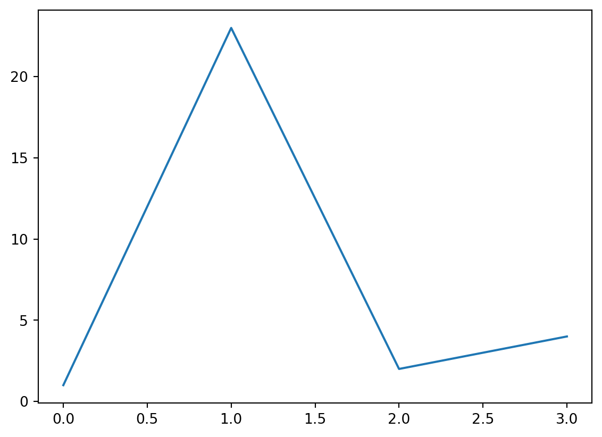

# Cross References

## Overview

Cross-references make it easier for readers to navigate your document by providing numbered references and hyperlinks to various entities like figures and tables. Every cross-referenceable entity requires a label—a unique identifier prefixed with a cross-reference type e.g. `#fig-element`. For example, this is a cross-referenceable figure:

``` markdown
{#fig-elephant}
```

The presence of the label (`#fig-elephant`) makes this figure referenceable. This enables you to use the following syntax to refer to it elsewhere in the document:

``` markdown
See @fig-elephant for an illustration.
```

Here is what this would look like rendered to HTML:


Note that cross reference identifiers must start with their type (e.g. `fig-` or `tbl-`). So the identifier `#fig-elephant` is valid for a cross-reference but the identifiers `#elephant` and `#elephant-fig` are not.

> **WARNING:**
>
> Unless you are creating a cross-reference, avoid using the reserved cross-reference prefixes for code cell labels (e.g. set using the `label` code cell option) and element IDs (set using a `#` in an attribute).
>
> The reserved prefixes are: `fig`, `tbl`, `lst`, `tip`, `nte`, `wrn`, `imp`, `cau`, `thm`, `lem`, `cor`, `prp`, `cnj`, `def`, `exm`, `exr`, `sol`, `rem`, `alg`, `eq`, `sec`.
>
> Also avoid using underscores (`_`) in labels and IDs as this can cause problems when rendering to PDF with LaTeX.

Quarto enables you to create cross-references to figures, tables, equations, sections, code listings, theorems, proofs, and more. Cross references can also be applied to dynamic output from Knitr and Jupyter.

On this page you’ll learn:

- Different ways to use the `@` syntax to create [References](#references).
- How to add [Lists](#lists) of references in LaTeX / PDF output.

Then, we enumerate the syntax for the different types of elements you might want to reference:

- [Floats](#floats): [Figures](#figures), [Tables](#tables) and [Code Listings](#code-listings)
- Blocks: [Callouts](#callouts), [Theorems and Proofs](#theorems-and-proofs) and [Equations](#equations)
- [Sections](#sections)

There are options available that control the text used for titles and references. For example, you could change “Figure 1” to read “Fig 1” or “fig. 1”. See the [options documentation](../../docs/authoring/cross-reference-options.llms.md) for details on how to customize the text used for cross-references.

## References

The examples on this page all use the default syntax for inline references (e.g. `@fig-elephant`), which results in the reference text “Figure 1”, “Table 1”, etc.

You can customize the appearance of inline references by either changing the syntax of the inline reference or by setting options. Here are the various ways to compose a cross-reference and their resulting output:

| Type          | Syntax                | Output   |
|---------------|-----------------------|----------|
| Default       | `@fig-elephant`       | Figure 1 |
| Capitalized   | `@Fig-elephant`       | Figure 1 |
| Custom Prefix | `[Fig @fig-elephant]` | Fig 1    |
| No Prefix     | `[-@fig-elephant]`    | 1        |

Note that the capitalized syntax makes no difference for the default output, but would indeed capitalize the first letter if the default prefix had been changed via an [option](../../docs/authoring/cross-reference-options.llms.md#references) to use lower case (e.g. “fig.”).

These syntax variations work not only for Figures, but for all cross-referenceable elements in Quarto such as Tables, Equations, Theorems, and so on.

You can also group cross-references using the following syntax:

``` markdown
As illustrated in [@fig-elephant; @fig-panther; @fig-rabbit].
```

There are a number of options that can be used to further customize the treatment of cross-references. See the guide on [Cross Reference Options](../../docs/authoring/cross-reference-options.llms.md#references) for additional details.

## Lists

For LaTeX / PDF output, you can use the raw LaTeX commands `\listoffigures`, `\listoftables` and `\listoflistings` to produce listings of all figures, tables, etc. within a document. You can use the `lof-title`, `lot-title`, and `lol-title` crossref options to customize the title of the listing.

For example:

``` markdown
---
title: "My Document"
crossref:
  lof-title: "List of Figures"
format: pdf
---

\listoffigures
```

Note that the default titles for the lists use the form displayed above (i.e. “List of \<Type\>”).

## Floats

[Figures](#figures), [tables](#tables) and [code listings](#code-listings) are known as “float” cross-references. Floats can appear in the rendered document at locations other than where they are defined, i.e. they float, and usually have captions.

In addition to the compact syntax for the most common uses of float cross-references, you can also define float cross-references with a div syntax. Use the div syntax when you need more flexibility in the content of your cross-reference, for example, to have a [video](../../docs/authoring/cross-references-divs.llms.md#videos) be referenced as a figure. Basic examples of the div syntax are included in the sections below, but you can find more complicated examples in [Cross-Reference Div Syntax](../../docs/authoring/cross-references-divs.llms.md).

You can also define custom types of float cross-reference to reference elements beyond figures, tables and code listings. Read more at [Custom Float Cross-References](../../docs/authoring/cross-references-custom.llms.md).

### Figures

As described on the Overview above, this is the markdown used to create a cross-referenceable figure and then refer to it:

``` markdown
{#fig-elephant}

See @fig-elephant for an illustration.
```

Note again that cross-reference identifiers must start with their type (e.g. `#fig-`) and that cross-reference identifiers must be all lower case.

To create a cross-reference to a figure using div syntax, create a fenced div with an id starting with `fig-`, include the image followed by the caption inside the div:

``` markdown
::: {#fig-elephant}


An Elephant
:::
```

You can read about using div syntax with figures at [Cross-Reference Div Syntax](../../docs/authoring/cross-references-divs.llms.md#figures).

#### Subfigures

You may want to create a figure composed of multiple subfigures. To do this, enclose the figures in a div (with its own label and caption) and give each subfigure its own label and (optionally) caption. You can then refer to either the entire figure in a reference or a single subfigure:

``` markdown
::: {#fig-elephants layout-ncol=2}

{#fig-surus}

{#fig-hanno}

Famous Elephants
:::

See @fig-elephants for examples. In particular, @fig-hanno.
```

Here is what this looks like when rendered as HTML:


Note that we also used the `layout-ncol` attribute to specify a two-column layout. See the article on [Figures](../../docs/authoring/figures.llms.md) for more details on laying out panels of figures.

#### Computations

Figures produced by Jupyter and Knitr can also be cross-referenced. To do this, add a `label` and `fig-cap` option at the top of the code block. For example:

## Jupyter

```` markdown
```{python}
#| label: fig-plot
#| fig-cap: "Plot"

import matplotlib.pyplot as plt
plt.plot([1,23,2,4])
plt.show()
```

For example, see @fig-plot.
````


## Knitr

```` markdown
```{r}
#| label: fig-plot
#| fig-cap: "Plot"

plot(cars)
```

For example, see @fig-plot.
````


> **TIP:**
>
> If you need to generate a dynamic caption, instead of using the `fig-cap` or `tbl-cap` code cell option, combine inline code with the [Cross-Reference Div Syntax](../../docs/authoring/cross-references-divs.llms.md#computed-captions).

You can also create multiple figures within a code cell and reference them as subfigures. To do this use `fig-cap` for the main caption, and `fig-subcap` to provide an array of subcaptions. For example:

```` markdown
```{python}
#| label: fig-plots
#| fig-cap: "Plots" 
#| fig-subcap:
#|   - "Plot 1"
#|   - "Plot 2" 
#| layout-ncol: 2

import matplotlib.pyplot as plt
plt.plot([1,23,2,4])
plt.show()

plt.plot([8,65,23,90])
plt.show()
```

See @fig-plots for examples. In particular, @fig-plots-2.
````


Note that subfigure reference labels are created automatically based on the main chunk label (e.g. `@fig-plots-1`, `@fig-plots-2`, etc.).

If you’d like subfigure captions that include only an identifier, e.g. “(a)”, and not a text caption, then specify `fig-subcap: true` rather than providing explicit subcaption text:

```` markdown
```{python}
#| label: fig-plots
#| fig-cap: "Plots" 
#| fig-subcap: true
#| layout-ncol: 2
```
````

### Tables

For markdown tables, add a caption below the table, then include a `#tbl-` label in braces at the end of the caption. For example:

``` markdown
| Col1 | Col2 | Col3 |
|------|------|------|
| A    | B    | C    |
| E    | F    | G    |
| A    | G    | G    |

: My Caption {#tbl-letters}

See @tbl-letters.
```

Which looks like this when rendered to HTML:


> **IMPORTANT:**
>
> In order for a table to be cross-referenceable, its label must start with the `tbl-` prefix.

To create a cross-reference to a table using div syntax, create a fenced div with an id starting with `tbl-`, include the table followed by the caption inside the div:

``` markdown
::: {#tbl-letters}

| Col1 | Col2 | Col3 |
|------|------|------|
| A    | B    | C    |
| E    | F    | G    |
| A    | G    | G    |

My Caption

::: 
```

You can read more about using div syntax with tables at [Cross-Reference Div Syntax](../../docs/authoring/cross-references-divs.llms.md#tables).

#### Subtables

You may want to create a composition of several sub-tables. To do this, create a div with a main identifier, then apply sub-identifiers (and optional caption text) to the contained tables. For example:

``` markdown
::: {#tbl-panel layout-ncol=2}
| Col1 | Col2 | Col3 |
|------|------|------|
| A    | B    | C    |
| E    | F    | G    |
| A    | G    | G    |

: First Table {#tbl-first}

| Col1 | Col2 | Col3 |
|------|------|------|
| A    | B    | C    |
| E    | F    | G    |
| A    | G    | G    |

: Second Table {#tbl-second}

Main Caption
:::

See @tbl-panel for details, especially @tbl-second.
```

Which looks like this when rendered to HTML:


Note that the “Main Caption” for the table is provided as the last block within the containing div.

#### Computations

You can also cross-reference tables created from code executed via computations. To do this, add the `label` and `tbl-cap` cell options. For example:

```` markdown
```{r}
#| label: tbl-iris
#| tbl-cap: "Iris Data"

library(knitr)
kable(head(iris))
```
````


> **TIP:**
>
> If you need to generate a dynamic caption, instead of using the `fig-cap` or `tbl-cap` code cell option, combine inline code with the [Cross-Reference Div Syntax](../../docs/authoring/cross-references-divs.llms.md#computed-captions).

You can also create multiple tables within a code cell and reference them as subtables. To do this, add a `tbl-subcap` option with an array of subcaptions. For example:

```` markdown
```{r}
#| label: tbl-tables
#| tbl-cap: "Tables"
#| tbl-subcap:
#|   - "Cars"
#|   - "Pressure"
#| layout-ncol: 2

library(knitr)
kable(head(cars))
kable(head(pressure))
```
````


If you’d like subtable captions that include only an identifier, e.g. “(a)”, and not a text caption, then specify `tbl-subcap: true` rather than providing explicit subcaption text:

```` markdown
```{r}
#| label: tbl-tables
#| tbl-cap: "Tables"
#| tbl-subcap: true
#| layout-ncol: 2

library(knitr)
kable(head(cars))
kable(head(pressure))
```
````


### Code Listings

To create a reference-able code block, add a `#lst-` identifier along with a `lst-cap` attribute. For example:

```` markdown
```{#lst-customers .sql lst-cap="Customers Query"}
SELECT * FROM Customers
```

Then we query the customers database (@lst-customers).
````

To create a cross-reference to a code listing using div syntax, create a fenced div with an id starting with `lst-`, include the code cell followed by the caption inside the div:

```` markdown
::: {#lst-customers}

```{.sql}
SELECT * FROM Customers
```

Customers Query

:::
````

You can read more about using div syntax for code listings in [Cross-Reference Div Syntax](../../docs/authoring/cross-references-divs.llms.md).

To cross-reference code from an executable code block, add the code cell options `lst-label` and `lst-cap`. The option `lst-label` provides the cross reference identifier and must begin with the prefix `lst-` to be treated as a code listing. The value of `lst-cap` provides the caption for the code listing. For example:

```` markdown
```{python}
#| lst-label: lst-import
#| lst-cap: Import pyplot

import matplotlib.pyplot as plt
```

@lst-import...
````

When rendered, this results in the following:

``` python
import matplotlib.pyplot as plt
```

Listing 1: Import pyplot

[Listing 1](#lst-import)…

If the code cell produces a figure or table, you can combine the `lst-` options with `label` and `fig-cap`/`tbl-cap` to create cross references to both the code and output:

```` markdown
```{python}
#| label: fig-plot
#| fig-cap: Figure caption
#| lst-label: lst-plot
#| lst-cap: Listing caption

plt.plot([1,23,2,4])
plt.show()
```

The code in @lst-plot produces the figure in @fig-plot.
````

When rendered, this produces the following output:

``` python
plt.plot([1,23,2,4])
plt.show()
```

Listing 2: Listing caption



Figure 1: Figure caption

The code in [Listing 2](#lst-plot) produces the plot in [Figure 1](#fig-plot).

## Callouts

To cross-reference a callout, add an ID attribute that starts with the appropriate callout prefix (see [Table 1](#tbl-callout-prefixes)). You can then reference the callout using the usual `@` syntax. For example, here we add the ID `#tip-example` to the callout, and then refer back to it:

``` markdown
::: {#tip-example .callout-tip}
## Cross-Referencing a Tip

Add an ID starting with `#tip-` to reference a tip.
:::

See @tip-example...
```

This renders as follows:

> **TIP:**
>
> Add an ID starting with `#tip-` to reference a tip.

See [Tip 1](#tip-example)…

The prefixes for each type of callout are:

| Callout Type | Prefix  |
|--------------|---------|
| `note`       | `#nte-` |
| `tip`        | `#tip-` |
| `warning`    | `#wrn-` |
| `important`  | `#imp-` |
| `caution`    | `#cau-` |

Table 1: Prefixes for callout cross-references

## Theorems and Proofs

Theorems are commonly used in articles and books in mathematics. To include a reference-able theorem, create a div with a `#thm-` label (or one of other theorem-type labels described below). You also need to specify a theorem name either via the first heading in the block. You can include any content you like within the div. For example:

``` markdown
::: {#thm-line}

## Line

The equation of any straight line, called a linear equation, can be written as:

$$
y = mx + b
$$
:::

See @thm-line.
```


For LaTeX output, the [amsthm](https://ctan.org/pkg/amsthm?lang=en) package is used for typesetting theorems. For other formats an appropriate treatment is used (the above is an example of HTML output).

There are a number of theorem variations supported, each with their own label prefix:

| **Label Prefix** | **Printed Name** | **LaTeX Environment** |
|------------------|------------------|-----------------------|
| `#thm-`          | Theorem          | theorem               |
| `#lem-`          | Lemma            | lemma                 |
| `#cor-`          | Corollary        | corollary             |
| `#prp-`          | Proposition      | proposition           |
| `#cnj-`          | Conjecture       | conjecture            |
| `#def-`          | Definition       | definition            |
| `#exm-`          | Example          | example               |
| `#exr-`          | Exercise         | exercise              |
| `#sol-`          | Solution         | solution              |
| `#rem-`          | Remark           | remark                |
| `#alg-`          | Algorithm        | algorithm             |

The `proof` environment receives similar typesetting as theorems, however it is not numbered (and therefore cannot be cross-referenced). To create a proof add the `.proof` class to a div:

``` markdown
::: {.proof}
By induction.
:::
```

As with theorems you can optionally include a heading as the first element of the div (or a `name` attribute) to give the environment a caption for typesetting (this typically appears in parentheses after the environment title).

For LaTeX output the [amsthm](https://ctan.org/pkg/amsthm?lang=en) package is used to typeset these environments. For other formats a similar treatment is used, but you can further customizing this using CSS.

## Equations

Provide an `#eq-` label immediately after an equation to make it referenceable. For example:

``` markdown
Black-Scholes (@eq-black-scholes) is a mathematical model that seeks to explain the behavior of financial derivatives, most commonly options:

$$
\frac{\partial \mathrm C}{ \partial \mathrm t } + \frac{1}{2}\sigma^{2} \mathrm S^{2}
\frac{\partial^{2} \mathrm C}{\partial \mathrm S^2}
  + \mathrm r \mathrm S \frac{\partial \mathrm C}{\partial \mathrm S}\ =
  \mathrm r \mathrm C 
$$ {#eq-black-scholes}
```

Black-Scholes ([Equation 1](#eq-black-scholes)) is a mathematical model that seeks to explain the behavior of financial derivatives, most commonly options:

\\ \frac{\partial \mathrm C}{ \partial \mathrm t } + \frac{1}{2}\sigma^{2} \mathrm S^{2} \frac{\partial^{2} \mathrm C}{\partial \mathrm S^2} + \mathrm r \mathrm S \frac{\partial \mathrm C}{\partial \mathrm S}\\ = \mathrm r \mathrm C \tag{1}\\

Note that the equation number is included (via `\qquad`) in the right margin of the equation.

## Sections

To reference a section, add a `#sec-` identifier to any heading. For example:

``` markdown
## Introduction {#sec-introduction}

See @sec-introduction for additional context.
```

Note that when using section cross-references, you will also need to enable the `number-sections` option (so that section numbering is visible to readers). For example:

``` yaml
---
title: "My Document"
number-sections: true
---
```
