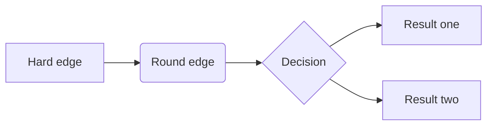
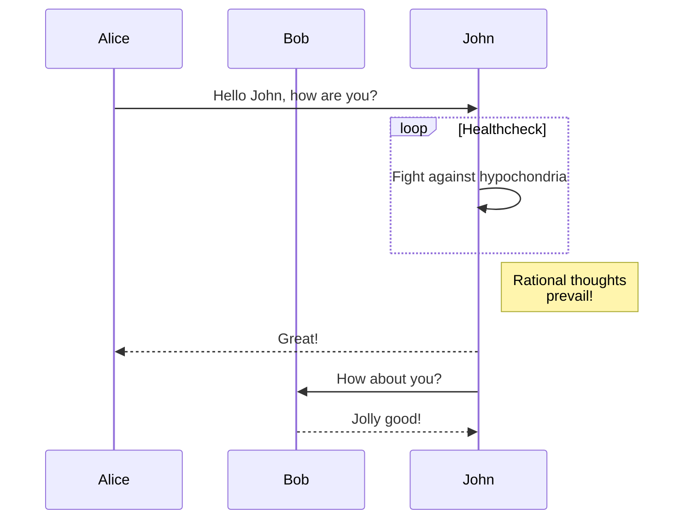
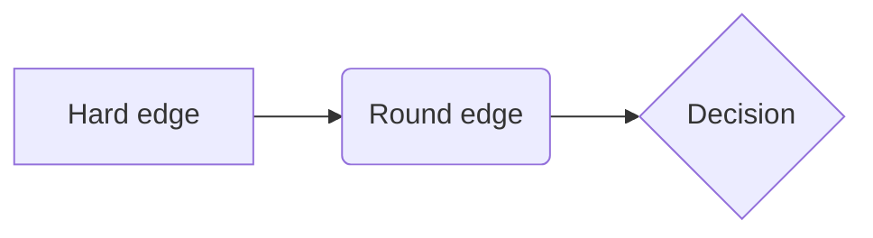

# Diagrams

## Overview

Quarto has native support for embedding [Mermaid](https://mermaid-js.github.io/mermaid/#/) and [Graphviz](https://graphviz.org/) diagrams. This enables you to create flowcharts, sequence diagrams, state diagrams, gantt charts, and more using a plain text syntax inspired by markdown.

For example, here we embed a flowchart created using Mermaid:

```` markdown
```{mermaid}
flowchart LR
  A[Hard edge] --> B(Round edge)
  B --> C{Decision}
  C --> D[Result one]
  C --> E[Result two]
```
````



As illustrated above, Mermaid diagrams are embedded using `{mermaid}` executable cells. Graphviz diagrams are embedded using `{dot}` executable cells. Note that cell options are added with slightly different syntax: `%%|` for `{mermaid}`, and `//|` for `{dot}`.

> **NOTE:**
>
> For print output formats like `pdf` or `docx`, diagram rendering makes use of the Chrome or Edge web browser to create a high-quality PNG. Quarto can automatically use an existing version of Chrome or Edge on your system, or alternatively if you don’t have either installed, can use a lighter-weight library version of Chrome (see [Chrome Install](#chrome-install) below for details).

## Mermaid

Mermaid is a Javascript based diagramming and charting tool that uses Markdown-inspired text definitions and a renderer to create and modify complex diagrams.

Mermaid diagrams use `%%` as their comment syntax, and so cell options are declared using `%%|`. Cell options **must** be included directly beneath the start of the diagram code chunk.

Above we demonstrated a flowchart created with Mermaid, here is a sequence diagram (also embedded using a `{mermaid}` executable cell):

```` markdown
```{mermaid}
sequenceDiagram
  participant Alice
  participant Bob
  Alice->>John: Hello John, how are you?
  loop Healthcheck
    John->>John: Fight against hypochondria
  end
  Note right of John: Rational thoughts <br/>prevail!
  John-->>Alice: Great!
  John->>Bob: How about you?
  Bob-->>John: Jolly good!
```
````



Note that Mermaid output varies depending on the target format (e.g. HTML vs. print-based). See the section below on [Mermaid Formats](#mermaid-formats) for additional details.

To learn more about using Mermaid, see the [Mermaid website](https://mermaid-js.github.io/mermaid/) or the [Mermaid book](https://www.amazon.com/Official-Guide-Mermaid-js-beautiful-flowcharts-dp-1801078025/dp/1801078025) (which is written by the creator of Mermaid).

## Graphviz

The Graphviz layout programs take descriptions of graphs in a simple text language, and make diagrams in useful formats. Graphviz has many useful features for concrete diagrams, such as options for colors, fonts, tabular node layouts, line styles, hyperlinks, and custom shapes.

Graphviz diagrams use `//` as their comment syntax, and so cell options are declared using `//|`. Cell options **must** be included directly beneath the start of the diagram code chunk.

For example, here is a simple undirected graph created using graphviz:

```` markdown
```{dot}
graph G {
  layout=neato
  run -- intr;
  intr -- runbl;
  runbl -- run;
  run -- kernel;
  kernel -- zombie;
  kernel -- sleep;
  kernel -- runmem;
  sleep -- swap;
  swap -- runswap;
  runswap -- new;
  runswap -- runmem;
  new -- runmem;
  sleep -- runmem;
}
```
````

![](data:image/svg+xml;base64,PHN2ZyB3aWR0aD0iNjcyIiBoZWlnaHQ9IjQ4MCIgdmlld2JveD0iMC4wMCAwLjAwIDM3MC45OSAyNDYuNzEiIHhtbG5zPSJodHRwOi8vd3d3LnczLm9yZy8yMDAwL3N2ZyIgeGxpbms9Imh0dHA6Ly93d3cudzMub3JnLzE5OTkveGxpbmsiIHN0eWxlPSI7IG1heC13aWR0aDogbm9uZTsgbWF4LWhlaWdodDogbm9uZSI+CjxnIGlkPSJncmFwaDAiIGNsYXNzPSJncmFwaCIgdHJhbnNmb3JtPSJzY2FsZSgxIDEpIHJvdGF0ZSgwKSB0cmFuc2xhdGUoNCAyNDIuNzEpIj4KPHRpdGxlPkc8L3RpdGxlPgo8cG9seWdvbiBmaWxsPSJ3aGl0ZSIgc3Ryb2tlPSJ0cmFuc3BhcmVudCIgcG9pbnRzPSItNCw0IC00LC0yNDIuNzEgMzY2Ljk5LC0yNDIuNzEgMzY2Ljk5LDQgLTQsNCI+PC9wb2x5Z29uPgo8IS0tIHJ1biAtLT4KPGcgaWQ9Im5vZGUxIiBjbGFzcz0ibm9kZSI+Cjx0aXRsZT5ydW48L3RpdGxlPgo8ZWxsaXBzZSBmaWxsPSJub25lIiBzdHJva2U9ImJsYWNrIiBjeD0iMTA1LjIyIiBjeT0iLTExMC4wMyIgcng9IjI3IiByeT0iMTgiPjwvZWxsaXBzZT4KPHRleHQgdGV4dC1hbmNob3I9Im1pZGRsZSIgeD0iMTA1LjIyIiB5PSItMTA1LjgzIiBmb250LWZhbWlseT0iVGltZXMsc2VyaWYiIGZvbnQtc2l6ZT0iMTQuMDAiPnJ1bjwvdGV4dD4KPC9nPgo8IS0tIGludHIgLS0+CjxnIGlkPSJub2RlMiIgY2xhc3M9Im5vZGUiPgo8dGl0bGU+aW50cjwvdGl0bGU+CjxlbGxpcHNlIGZpbGw9Im5vbmUiIHN0cm9rZT0iYmxhY2siIGN4PSI0OC4xMSIgY3k9Ii01OS43MSIgcng9IjI3IiByeT0iMTgiPjwvZWxsaXBzZT4KPHRleHQgdGV4dC1hbmNob3I9Im1pZGRsZSIgeD0iNDguMTEiIHk9Ii01NS41MSIgZm9udC1mYW1pbHk9IlRpbWVzLHNlcmlmIiBmb250LXNpemU9IjE0LjAwIj5pbnRyPC90ZXh0Pgo8L2c+CjwhLS0gcnVuJiM0NTsmIzQ1O2ludHIgLS0+CjxnIGlkPSJlZGdlMSIgY2xhc3M9ImVkZ2UiPgo8dGl0bGU+cnVuLS1pbnRyPC90aXRsZT4KPHBhdGggZmlsbD0ibm9uZSIgc3Ryb2tlPSJibGFjayIgZD0iTTg4LjcsLTk1LjQ4QzgxLjE5LC04OC44NiA3Mi4zMiwtODEuMDQgNjQuNzksLTc0LjQiIC8+CjwvZz4KPCEtLSBrZXJuZWwgLS0+CjxnIGlkPSJub2RlNCIgY2xhc3M9Im5vZGUiPgo8dGl0bGU+a2VybmVsPC90aXRsZT4KPGVsbGlwc2UgZmlsbD0ibm9uZSIgc3Ryb2tlPSJibGFjayIgY3g9IjE4MC45NSIgY3k9Ii0xMzcuNTQiIHJ4PSIzNS4zMyIgcnk9IjE4Ij48L2VsbGlwc2U+Cjx0ZXh0IHRleHQtYW5jaG9yPSJtaWRkbGUiIHg9IjE4MC45NSIgeT0iLTEzMy4zNCIgZm9udC1mYW1pbHk9IlRpbWVzLHNlcmlmIiBmb250LXNpemU9IjE0LjAwIj5rZXJuZWw8L3RleHQ+CjwvZz4KPCEtLSBydW4mIzQ1OyYjNDU7a2VybmVsIC0tPgo8ZyBpZD0iZWRnZTQiIGNsYXNzPSJlZGdlIj4KPHRpdGxlPnJ1bi0ta2VybmVsPC90aXRsZT4KPHBhdGggZmlsbD0ibm9uZSIgc3Ryb2tlPSJibGFjayIgZD0iTTEyOS4xOCwtMTE4LjczQzEzNi40NiwtMTIxLjM4IDE0NC41NCwtMTI0LjMxIDE1Mi4xLC0xMjcuMDYiIC8+CjwvZz4KPCEtLSBydW5ibCAtLT4KPGcgaWQ9Im5vZGUzIiBjbGFzcz0ibm9kZSI+Cjx0aXRsZT5ydW5ibDwvdGl0bGU+CjxlbGxpcHNlIGZpbGw9Im5vbmUiIHN0cm9rZT0iYmxhY2siIGN4PSIzMS40MiIgY3k9Ii0xMjYuMTYiIHJ4PSIzMS4zNCIgcnk9IjE4Ij48L2VsbGlwc2U+Cjx0ZXh0IHRleHQtYW5jaG9yPSJtaWRkbGUiIHg9IjMxLjQyIiB5PSItMTIxLjk2IiBmb250LWZhbWlseT0iVGltZXMsc2VyaWYiIGZvbnQtc2l6ZT0iMTQuMDAiPnJ1bmJsPC90ZXh0Pgo8L2c+CjwhLS0gaW50ciYjNDU7JiM0NTtydW5ibCAtLT4KPGcgaWQ9ImVkZ2UyIiBjbGFzcz0iZWRnZSI+Cjx0aXRsZT5pbnRyLS1ydW5ibDwvdGl0bGU+CjxwYXRoIGZpbGw9Im5vbmUiIHN0cm9rZT0iYmxhY2siIGQ9Ik00My42NCwtNzcuNTFDNDEuMjUsLTg3LjA1IDM4LjMsLTk4Ljc2IDM1LjkxLC0xMDguMyIgLz4KPC9nPgo8IS0tIHJ1bmJsJiM0NTsmIzQ1O3J1biAtLT4KPGcgaWQ9ImVkZ2UzIiBjbGFzcz0iZWRnZSI+Cjx0aXRsZT5ydW5ibC0tcnVuPC90aXRsZT4KPHBhdGggZmlsbD0ibm9uZSIgc3Ryb2tlPSJibGFjayIgZD0iTTYxLjAxLC0xMTkuN0M2Ny4xMSwtMTE4LjM2IDczLjQ4LC0xMTYuOTcgNzkuNDMsLTExNS42NyIgLz4KPC9nPgo8IS0tIHpvbWJpZSAtLT4KPGcgaWQ9Im5vZGU1IiBjbGFzcz0ibm9kZSI+Cjx0aXRsZT56b21iaWU8L3RpdGxlPgo8ZWxsaXBzZSBmaWxsPSJub25lIiBzdHJva2U9ImJsYWNrIiBjeD0iMTY4LjMxIiBjeT0iLTIyMC43MSIgcng9IjM5LjQyIiByeT0iMTgiPjwvZWxsaXBzZT4KPHRleHQgdGV4dC1hbmNob3I9Im1pZGRsZSIgeD0iMTY4LjMxIiB5PSItMjE2LjUxIiBmb250LWZhbWlseT0iVGltZXMsc2VyaWYiIGZvbnQtc2l6ZT0iMTQuMDAiPnpvbWJpZTwvdGV4dD4KPC9nPgo8IS0tIGtlcm5lbCYjNDU7JiM0NTt6b21iaWUgLS0+CjxnIGlkPSJlZGdlNSIgY2xhc3M9ImVkZ2UiPgo8dGl0bGU+a2VybmVsLS16b21iaWU8L3RpdGxlPgo8cGF0aCBmaWxsPSJub25lIiBzdHJva2U9ImJsYWNrIiBkPSJNMTc4LjIxLC0xNTUuNThDMTc2LjA5LC0xNjkuNTQgMTczLjE3LC0xODguNzYgMTcxLjA1LC0yMDIuNyIgLz4KPC9nPgo8IS0tIHNsZWVwIC0tPgo8ZyBpZD0ibm9kZTYiIGNsYXNzPSJub2RlIj4KPHRpdGxlPnNsZWVwPC90aXRsZT4KPGVsbGlwc2UgZmlsbD0ibm9uZSIgc3Ryb2tlPSJibGFjayIgY3g9IjI1My4yNSIgY3k9Ii0xNTQuOTciIHJ4PSIzMC43NiIgcnk9IjE4Ij48L2VsbGlwc2U+Cjx0ZXh0IHRleHQtYW5jaG9yPSJtaWRkbGUiIHg9IjI1My4yNSIgeT0iLTE1MC43NyIgZm9udC1mYW1pbHk9IlRpbWVzLHNlcmlmIiBmb250LXNpemU9IjE0LjAwIj5zbGVlcDwvdGV4dD4KPC9nPgo8IS0tIGtlcm5lbCYjNDU7JiM0NTtzbGVlcCAtLT4KPGcgaWQ9ImVkZ2U2IiBjbGFzcz0iZWRnZSI+Cjx0aXRsZT5rZXJuZWwtLXNsZWVwPC90aXRsZT4KPHBhdGggZmlsbD0ibm9uZSIgc3Ryb2tlPSJibGFjayIgZD0iTTIxMi44NywtMTQ1LjIzQzIxNi44MSwtMTQ2LjE4IDIyMC44MSwtMTQ3LjE1IDIyNC42OSwtMTQ4LjA4IiAvPgo8L2c+CjwhLS0gcnVubWVtIC0tPgo8ZyBpZD0ibm9kZTciIGNsYXNzPSJub2RlIj4KPHRpdGxlPnJ1bm1lbTwvdGl0bGU+CjxlbGxpcHNlIGZpbGw9Im5vbmUiIHN0cm9rZT0iYmxhY2siIGN4PSIyNDAuMTciIGN5PSItODMuMzYiIHJ4PSI0My40NCIgcnk9IjE4Ij48L2VsbGlwc2U+Cjx0ZXh0IHRleHQtYW5jaG9yPSJtaWRkbGUiIHg9IjI0MC4xNyIgeT0iLTc5LjE2IiBmb250LWZhbWlseT0iVGltZXMsc2VyaWYiIGZvbnQtc2l6ZT0iMTQuMDAiPnJ1bm1lbTwvdGV4dD4KPC9nPgo8IS0tIGtlcm5lbCYjNDU7JiM0NTtydW5tZW0gLS0+CjxnIGlkPSJlZGdlNyIgY2xhc3M9ImVkZ2UiPgo8dGl0bGU+a2VybmVsLS1ydW5tZW08L3RpdGxlPgo8cGF0aCBmaWxsPSJub25lIiBzdHJva2U9ImJsYWNrIiBkPSJNMTk4LjQsLTEyMS41N0MyMDUuOSwtMTE0LjcxIDIxNC42NywtMTA2LjY5IDIyMi4yMywtOTkuNzciIC8+CjwvZz4KPCEtLSBzbGVlcCYjNDU7JiM0NTtydW5tZW0gLS0+CjxnIGlkPSJlZGdlMTMiIGNsYXNzPSJlZGdlIj4KPHRpdGxlPnNsZWVwLS1ydW5tZW08L3RpdGxlPgo8cGF0aCBmaWxsPSJub25lIiBzdHJva2U9ImJsYWNrIiBkPSJNMjQ5Ljk1LC0xMzYuOUMyNDcuOTgsLTEyNi4xMyAyNDUuNDksLTExMi40OSAyNDMuNTEsLTEwMS42NyIgLz4KPC9nPgo8IS0tIHN3YXAgLS0+CjxnIGlkPSJub2RlOCIgY2xhc3M9Im5vZGUiPgo8dGl0bGU+c3dhcDwvdGl0bGU+CjxlbGxpcHNlIGZpbGw9Im5vbmUiIHN0cm9rZT0iYmxhY2siIGN4PSIzMzAuOTUiIGN5PSItMTQ4LjI1IiByeD0iMzAuNzciIHJ5PSIxOCI+PC9lbGxpcHNlPgo8dGV4dCB0ZXh0LWFuY2hvcj0ibWlkZGxlIiB4PSIzMzAuOTUiIHk9Ii0xNDQuMDUiIGZvbnQtZmFtaWx5PSJUaW1lcyxzZXJpZiIgZm9udC1zaXplPSIxNC4wMCI+c3dhcDwvdGV4dD4KPC9nPgo8IS0tIHNsZWVwJiM0NTsmIzQ1O3N3YXAgLS0+CjxnIGlkPSJlZGdlOCIgY2xhc3M9ImVkZ2UiPgo8dGl0bGU+c2xlZXAtLXN3YXA8L3RpdGxlPgo8cGF0aCBmaWxsPSJub25lIiBzdHJva2U9ImJsYWNrIiBkPSJNMjgzLjk2LC0xNTIuMzFDMjg5LjMsLTE1MS44NSAyOTQuODYsLTE1MS4zNyAzMDAuMjEsLTE1MC45MSIgLz4KPC9nPgo8IS0tIHJ1bnN3YXAgLS0+CjxnIGlkPSJub2RlOSIgY2xhc3M9Im5vZGUiPgo8dGl0bGU+cnVuc3dhcDwvdGl0bGU+CjxlbGxpcHNlIGZpbGw9Im5vbmUiIHN0cm9rZT0iYmxhY2siIGN4PSIzMTkuMjMiIGN5PSItNzMuNDYiIHJ4PSI0My41MSIgcnk9IjE4Ij48L2VsbGlwc2U+Cjx0ZXh0IHRleHQtYW5jaG9yPSJtaWRkbGUiIHg9IjMxOS4yMyIgeT0iLTY5LjI2IiBmb250LWZhbWlseT0iVGltZXMsc2VyaWYiIGZvbnQtc2l6ZT0iMTQuMDAiPnJ1bnN3YXA8L3RleHQ+CjwvZz4KPCEtLSBzd2FwJiM0NTsmIzQ1O3J1bnN3YXAgLS0+CjxnIGlkPSJlZGdlOSIgY2xhc3M9ImVkZ2UiPgo8dGl0bGU+c3dhcC0tcnVuc3dhcDwvdGl0bGU+CjxwYXRoIGZpbGw9Im5vbmUiIHN0cm9rZT0iYmxhY2siIGQ9Ik0zMjguMTEsLTEzMC4xNUMzMjYuMjgsLTExOC40NyAzMjMuOTEsLTEwMy4zNSAzMjIuMDgsLTkxLjY2IiAvPgo8L2c+CjwhLS0gcnVuc3dhcCYjNDU7JiM0NTtydW5tZW0gLS0+CjxnIGlkPSJlZGdlMTEiIGNsYXNzPSJlZGdlIj4KPHRpdGxlPnJ1bnN3YXAtLXJ1bm1lbTwvdGl0bGU+CjxwYXRoIGZpbGw9Im5vbmUiIHN0cm9rZT0iYmxhY2siIGQ9Ik0yNzYuOTIsLTc4Ljc2QzI3Ni43OCwtNzguNzcgMjc2LjYzLC03OC43OSAyNzYuNDgsLTc4LjgxIiAvPgo8L2c+CjwhLS0gbmV3IC0tPgo8ZyBpZD0ibm9kZTEwIiBjbGFzcz0ibm9kZSI+Cjx0aXRsZT5uZXc8L3RpdGxlPgo8ZWxsaXBzZSBmaWxsPSJub25lIiBzdHJva2U9ImJsYWNrIiBjeD0iMjc4LjMxIiBjeT0iLTE4IiByeD0iMjcuMjUiIHJ5PSIxOCI+PC9lbGxpcHNlPgo8dGV4dCB0ZXh0LWFuY2hvcj0ibWlkZGxlIiB4PSIyNzguMzEiIHk9Ii0xMy44IiBmb250LWZhbWlseT0iVGltZXMsc2VyaWYiIGZvbnQtc2l6ZT0iMTQuMDAiPm5ldzwvdGV4dD4KPC9nPgo8IS0tIHJ1bnN3YXAmIzQ1OyYjNDU7bmV3IC0tPgo8ZyBpZD0iZWRnZTEwIiBjbGFzcz0iZWRnZSI+Cjx0aXRsZT5ydW5zd2FwLS1uZXc8L3RpdGxlPgo8cGF0aCBmaWxsPSJub25lIiBzdHJva2U9ImJsYWNrIiBkPSJNMzA2LjUxLC01Ni4yMUMzMDEuMzUsLTQ5LjIyIDI5NS40MiwtNDEuMTggMjkwLjMzLC0zNC4yOSIgLz4KPC9nPgo8IS0tIG5ldyYjNDU7JiM0NTtydW5tZW0gLS0+CjxnIGlkPSJlZGdlMTIiIGNsYXNzPSJlZGdlIj4KPHRpdGxlPm5ldy0tcnVubWVtPC90aXRsZT4KPHBhdGggZmlsbD0ibm9uZSIgc3Ryb2tlPSJibGFjayIgZD0iTTI2OC40OSwtMzQuODNDMjYzLjAxLC00NC4yMSAyNTYuMiwtNTUuODkgMjUwLjYyLC02NS40NCIgLz4KPC9nPgo8L2c+Cjwvc3ZnPg==)

To learn more about Graphviz, see the [Graphviz website](https://graphviz.org/), this list of simple [Graphiz Examples](https://renenyffenegger.ch/notes/tools/Graphviz/examples/index), or the [Graphviz Gallery](https://graphviz.org/gallery/).

## Authoring

There are a variety of tools available to improve your productivity authoring diagrams:

1.  The [Mermaid Live Editor](https://mermaid.live/) is an online tool for editing and previewing Mermaid diagrams in real time.

2.  [Graphviz Online](https://dreampuf.github.io/GraphvizOnline/) provides a similar tool for editing Graphviz diagrams.

3.  [RStudio](https://www.rstudio.com/products/rstudio/download/) includes support for editing and previewing `.mmd` and `.dot` files (with help from the [DiagrammeR](https://rich-iannone.github.io/DiagrammeR/) package).

4.  The Quarto Extension for VS Code and Positron (available on both [OpenVSX](https://open-vsx.org/extension/quarto/quarto) and [Microsoft’s marketplace](https://marketplace.visualstudio.com/items?itemName=quarto.quarto)) supports live preview of diagrams embedded in `.qmd` files and in `.mmd` and `.dot` files:

    

## Cross-References

Diagrams can be treated as figures the same way that images and plot output are. For example, if we added the following figure options to the diagram above:

```` markdown
```{dot}
//| label: fig-simple
//| fig-cap: "This is a simple graphviz graph."
```
````

We’d get this output:

![](data:image/svg+xml;base64,PHN2ZyB3aWR0aD0iNjcyIiBoZWlnaHQ9IjQ4MCIgdmlld2JveD0iMC4wMCAwLjAwIDM3MC45OSAyNDYuNzEiIHhtbG5zPSJodHRwOi8vd3d3LnczLm9yZy8yMDAwL3N2ZyIgeGxpbms9Imh0dHA6Ly93d3cudzMub3JnLzE5OTkveGxpbmsiIHN0eWxlPSI7IG1heC13aWR0aDogbm9uZTsgbWF4LWhlaWdodDogbm9uZSI+CjxnIGlkPSJncmFwaDAiIGNsYXNzPSJncmFwaCIgdHJhbnNmb3JtPSJzY2FsZSgxIDEpIHJvdGF0ZSgwKSB0cmFuc2xhdGUoNCAyNDIuNzEpIj4KPHRpdGxlPkc8L3RpdGxlPgo8cG9seWdvbiBmaWxsPSJ3aGl0ZSIgc3Ryb2tlPSJ0cmFuc3BhcmVudCIgcG9pbnRzPSItNCw0IC00LC0yNDIuNzEgMzY2Ljk5LC0yNDIuNzEgMzY2Ljk5LDQgLTQsNCI+PC9wb2x5Z29uPgo8IS0tIHJ1biAtLT4KPGcgaWQ9Im5vZGUxIiBjbGFzcz0ibm9kZSI+Cjx0aXRsZT5ydW48L3RpdGxlPgo8ZWxsaXBzZSBmaWxsPSJub25lIiBzdHJva2U9ImJsYWNrIiBjeD0iMTA1LjIyIiBjeT0iLTExMC4wMyIgcng9IjI3IiByeT0iMTgiPjwvZWxsaXBzZT4KPHRleHQgdGV4dC1hbmNob3I9Im1pZGRsZSIgeD0iMTA1LjIyIiB5PSItMTA1LjgzIiBmb250LWZhbWlseT0iVGltZXMsc2VyaWYiIGZvbnQtc2l6ZT0iMTQuMDAiPnJ1bjwvdGV4dD4KPC9nPgo8IS0tIGludHIgLS0+CjxnIGlkPSJub2RlMiIgY2xhc3M9Im5vZGUiPgo8dGl0bGU+aW50cjwvdGl0bGU+CjxlbGxpcHNlIGZpbGw9Im5vbmUiIHN0cm9rZT0iYmxhY2siIGN4PSI0OC4xMSIgY3k9Ii01OS43MSIgcng9IjI3IiByeT0iMTgiPjwvZWxsaXBzZT4KPHRleHQgdGV4dC1hbmNob3I9Im1pZGRsZSIgeD0iNDguMTEiIHk9Ii01NS41MSIgZm9udC1mYW1pbHk9IlRpbWVzLHNlcmlmIiBmb250LXNpemU9IjE0LjAwIj5pbnRyPC90ZXh0Pgo8L2c+CjwhLS0gcnVuJiM0NTsmIzQ1O2ludHIgLS0+CjxnIGlkPSJlZGdlMSIgY2xhc3M9ImVkZ2UiPgo8dGl0bGU+cnVuLS1pbnRyPC90aXRsZT4KPHBhdGggZmlsbD0ibm9uZSIgc3Ryb2tlPSJibGFjayIgZD0iTTg4LjcsLTk1LjQ4QzgxLjE5LC04OC44NiA3Mi4zMiwtODEuMDQgNjQuNzksLTc0LjQiIC8+CjwvZz4KPCEtLSBrZXJuZWwgLS0+CjxnIGlkPSJub2RlNCIgY2xhc3M9Im5vZGUiPgo8dGl0bGU+a2VybmVsPC90aXRsZT4KPGVsbGlwc2UgZmlsbD0ibm9uZSIgc3Ryb2tlPSJibGFjayIgY3g9IjE4MC45NSIgY3k9Ii0xMzcuNTQiIHJ4PSIzNS4zMyIgcnk9IjE4Ij48L2VsbGlwc2U+Cjx0ZXh0IHRleHQtYW5jaG9yPSJtaWRkbGUiIHg9IjE4MC45NSIgeT0iLTEzMy4zNCIgZm9udC1mYW1pbHk9IlRpbWVzLHNlcmlmIiBmb250LXNpemU9IjE0LjAwIj5rZXJuZWw8L3RleHQ+CjwvZz4KPCEtLSBydW4mIzQ1OyYjNDU7a2VybmVsIC0tPgo8ZyBpZD0iZWRnZTQiIGNsYXNzPSJlZGdlIj4KPHRpdGxlPnJ1bi0ta2VybmVsPC90aXRsZT4KPHBhdGggZmlsbD0ibm9uZSIgc3Ryb2tlPSJibGFjayIgZD0iTTEyOS4xOCwtMTE4LjczQzEzNi40NiwtMTIxLjM4IDE0NC41NCwtMTI0LjMxIDE1Mi4xLC0xMjcuMDYiIC8+CjwvZz4KPCEtLSBydW5ibCAtLT4KPGcgaWQ9Im5vZGUzIiBjbGFzcz0ibm9kZSI+Cjx0aXRsZT5ydW5ibDwvdGl0bGU+CjxlbGxpcHNlIGZpbGw9Im5vbmUiIHN0cm9rZT0iYmxhY2siIGN4PSIzMS40MiIgY3k9Ii0xMjYuMTYiIHJ4PSIzMS4zNCIgcnk9IjE4Ij48L2VsbGlwc2U+Cjx0ZXh0IHRleHQtYW5jaG9yPSJtaWRkbGUiIHg9IjMxLjQyIiB5PSItMTIxLjk2IiBmb250LWZhbWlseT0iVGltZXMsc2VyaWYiIGZvbnQtc2l6ZT0iMTQuMDAiPnJ1bmJsPC90ZXh0Pgo8L2c+CjwhLS0gaW50ciYjNDU7JiM0NTtydW5ibCAtLT4KPGcgaWQ9ImVkZ2UyIiBjbGFzcz0iZWRnZSI+Cjx0aXRsZT5pbnRyLS1ydW5ibDwvdGl0bGU+CjxwYXRoIGZpbGw9Im5vbmUiIHN0cm9rZT0iYmxhY2siIGQ9Ik00My42NCwtNzcuNTFDNDEuMjUsLTg3LjA1IDM4LjMsLTk4Ljc2IDM1LjkxLC0xMDguMyIgLz4KPC9nPgo8IS0tIHJ1bmJsJiM0NTsmIzQ1O3J1biAtLT4KPGcgaWQ9ImVkZ2UzIiBjbGFzcz0iZWRnZSI+Cjx0aXRsZT5ydW5ibC0tcnVuPC90aXRsZT4KPHBhdGggZmlsbD0ibm9uZSIgc3Ryb2tlPSJibGFjayIgZD0iTTYxLjAxLC0xMTkuN0M2Ny4xMSwtMTE4LjM2IDczLjQ4LC0xMTYuOTcgNzkuNDMsLTExNS42NyIgLz4KPC9nPgo8IS0tIHpvbWJpZSAtLT4KPGcgaWQ9Im5vZGU1IiBjbGFzcz0ibm9kZSI+Cjx0aXRsZT56b21iaWU8L3RpdGxlPgo8ZWxsaXBzZSBmaWxsPSJub25lIiBzdHJva2U9ImJsYWNrIiBjeD0iMTY4LjMxIiBjeT0iLTIyMC43MSIgcng9IjM5LjQyIiByeT0iMTgiPjwvZWxsaXBzZT4KPHRleHQgdGV4dC1hbmNob3I9Im1pZGRsZSIgeD0iMTY4LjMxIiB5PSItMjE2LjUxIiBmb250LWZhbWlseT0iVGltZXMsc2VyaWYiIGZvbnQtc2l6ZT0iMTQuMDAiPnpvbWJpZTwvdGV4dD4KPC9nPgo8IS0tIGtlcm5lbCYjNDU7JiM0NTt6b21iaWUgLS0+CjxnIGlkPSJlZGdlNSIgY2xhc3M9ImVkZ2UiPgo8dGl0bGU+a2VybmVsLS16b21iaWU8L3RpdGxlPgo8cGF0aCBmaWxsPSJub25lIiBzdHJva2U9ImJsYWNrIiBkPSJNMTc4LjIxLC0xNTUuNThDMTc2LjA5LC0xNjkuNTQgMTczLjE3LC0xODguNzYgMTcxLjA1LC0yMDIuNyIgLz4KPC9nPgo8IS0tIHNsZWVwIC0tPgo8ZyBpZD0ibm9kZTYiIGNsYXNzPSJub2RlIj4KPHRpdGxlPnNsZWVwPC90aXRsZT4KPGVsbGlwc2UgZmlsbD0ibm9uZSIgc3Ryb2tlPSJibGFjayIgY3g9IjI1My4yNSIgY3k9Ii0xNTQuOTciIHJ4PSIzMC43NiIgcnk9IjE4Ij48L2VsbGlwc2U+Cjx0ZXh0IHRleHQtYW5jaG9yPSJtaWRkbGUiIHg9IjI1My4yNSIgeT0iLTE1MC43NyIgZm9udC1mYW1pbHk9IlRpbWVzLHNlcmlmIiBmb250LXNpemU9IjE0LjAwIj5zbGVlcDwvdGV4dD4KPC9nPgo8IS0tIGtlcm5lbCYjNDU7JiM0NTtzbGVlcCAtLT4KPGcgaWQ9ImVkZ2U2IiBjbGFzcz0iZWRnZSI+Cjx0aXRsZT5rZXJuZWwtLXNsZWVwPC90aXRsZT4KPHBhdGggZmlsbD0ibm9uZSIgc3Ryb2tlPSJibGFjayIgZD0iTTIxMi44NywtMTQ1LjIzQzIxNi44MSwtMTQ2LjE4IDIyMC44MSwtMTQ3LjE1IDIyNC42OSwtMTQ4LjA4IiAvPgo8L2c+CjwhLS0gcnVubWVtIC0tPgo8ZyBpZD0ibm9kZTciIGNsYXNzPSJub2RlIj4KPHRpdGxlPnJ1bm1lbTwvdGl0bGU+CjxlbGxpcHNlIGZpbGw9Im5vbmUiIHN0cm9rZT0iYmxhY2siIGN4PSIyNDAuMTciIGN5PSItODMuMzYiIHJ4PSI0My40NCIgcnk9IjE4Ij48L2VsbGlwc2U+Cjx0ZXh0IHRleHQtYW5jaG9yPSJtaWRkbGUiIHg9IjI0MC4xNyIgeT0iLTc5LjE2IiBmb250LWZhbWlseT0iVGltZXMsc2VyaWYiIGZvbnQtc2l6ZT0iMTQuMDAiPnJ1bm1lbTwvdGV4dD4KPC9nPgo8IS0tIGtlcm5lbCYjNDU7JiM0NTtydW5tZW0gLS0+CjxnIGlkPSJlZGdlNyIgY2xhc3M9ImVkZ2UiPgo8dGl0bGU+a2VybmVsLS1ydW5tZW08L3RpdGxlPgo8cGF0aCBmaWxsPSJub25lIiBzdHJva2U9ImJsYWNrIiBkPSJNMTk4LjQsLTEyMS41N0MyMDUuOSwtMTE0LjcxIDIxNC42NywtMTA2LjY5IDIyMi4yMywtOTkuNzciIC8+CjwvZz4KPCEtLSBzbGVlcCYjNDU7JiM0NTtydW5tZW0gLS0+CjxnIGlkPSJlZGdlMTMiIGNsYXNzPSJlZGdlIj4KPHRpdGxlPnNsZWVwLS1ydW5tZW08L3RpdGxlPgo8cGF0aCBmaWxsPSJub25lIiBzdHJva2U9ImJsYWNrIiBkPSJNMjQ5Ljk1LC0xMzYuOUMyNDcuOTgsLTEyNi4xMyAyNDUuNDksLTExMi40OSAyNDMuNTEsLTEwMS42NyIgLz4KPC9nPgo8IS0tIHN3YXAgLS0+CjxnIGlkPSJub2RlOCIgY2xhc3M9Im5vZGUiPgo8dGl0bGU+c3dhcDwvdGl0bGU+CjxlbGxpcHNlIGZpbGw9Im5vbmUiIHN0cm9rZT0iYmxhY2siIGN4PSIzMzAuOTUiIGN5PSItMTQ4LjI1IiByeD0iMzAuNzciIHJ5PSIxOCI+PC9lbGxpcHNlPgo8dGV4dCB0ZXh0LWFuY2hvcj0ibWlkZGxlIiB4PSIzMzAuOTUiIHk9Ii0xNDQuMDUiIGZvbnQtZmFtaWx5PSJUaW1lcyxzZXJpZiIgZm9udC1zaXplPSIxNC4wMCI+c3dhcDwvdGV4dD4KPC9nPgo8IS0tIHNsZWVwJiM0NTsmIzQ1O3N3YXAgLS0+CjxnIGlkPSJlZGdlOCIgY2xhc3M9ImVkZ2UiPgo8dGl0bGU+c2xlZXAtLXN3YXA8L3RpdGxlPgo8cGF0aCBmaWxsPSJub25lIiBzdHJva2U9ImJsYWNrIiBkPSJNMjgzLjk2LC0xNTIuMzFDMjg5LjMsLTE1MS44NSAyOTQuODYsLTE1MS4zNyAzMDAuMjEsLTE1MC45MSIgLz4KPC9nPgo8IS0tIHJ1bnN3YXAgLS0+CjxnIGlkPSJub2RlOSIgY2xhc3M9Im5vZGUiPgo8dGl0bGU+cnVuc3dhcDwvdGl0bGU+CjxlbGxpcHNlIGZpbGw9Im5vbmUiIHN0cm9rZT0iYmxhY2siIGN4PSIzMTkuMjMiIGN5PSItNzMuNDYiIHJ4PSI0My41MSIgcnk9IjE4Ij48L2VsbGlwc2U+Cjx0ZXh0IHRleHQtYW5jaG9yPSJtaWRkbGUiIHg9IjMxOS4yMyIgeT0iLTY5LjI2IiBmb250LWZhbWlseT0iVGltZXMsc2VyaWYiIGZvbnQtc2l6ZT0iMTQuMDAiPnJ1bnN3YXA8L3RleHQ+CjwvZz4KPCEtLSBzd2FwJiM0NTsmIzQ1O3J1bnN3YXAgLS0+CjxnIGlkPSJlZGdlOSIgY2xhc3M9ImVkZ2UiPgo8dGl0bGU+c3dhcC0tcnVuc3dhcDwvdGl0bGU+CjxwYXRoIGZpbGw9Im5vbmUiIHN0cm9rZT0iYmxhY2siIGQ9Ik0zMjguMTEsLTEzMC4xNUMzMjYuMjgsLTExOC40NyAzMjMuOTEsLTEwMy4zNSAzMjIuMDgsLTkxLjY2IiAvPgo8L2c+CjwhLS0gcnVuc3dhcCYjNDU7JiM0NTtydW5tZW0gLS0+CjxnIGlkPSJlZGdlMTEiIGNsYXNzPSJlZGdlIj4KPHRpdGxlPnJ1bnN3YXAtLXJ1bm1lbTwvdGl0bGU+CjxwYXRoIGZpbGw9Im5vbmUiIHN0cm9rZT0iYmxhY2siIGQ9Ik0yNzYuOTIsLTc4Ljc2QzI3Ni43OCwtNzguNzcgMjc2LjYzLC03OC43OSAyNzYuNDgsLTc4LjgxIiAvPgo8L2c+CjwhLS0gbmV3IC0tPgo8ZyBpZD0ibm9kZTEwIiBjbGFzcz0ibm9kZSI+Cjx0aXRsZT5uZXc8L3RpdGxlPgo8ZWxsaXBzZSBmaWxsPSJub25lIiBzdHJva2U9ImJsYWNrIiBjeD0iMjc4LjMxIiBjeT0iLTE4IiByeD0iMjcuMjUiIHJ5PSIxOCI+PC9lbGxpcHNlPgo8dGV4dCB0ZXh0LWFuY2hvcj0ibWlkZGxlIiB4PSIyNzguMzEiIHk9Ii0xMy44IiBmb250LWZhbWlseT0iVGltZXMsc2VyaWYiIGZvbnQtc2l6ZT0iMTQuMDAiPm5ldzwvdGV4dD4KPC9nPgo8IS0tIHJ1bnN3YXAmIzQ1OyYjNDU7bmV3IC0tPgo8ZyBpZD0iZWRnZTEwIiBjbGFzcz0iZWRnZSI+Cjx0aXRsZT5ydW5zd2FwLS1uZXc8L3RpdGxlPgo8cGF0aCBmaWxsPSJub25lIiBzdHJva2U9ImJsYWNrIiBkPSJNMzA2LjUxLC01Ni4yMUMzMDEuMzUsLTQ5LjIyIDI5NS40MiwtNDEuMTggMjkwLjMzLC0zNC4yOSIgLz4KPC9nPgo8IS0tIG5ldyYjNDU7JiM0NTtydW5tZW0gLS0+CjxnIGlkPSJlZGdlMTIiIGNsYXNzPSJlZGdlIj4KPHRpdGxlPm5ldy0tcnVubWVtPC90aXRsZT4KPHBhdGggZmlsbD0ibm9uZSIgc3Ryb2tlPSJibGFjayIgZD0iTTI2OC40OSwtMzQuODNDMjYzLjAxLC00NC4yMSAyNTYuMiwtNTUuODkgMjUwLjYyLC02NS40NCIgLz4KPC9nPgo8L2c+Cjwvc3ZnPg==)

Figure 1: This is a simple graphviz graph.

We could then create a cross-reference to the diagram with:

``` markdown
@fig-simple
```

To create a cross-references to a diagram using div syntax, treat it like a figure. For example, [Figure 2](#fig-simple) is created using:

```` markdown
::: {#fig-simple}

```{dot}
graph {
  A -- B
}
```

This is a simple graphviz graph
:::
````

![](data:image/svg+xml;base64,PHN2ZyB3aWR0aD0iMTQ0IiBoZWlnaHQ9IjQ4MCIgdmlld2JveD0iMC4wMCAwLjAwIDYyLjAwIDExNi4wMCIgeG1sbnM9Imh0dHA6Ly93d3cudzMub3JnLzIwMDAvc3ZnIiB4bGluaz0iaHR0cDovL3d3dy53My5vcmcvMTk5OS94bGluayIgc3R5bGU9IjsgbWF4LXdpZHRoOiBub25lOyBtYXgtaGVpZ2h0OiBub25lIj4KPGcgaWQ9ImdyYXBoMCIgY2xhc3M9ImdyYXBoIiB0cmFuc2Zvcm09InNjYWxlKDEgMSkgcm90YXRlKDApIHRyYW5zbGF0ZSg0IDExMikiPgo8cG9seWdvbiBmaWxsPSJ3aGl0ZSIgc3Ryb2tlPSJ0cmFuc3BhcmVudCIgcG9pbnRzPSItNCw0IC00LC0xMTIgNTgsLTExMiA1OCw0IC00LDQiPjwvcG9seWdvbj4KPCEtLSBBIC0tPgo8ZyBpZD0ibm9kZTEiIGNsYXNzPSJub2RlIj4KPHRpdGxlPkE8L3RpdGxlPgo8ZWxsaXBzZSBmaWxsPSJub25lIiBzdHJva2U9ImJsYWNrIiBjeD0iMjciIGN5PSItOTAiIHJ4PSIyNyIgcnk9IjE4Ij48L2VsbGlwc2U+Cjx0ZXh0IHRleHQtYW5jaG9yPSJtaWRkbGUiIHg9IjI3IiB5PSItODUuOCIgZm9udC1mYW1pbHk9IlRpbWVzLHNlcmlmIiBmb250LXNpemU9IjE0LjAwIj5BPC90ZXh0Pgo8L2c+CjwhLS0gQiAtLT4KPGcgaWQ9Im5vZGUyIiBjbGFzcz0ibm9kZSI+Cjx0aXRsZT5CPC90aXRsZT4KPGVsbGlwc2UgZmlsbD0ibm9uZSIgc3Ryb2tlPSJibGFjayIgY3g9IjI3IiBjeT0iLTE4IiByeD0iMjciIHJ5PSIxOCI+PC9lbGxpcHNlPgo8dGV4dCB0ZXh0LWFuY2hvcj0ibWlkZGxlIiB4PSIyNyIgeT0iLTEzLjgiIGZvbnQtZmFtaWx5PSJUaW1lcyxzZXJpZiIgZm9udC1zaXplPSIxNC4wMCI+QjwvdGV4dD4KPC9nPgo8IS0tIEEmIzQ1OyYjNDU7QiAtLT4KPGcgaWQ9ImVkZ2UxIiBjbGFzcz0iZWRnZSI+Cjx0aXRsZT5BLS1CPC90aXRsZT4KPHBhdGggZmlsbD0ibm9uZSIgc3Ryb2tlPSJibGFjayIgZD0iTTI3LC03MS43QzI3LC02MC44NSAyNywtNDYuOTIgMjcsLTM2LjEiIC8+CjwvZz4KPC9nPgo8L3N2Zz4=)

Figure 2: This is a simple graphviz graph

If you would rather give diagrams a label and counter distinct from figures, consider defining [Custom Cross-Reference Types](../../docs/authoring/cross-references-custom.llms.md).

## File Include

You might find it more convenient to edit your diagram in a standalone `.dot` or `.mmd` file and then reference it from within your `.qmd` document. You can do this by adding the `file` option to a Mermaid or Graphviz cell.

For example, here we include a very complex diagram whose definition would be too unwieldy to provide inline:

```` markdown
```{dot}
//| label: fig-linux-kernel
//| fig-cap: "A diagram of the Linux kernel."
//| file: linux-kernel-diagram.dot
```
````

![](data:image/svg+xml;base64,PHN2ZyB3aWR0aD0iNjcyIiBoZWlnaHQ9IjQ4MCIgdmlld2JveD0iMC4wMCAwLjAwIDE0NDQuMDAgODA1LjgwIiB4bWxucz0iaHR0cDovL3d3dy53My5vcmcvMjAwMC9zdmciIHhsaW5rPSJodHRwOi8vd3d3LnczLm9yZy8xOTk5L3hsaW5rIiBzdHlsZT0iOyBtYXgtd2lkdGg6IG5vbmU7IG1heC1oZWlnaHQ6IG5vbmUiPgo8ZyBpZD0iZ3JhcGgwIiBjbGFzcz0iZ3JhcGgiIHRyYW5zZm9ybT0ic2NhbGUoMSAxKSByb3RhdGUoMCkgdHJhbnNsYXRlKDQgODAxLjgpIj4KPHRpdGxlPkxpbnV4X2tlcm5lbF9kaWFncmFtPC90aXRsZT4KPHBvbHlnb24gZmlsbD0id2hpdGUiIHN0cm9rZT0idHJhbnNwYXJlbnQiIHBvaW50cz0iLTQsNCAtNCwtODAxLjggMTQ0MCwtODAxLjggMTQ0MCw0IC00LDQiPjwvcG9seWdvbj4KPCEtLSBzeXN0ZW1fIC0tPgo8IS0tIFNDSSAtLT4KPGcgaWQ9Im5vZGUzIiBjbGFzcz0ibm9kZSI+Cjx0aXRsZT5TQ0k8L3RpdGxlPgo8ZyBpZD0iYV9ub2RlMyI+PGEgaHJlZj0iaHR0cHM6Ly9lbi53aWtpYm9va3Mub3JnL3dpa2kvVGhlX0xpbnV4X0tlcm5lbC9TeXNjYWxscyIgdGl0bGU9IlN5c3RlbSBjYWxscyI+CjxlbGxpcHNlIGZpbGw9IiNkOWU3ZWUiIHN0cm9rZT0iI2UyN2RkNiIgc3Ryb2tlLXdpZHRoPSI1IiBjeD0iNDgzIiBjeT0iLTU5MiIgcng9Ijc5IiByeT0iMzYiPjwvZWxsaXBzZT4KPHRleHQgdGV4dC1hbmNob3I9Im1pZGRsZSIgeD0iNDgzIiB5PSItNTg0LjgiIGZvbnQtZmFtaWx5PSJIZWx2ZXRpY2EsQXJpYWwsc2Fucy1zZXJpZiIgZm9udC1zaXplPSIyNC4wMCI+U3lzdGVtIGNhbGxzPC90ZXh0Pgo8L2E+CjwvZz4KPC9nPgo8IS0tIHN5c3RlbV8mIzQ1OyZndDtTQ0kgLS0+CjwhLS0gc3lzdGVtIC0tPgo8ZyBpZD0ibm9kZTIiIGNsYXNzPSJub2RlIj4KPHRpdGxlPnN5c3RlbTwvdGl0bGU+CjxnIGlkPSJhX25vZGUyIj48YSBocmVmPSJodHRwczovL2VuLndpa2lib29rcy5vcmcvd2lraS9UaGVfTGludXhfS2VybmVsL1N5c3RlbSIgdGl0bGU9InN5c3RlbSI+Cjxwb2x5Z29uIGZpbGw9IndoaXRlIiBzdHJva2U9IiNlMjdkZDYiIHN0cm9rZS13aWR0aD0iNSIgcG9pbnRzPSI1NTUsLTczNS44IDQxMSwtNzM1LjggNDExLC02OTIuOCA1NTUsLTY5Mi44IDU1NSwtNzM1LjgiPjwvcG9seWdvbj4KPHRleHQgdGV4dC1hbmNob3I9Im1pZGRsZSIgeD0iNDgzIiB5PSItNzA3LjEiIGZvbnQtZmFtaWx5PSJIZWx2ZXRpY2EsQXJpYWwsc2Fucy1zZXJpZiIgZm9udC1zaXplPSIyNC4wMCI+c3lzdGVtPC90ZXh0Pgo8L2E+CjwvZz4KPC9nPgo8IS0tIHN5c3RlbSYjNDU7Jmd0O3N5c3RlbV8gLS0+CjxnIGlkPSJlZGdlMSIgY2xhc3M9ImVkZ2UiPgo8dGl0bGU+c3lzdGVtLSZndDtzeXN0ZW1fPC90aXRsZT4KPHBhdGggZmlsbD0ibm9uZSIgc3Ryb2tlPSIjZTI3ZGQ2IiBzdHJva2Utd2lkdGg9IjUiIGQ9Ik00ODMsLTY5Mi43OUM0ODMsLTY4My4zNSA0ODMsLTY3Mi45IDQ4MywtNjY2Ljc1IiAvPgo8cG9seWdvbiBmaWxsPSIjZTI3ZGQ2IiBzdHJva2U9IiNlMjdkZDYiIHN0cm9rZS13aWR0aD0iNSIgcG9pbnRzPSI0ODUuMTksLTY2Ni40NSA0ODMsLTY2MS40NSA0ODAuODEsLTY2Ni40NSA0ODUuMTksLTY2Ni40NSI+PC9wb2x5Z29uPgo8L2c+CjwhLS0gcHJvY2Vzc2luZyAtLT4KPGcgaWQ9Im5vZGUxOCIgY2xhc3M9Im5vZGUiPgo8dGl0bGU+cHJvY2Vzc2luZzwvdGl0bGU+CjxnIGlkPSJhX25vZGUxOCI+PGEgaHJlZj0iaHR0cHM6Ly9lbi53aWtpYm9va3Mub3JnL3dpa2kvVGhlX0xpbnV4X0tlcm5lbC9Qcm9jZXNzaW5nIiB0aXRsZT0icHJvY2Vzc2luZyI+Cjxwb2x5Z29uIGZpbGw9IndoaXRlIiBzdHJva2U9IiNjNDY3NDciIHN0cm9rZS13aWR0aD0iNSIgcG9pbnRzPSI3MzUsLTczNS44IDU5MSwtNzM1LjggNTkxLC02OTIuOCA3MzUsLTY5Mi44IDczNSwtNzM1LjgiPjwvcG9seWdvbj4KPHRleHQgdGV4dC1hbmNob3I9Im1pZGRsZSIgeD0iNjYzIiB5PSItNzA3LjEiIGZvbnQtZmFtaWx5PSJIZWx2ZXRpY2EsQXJpYWwsc2Fucy1zZXJpZiIgZm9udC1zaXplPSIyNC4wMCI+cHJvY2Vzc2luZzwvdGV4dD4KPC9hPgo8L2c+CjwvZz4KPCEtLSBzeXN0ZW0mIzQ1OyZndDtwcm9jZXNzaW5nIC0tPgo8IS0tIHN5c2ZzIC0tPgo8ZyBpZD0ibm9kZTQiIGNsYXNzPSJub2RlIj4KPHRpdGxlPnN5c2ZzPC90aXRsZT4KPHBvbHlnb24gZmlsbD0iI2IyZDNlNCIgc3Ryb2tlPSIjZTI3ZGQ2IiBzdHJva2Utd2lkdGg9IjUiIHBvaW50cz0iNTYyLC01NDIgNDA0LC01NDIgNDA0LC00NzAgNTYyLC00NzAgNTYyLC01NDIiPjwvcG9seWdvbj4KPHRleHQgdGV4dC1hbmNob3I9Im1pZGRsZSIgeD0iNDgzIiB5PSItNTEzLjIiIGZvbnQtZmFtaWx5PSJIZWx2ZXRpY2EsQXJpYWwsc2Fucy1zZXJpZiIgZm9udC1zaXplPSIyNC4wMCI+cHJvYyAmYW1wOyBzeXNmczwvdGV4dD4KPHRleHQgdGV4dC1hbmNob3I9Im1pZGRsZSIgeD0iNDgzIiB5PSItNDg0LjQiIGZvbnQtZmFtaWx5PSJIZWx2ZXRpY2EsQXJpYWwsc2Fucy1zZXJpZiIgZm9udC1zaXplPSIyNC4wMCI+ZmlsZSBzeXN0ZW1zPC90ZXh0Pgo8L2c+CjwhLS0gU0NJJiM0NTsmZ3Q7c3lzZnMgLS0+CjxnIGlkPSJlZGdlMiIgY2xhc3M9ImVkZ2UiPgo8dGl0bGU+U0NJLSZndDtzeXNmczwvdGl0bGU+CjxwYXRoIGZpbGw9Im5vbmUiIHN0cm9rZT0iI2UyN2RkNiIgc3Ryb2tlLXdpZHRoPSI1IiBkPSJNNDgzLC01NTUuODZDNDgzLC01NTEuMzcgNDgzLC01NDYuNzYgNDgzLC01NDIuMjciIC8+CjwvZz4KPCEtLSBETSAtLT4KPGcgaWQ9Im5vZGU1IiBjbGFzcz0ibm9kZSI+Cjx0aXRsZT5ETTwvdGl0bGU+Cjxwb2x5Z29uIGZpbGw9IiM5MWI1YzkiIHN0cm9rZT0iI2UyN2RkNiIgc3Ryb2tlLXdpZHRoPSI1IiBwb2ludHM9IjU1NSwtNDA3Ljk5IDU1NSwtNDMyLjAxIDUxMi44MiwtNDQ5IDQ1My4xOCwtNDQ5IDQxMSwtNDMyLjAxIDQxMSwtNDA3Ljk5IDQ1My4xOCwtMzkxIDUxMi44MiwtMzkxIDU1NSwtNDA3Ljk5Ij48L3BvbHlnb24+Cjx0ZXh0IHRleHQtYW5jaG9yPSJtaWRkbGUiIHg9IjQ4MyIgeT0iLTQyNiIgZm9udC1mYW1pbHk9IkhlbHZldGljYSxBcmlhbCxzYW5zLXNlcmlmIiBmb250LXNpemU9IjIwLjAwIj5EZXZpY2U8L3RleHQ+Cjx0ZXh0IHRleHQtYW5jaG9yPSJtaWRkbGUiIHg9IjQ4MyIgeT0iLTQwMiIgZm9udC1mYW1pbHk9IkhlbHZldGljYSxBcmlhbCxzYW5zLXNlcmlmIiBmb250LXNpemU9IjIwLjAwIj5Nb2RlbDwvdGV4dD4KPC9nPgo8IS0tIHN5c2ZzJiM0NTsmZ3Q7RE0gLS0+CjxnIGlkPSJlZGdlMyIgY2xhc3M9ImVkZ2UiPgo8dGl0bGU+c3lzZnMtJmd0O0RNPC90aXRsZT4KPHBhdGggZmlsbD0ibm9uZSIgc3Ryb2tlPSIjZTI3ZGQ2IiBzdHJva2Utd2lkdGg9IjUiIGQ9Ik00ODMsLTQ2OS44NkM0ODMsLTQ2Mi45NCA0ODMsLTQ1NS43NiA0ODMsLTQ0OS4xMSIgLz4KPC9nPgo8IS0tIGxvZ19zeXMgLS0+CjxnIGlkPSJub2RlNiIgY2xhc3M9Im5vZGUiPgo8dGl0bGU+bG9nX3N5czwvdGl0bGU+Cjxwb2x5Z29uIGZpbGw9IiM2YTlhYjEiIHN0cm9rZT0iI2UyN2RkNiIgc3Ryb2tlLXdpZHRoPSI1IiBwb2ludHM9IjU2MiwtMzcwIDQwNCwtMzcwIDQwNCwtMjY2IDU2MiwtMjY2IDU2MiwtMzcwIj48L3BvbHlnb24+Cjx0ZXh0IHRleHQtYW5jaG9yPSJtaWRkbGUiIHg9IjQ4MyIgeT0iLTM0OCIgZm9udC1mYW1pbHk9IkhlbHZldGljYSxBcmlhbCxzYW5zLXNlcmlmIiBmb250LXNpemU9IjIwLjAwIj5zeXN0ZW0gcnVuLDwvdGV4dD4KPHRleHQgdGV4dC1hbmNob3I9Im1pZGRsZSIgeD0iNDgzIiB5PSItMzI0IiBmb250LWZhbWlseT0iSGVsdmV0aWNhLEFyaWFsLHNhbnMtc2VyaWYiIGZvbnQtc2l6ZT0iMjAuMDAiPm1vZHVsZXMsPC90ZXh0Pgo8dGV4dCB0ZXh0LWFuY2hvcj0ibWlkZGxlIiB4PSI0ODMiIHk9Ii0zMDAiIGZvbnQtZmFtaWx5PSJIZWx2ZXRpY2EsQXJpYWwsc2Fucy1zZXJpZiIgZm9udC1zaXplPSIyMC4wMCI+Z2VuZXJpYzwvdGV4dD4KPHRleHQgdGV4dC1hbmNob3I9Im1pZGRsZSIgeD0iNDgzIiB5PSItMjc2IiBmb250LWZhbWlseT0iSGVsdmV0aWNhLEFyaWFsLHNhbnMtc2VyaWYiIGZvbnQtc2l6ZT0iMjAuMDAiPkhXIGFjY2VzcyA8L3RleHQ+CjwvZz4KPCEtLSBETSYjNDU7Jmd0O2xvZ19zeXMgLS0+CjxnIGlkPSJlZGdlNCIgY2xhc3M9ImVkZ2UiPgo8dGl0bGU+RE0tJmd0O2xvZ19zeXM8L3RpdGxlPgo8cGF0aCBmaWxsPSJub25lIiBzdHJva2U9IiNlMjdkZDYiIHN0cm9rZS13aWR0aD0iNSIgZD0iTTQ4MywtMzkwLjg4QzQ4MywtMzg0LjQxIDQ4MywtMzc3LjMzIDQ4MywtMzcwLjIyIiAvPgo8L2c+CjwhLS0gYnVzX2RydiAtLT4KPGcgaWQ9Im5vZGU3IiBjbGFzcz0ibm9kZSI+Cjx0aXRsZT5idXNfZHJ2PC90aXRsZT4KPHBvbHlnb24gZmlsbD0iIzcxODA5YiIgc3Ryb2tlPSIjZTI3ZGQ2IiBzdHJva2Utd2lkdGg9IjUiIHBvaW50cz0iNTYyLC0yNDggNDA0LC0yNDggNDA0LC0xNzYgNTYyLC0xNzYgNTYyLC0yNDgiPjwvcG9seWdvbj4KPHRleHQgdGV4dC1hbmNob3I9Im1pZGRsZSIgeD0iNDgzIiB5PSItMjA0LjgiIGZvbnQtZmFtaWx5PSJIZWx2ZXRpY2EsQXJpYWwsc2Fucy1zZXJpZiIgZm9udC1zaXplPSIyNC4wMCI+YnVzIGRyaXZlcnM8L3RleHQ+CjwvZz4KPCEtLSBsb2dfc3lzJiM0NTsmZ3Q7YnVzX2RydiAtLT4KPGcgaWQ9ImVkZ2U1IiBjbGFzcz0iZWRnZSI+Cjx0aXRsZT5sb2dfc3lzLSZndDtidXNfZHJ2PC90aXRsZT4KPHBhdGggZmlsbD0ibm9uZSIgc3Ryb2tlPSIjZTI3ZGQ2IiBzdHJva2Utd2lkdGg9IjUiIGQ9Ik00ODMsLTI2NS45MUM0ODMsLTI1OS44NSA0ODMsLTI1My43NyA0ODMsLTI0OC4wMSIgLz4KPC9nPgo8IS0tIGJ1c2VzIC0tPgo8ZyBpZD0ibm9kZTgiIGNsYXNzPSJub2RlIj4KPHRpdGxlPmJ1c2VzPC90aXRsZT4KPHBvbHlnb24gZmlsbD0iIzc3Nzc3NyIgc3Ryb2tlPSIjZTI3ZGQ2IiBzdHJva2Utd2lkdGg9IjUiIHBvaW50cz0iNTYyLC0xNTggNDA0LC0xNTggNDA0LC04NiA1NjIsLTg2IDU2MiwtMTU4Ij48L3BvbHlnb24+Cjx0ZXh0IHRleHQtYW5jaG9yPSJtaWRkbGUiIHg9IjQ4MyIgeT0iLTEyOCIgZm9udC1mYW1pbHk9IkhlbHZldGljYSxBcmlhbCxzYW5zLXNlcmlmIiBmb250LXNpemU9IjIwLjAwIiBmaWxsPSJ3aGl0ZSI+YnVzZXM6PC90ZXh0Pgo8dGV4dCB0ZXh0LWFuY2hvcj0ibWlkZGxlIiB4PSI0ODMiIHk9Ii0xMDQiIGZvbnQtZmFtaWx5PSJIZWx2ZXRpY2EsQXJpYWwsc2Fucy1zZXJpZiIgZm9udC1zaXplPSIyMC4wMCIgZmlsbD0id2hpdGUiPlBDSSwgVVNCIC4uLjwvdGV4dD4KPC9nPgo8IS0tIGJ1c19kcnYmIzQ1OyZndDtidXNlcyAtLT4KPGcgaWQ9ImVkZ2U2IiBjbGFzcz0iZWRnZSI+Cjx0aXRsZT5idXNfZHJ2LSZndDtidXNlczwvdGl0bGU+CjxwYXRoIGZpbGw9Im5vbmUiIHN0cm9rZT0iI2UyN2RkNiIgc3Ryb2tlLXdpZHRoPSI1IiBkPSJNNDgzLC0xNzUuOTdDNDgzLC0xNzAuMTIgNDgzLC0xNjQuMDUgNDgzLC0xNTguMiIgLz4KPC9nPgo8IS0tIG5ldHdvcmtpbmdfIC0tPgo8IS0tIHNvY2sgLS0+CjxnIGlkPSJub2RlMTEiIGNsYXNzPSJub2RlIj4KPHRpdGxlPnNvY2s8L3RpdGxlPgo8ZWxsaXBzZSBmaWxsPSIjZDllN2VlIiBzdHJva2U9IiM2MWMyYzUiIHN0cm9rZS13aWR0aD0iNSIgY3g9IjEzNTciIGN5PSItNTkyIiByeD0iNzkiIHJ5PSIzNiI+PC9lbGxpcHNlPgo8dGV4dCB0ZXh0LWFuY2hvcj0ibWlkZGxlIiB4PSIxMzU3IiB5PSItNTg0LjgiIGZvbnQtZmFtaWx5PSJIZWx2ZXRpY2EsQXJpYWwsc2Fucy1zZXJpZiIgZm9udC1zaXplPSIyNC4wMCI+U29ja2V0czwvdGV4dD4KPC9nPgo8IS0tIG5ldHdvcmtpbmdfJiM0NTsmZ3Q7c29jayAtLT4KPCEtLSBuZXR3b3JraW5nIC0tPgo8ZyBpZD0ibm9kZTEwIiBjbGFzcz0ibm9kZSI+Cjx0aXRsZT5uZXR3b3JraW5nPC90aXRsZT4KPGcgaWQ9ImFfbm9kZTEwIj48YSBocmVmPSJodHRwczovL2VuLndpa2lib29rcy5vcmcvd2lraS9UaGVfTGludXhfS2VybmVsL05ldHdvcmtpbmciIHRpdGxlPSJuZXR3b3JraW5nIj4KPHBvbHlnb24gZmlsbD0id2hpdGUiIHN0cm9rZT0iIzYxYzJjNSIgc3Ryb2tlLXdpZHRoPSI1IiBwb2ludHM9IjE0MjksLTczNS44IDEyODUsLTczNS44IDEyODUsLTY5Mi44IDE0MjksLTY5Mi44IDE0MjksLTczNS44Ij48L3BvbHlnb24+Cjx0ZXh0IHRleHQtYW5jaG9yPSJtaWRkbGUiIHg9IjEzNTciIHk9Ii03MDcuMSIgZm9udC1mYW1pbHk9IkhlbHZldGljYSxBcmlhbCxzYW5zLXNlcmlmIiBmb250LXNpemU9IjI0LjAwIj5uZXR3b3JraW5nPC90ZXh0Pgo8L2E+CjwvZz4KPC9nPgo8IS0tIG5ldHdvcmtpbmcmIzQ1OyZndDtuZXR3b3JraW5nXyAtLT4KPGcgaWQ9ImVkZ2U3IiBjbGFzcz0iZWRnZSI+Cjx0aXRsZT5uZXR3b3JraW5nLSZndDtuZXR3b3JraW5nXzwvdGl0bGU+CjxwYXRoIGZpbGw9Im5vbmUiIHN0cm9rZT0iIzYxYzJjNSIgc3Ryb2tlLXdpZHRoPSI1IiBkPSJNMTM1NywtNjkyLjc5QzEzNTcsLTY4My4zNSAxMzU3LC02NzIuOSAxMzU3LC02NjYuNzUiIC8+Cjxwb2x5Z29uIGZpbGw9IiM2MWMyYzUiIHN0cm9rZT0iIzYxYzJjNSIgc3Ryb2tlLXdpZHRoPSI1IiBwb2ludHM9IjEzNTkuMTksLTY2Ni40NSAxMzU3LC02NjEuNDUgMTM1NC44MSwtNjY2LjQ1IDEzNTkuMTksLTY2Ni40NSI+PC9wb2x5Z29uPgo8L2c+CjwhLS0gcHJvdF9mYW0gLS0+CjxnIGlkPSJub2RlMTIiIGNsYXNzPSJub2RlIj4KPHRpdGxlPnByb3RfZmFtPC90aXRsZT4KPHBvbHlnb24gZmlsbD0iI2IyZDNlNCIgc3Ryb2tlPSIjNjFjMmM1IiBzdHJva2Utd2lkdGg9IjUiIHBvaW50cz0iMTQzNiwtNTQyIDEyNzgsLTU0MiAxMjc4LC00NzAgMTQzNiwtNDcwIDE0MzYsLTU0MiI+PC9wb2x5Z29uPgo8dGV4dCB0ZXh0LWFuY2hvcj0ibWlkZGxlIiB4PSIxMzU3IiB5PSItNTEzLjIiIGZvbnQtZmFtaWx5PSJIZWx2ZXRpY2EsQXJpYWwsc2Fucy1zZXJpZiIgZm9udC1zaXplPSIyNC4wMCI+cHJvdG9jb2w8L3RleHQ+Cjx0ZXh0IHRleHQtYW5jaG9yPSJtaWRkbGUiIHg9IjEzNTciIHk9Ii00ODQuNCIgZm9udC1mYW1pbHk9IkhlbHZldGljYSxBcmlhbCxzYW5zLXNlcmlmIiBmb250LXNpemU9IjI0LjAwIj5mYW1pbGllczwvdGV4dD4KPC9nPgo8IS0tIHNvY2smIzQ1OyZndDtwcm90X2ZhbSAtLT4KPGcgaWQ9ImVkZ2U4IiBjbGFzcz0iZWRnZSI+Cjx0aXRsZT5zb2NrLSZndDtwcm90X2ZhbTwvdGl0bGU+CjxwYXRoIGZpbGw9Im5vbmUiIHN0cm9rZT0iIzYxYzJjNSIgc3Ryb2tlLXdpZHRoPSI1IiBkPSJNMTM1NywtNTU1Ljg2QzEzNTcsLTU1MS4zNyAxMzU3LC01NDYuNzYgMTM1NywtNTQyLjI3IiAvPgo8L2c+CjwhLS0gbG9nX3Byb3QgLS0+CjxnIGlkPSJub2RlMTMiIGNsYXNzPSJub2RlIj4KPHRpdGxlPmxvZ19wcm90PC90aXRsZT4KPHBvbHlnb24gZmlsbD0iIzZhOWFiMSIgc3Ryb2tlPSIjNjFjMmM1IiBzdHJva2Utd2lkdGg9IjUiIHBvaW50cz0iMTQzNiwtMzU0IDEyNzgsLTM1NCAxMjc4LC0yODIgMTQzNiwtMjgyIDE0MzYsLTM1NCI+PC9wb2x5Z29uPgo8dGV4dCB0ZXh0LWFuY2hvcj0ibWlkZGxlIiB4PSIxMzU3IiB5PSItMzI1LjIiIGZvbnQtZmFtaWx5PSJIZWx2ZXRpY2EsQXJpYWwsc2Fucy1zZXJpZiIgZm9udC1zaXplPSIyNC4wMCI+cHJvdG9jb2xzOjwvdGV4dD4KPHRleHQgdGV4dC1hbmNob3I9Im1pZGRsZSIgeD0iMTM1NyIgeT0iLTI5Ni40IiBmb250LWZhbWlseT0iSGVsdmV0aWNhLEFyaWFsLHNhbnMtc2VyaWYiIGZvbnQtc2l6ZT0iMjQuMDAiPlRDUCwgVURQLCBJUDwvdGV4dD4KPC9nPgo8IS0tIHByb3RfZmFtJiM0NTsmZ3Q7bG9nX3Byb3QgLS0+CjxnIGlkPSJlZGdlOSIgY2xhc3M9ImVkZ2UiPgo8dGl0bGU+cHJvdF9mYW0tJmd0O2xvZ19wcm90PC90aXRsZT4KPHBhdGggZmlsbD0ibm9uZSIgc3Ryb2tlPSIjNjFjMmM1IiBzdHJva2Utd2lkdGg9IjUiIGQ9Ik0xMzU3LC00NjkuNzVDMTM1NywtNDM2LjQ2IDEzNTcsLTM4Ny4zOSAxMzU3LC0zNTQuMTQiIC8+CjwvZz4KPCEtLSBuZXRpZiAtLT4KPGcgaWQ9Im5vZGUxNCIgY2xhc3M9Im5vZGUiPgo8dGl0bGU+bmV0aWY8L3RpdGxlPgo8cG9seWdvbiBmaWxsPSIjNzE4MDliIiBzdHJva2U9IiM2MWMyYzUiIHN0cm9rZS13aWR0aD0iNSIgcG9pbnRzPSIxNDM2LC0yNTIgMTI3OCwtMjUyIDEyNzgsLTE3MiAxNDM2LC0xNzIgMTQzNiwtMjUyIj48L3BvbHlnb24+Cjx0ZXh0IHRleHQtYW5jaG9yPSJtaWRkbGUiIHg9IjEzNTciIHk9Ii0yMzAiIGZvbnQtZmFtaWx5PSJIZWx2ZXRpY2EsQXJpYWwsc2Fucy1zZXJpZiIgZm9udC1zaXplPSIyMC4wMCI+bmV0d29yazwvdGV4dD4KPHRleHQgdGV4dC1hbmNob3I9Im1pZGRsZSIgeD0iMTM1NyIgeT0iLTIwNiIgZm9udC1mYW1pbHk9IkhlbHZldGljYSxBcmlhbCxzYW5zLXNlcmlmIiBmb250LXNpemU9IjIwLjAwIj5pbnRlcmZhY2VzPC90ZXh0Pgo8dGV4dCB0ZXh0LWFuY2hvcj0ibWlkZGxlIiB4PSIxMzU3IiB5PSItMTgyIiBmb250LWZhbWlseT0iSGVsdmV0aWNhLEFyaWFsLHNhbnMtc2VyaWYiIGZvbnQtc2l6ZT0iMjAuMDAiPmFuZCBkcml2ZXJzPC90ZXh0Pgo8L2c+CjwhLS0gbG9nX3Byb3QmIzQ1OyZndDtuZXRpZiAtLT4KPGcgaWQ9ImVkZ2UxMCIgY2xhc3M9ImVkZ2UiPgo8dGl0bGU+bG9nX3Byb3QtJmd0O25ldGlmPC90aXRsZT4KPHBhdGggZmlsbD0ibm9uZSIgc3Ryb2tlPSIjNjFjMmM1IiBzdHJva2Utd2lkdGg9IjUiIGQ9Ik0xMzU3LC0yODEuNzlDMTM1NywtMjcyLjI0IDEzNTcsLTI2MS44NSAxMzU3LC0yNTIuMSIgLz4KPC9nPgo8IS0tIG5ldF9odyAtLT4KPGcgaWQ9Im5vZGUxNSIgY2xhc3M9Im5vZGUiPgo8dGl0bGU+bmV0X2h3PC90aXRsZT4KPHBvbHlnb24gZmlsbD0iIzc3Nzc3NyIgc3Ryb2tlPSIjNjFjMmM1IiBzdHJva2Utd2lkdGg9IjUiIHBvaW50cz0iMTQzNiwtMTU4IDEyNzgsLTE1OCAxMjc4LC04NiAxNDM2LC04NiAxNDM2LC0xNTgiPjwvcG9seWdvbj4KPHRleHQgdGV4dC1hbmNob3I9Im1pZGRsZSIgeD0iMTM1NyIgeT0iLTEyOCIgZm9udC1mYW1pbHk9IkhlbHZldGljYSxBcmlhbCxzYW5zLXNlcmlmIiBmb250LXNpemU9IjIwLjAwIiBmaWxsPSJ3aGl0ZSI+bmV0d29yazo8L3RleHQ+Cjx0ZXh0IHRleHQtYW5jaG9yPSJtaWRkbGUiIHg9IjEzNTciIHk9Ii0xMDQiIGZvbnQtZmFtaWx5PSJIZWx2ZXRpY2EsQXJpYWwsc2Fucy1zZXJpZiIgZm9udC1zaXplPSIyMC4wMCIgZmlsbD0id2hpdGUiPkV0aGVybmV0LCBXaUZpIC4uLjwvdGV4dD4KPC9nPgo8IS0tIG5ldGlmJiM0NTsmZ3Q7bmV0X2h3IC0tPgo8ZyBpZD0iZWRnZTExIiBjbGFzcz0iZWRnZSI+Cjx0aXRsZT5uZXRpZi0mZ3Q7bmV0X2h3PC90aXRsZT4KPHBhdGggZmlsbD0ibm9uZSIgc3Ryb2tlPSIjNjFjMmM1IiBzdHJva2Utd2lkdGg9IjUiIGQ9Ik0xMzU3LC0xNzEuODlDMTM1NywtMTY3LjMgMTM1NywtMTYyLjY0IDEzNTcsLTE1OC4xMSIgLz4KPC9nPgo8IS0tIE5GUyAtLT4KPGcgaWQ9Im5vZGUxNiIgY2xhc3M9Im5vZGUiPgo8dGl0bGU+TkZTPC90aXRsZT4KPHBvbHlnb24gZmlsbD0iIzkxYjVjOSIgc3Ryb2tlPSIjODM4M2NjIiBzdHJva2Utd2lkdGg9IjUiIHBvaW50cz0iMTMxMCwtNDA3Ljk5IDEzMTAsLTQzMi4wMSAxMjg0LjgxLC00NDkgMTI0OS4xOSwtNDQ5IDEyMjQsLTQzMi4wMSAxMjI0LC00MDcuOTkgMTI0OS4xOSwtMzkxIDEyODQuODEsLTM5MSAxMzEwLC00MDcuOTkiPjwvcG9seWdvbj4KPHRleHQgdGV4dC1hbmNob3I9Im1pZGRsZSIgeD0iMTI2NyIgeT0iLTQxMi44IiBmb250LWZhbWlseT0iSGVsdmV0aWNhLEFyaWFsLHNhbnMtc2VyaWYiIGZvbnQtc2l6ZT0iMjQuMDAiPk5GUzwvdGV4dD4KPC9nPgo8IS0tIE5GUyYjNDU7Jmd0O2xvZ19wcm90IC0tPgo8ZyBpZD0iZWRnZTEyIiBjbGFzcz0iZWRnZSI+Cjx0aXRsZT5ORlMtJmd0O2xvZ19wcm90PC90aXRsZT4KPHBhdGggZmlsbD0ibm9uZSIgc3Ryb2tlPSIjNjFjMmM1IiBzdHJva2Utd2lkdGg9IjUiIGQ9Ik0xMjg5LjQ4LC0zOTQuMDJDMTMwMC4zMSwtMzgxLjk5IDEzMTMuNDgsLTM2Ny4zNSAxMzI1LjMxLC0zNTQuMjEiIC8+CjwvZz4KPCEtLSBwcm9jZXNzaW5nXyAtLT4KPCEtLSBwcm9jIC0tPgo8ZyBpZD0ibm9kZTE5IiBjbGFzcz0ibm9kZSI+Cjx0aXRsZT5wcm9jPC90aXRsZT4KPGVsbGlwc2UgZmlsbD0iI2Q5ZTdlZSIgc3Ryb2tlPSIjYzQ2NzQ3IiBzdHJva2Utd2lkdGg9IjUiIGN4PSI2NjMiIGN5PSItNTkyIiByeD0iNzkiIHJ5PSIzNiI+PC9lbGxpcHNlPgo8dGV4dCB0ZXh0LWFuY2hvcj0ibWlkZGxlIiB4PSI2NjMiIHk9Ii01ODQuOCIgZm9udC1mYW1pbHk9IkhlbHZldGljYSxBcmlhbCxzYW5zLXNlcmlmIiBmb250LXNpemU9IjI0LjAwIj5Qcm9jZXNzZXM8L3RleHQ+CjwvZz4KPCEtLSBwcm9jZXNzaW5nXyYjNDU7Jmd0O3Byb2MgLS0+CjwhLS0gcHJvY2Vzc2luZyYjNDU7Jmd0O3Byb2Nlc3NpbmdfIC0tPgo8ZyBpZD0iZWRnZTEzIiBjbGFzcz0iZWRnZSI+Cjx0aXRsZT5wcm9jZXNzaW5nLSZndDtwcm9jZXNzaW5nXzwvdGl0bGU+CjxwYXRoIGZpbGw9Im5vbmUiIHN0cm9rZT0iI2M0Njc0NyIgc3Ryb2tlLXdpZHRoPSI1IiBkPSJNNjYzLC02OTIuNzlDNjYzLC02ODMuMzUgNjYzLC02NzIuOSA2NjMsLTY2Ni43NSIgLz4KPHBvbHlnb24gZmlsbD0iI2M0Njc0NyIgc3Ryb2tlPSIjYzQ2NzQ3IiBzdHJva2Utd2lkdGg9IjUiIHBvaW50cz0iNjY1LjE5LC02NjYuNDUgNjYzLC02NjEuNDUgNjYwLjgxLC02NjYuNDUgNjY1LjE5LC02NjYuNDUiPjwvcG9seWdvbj4KPC9nPgo8IS0tIG1lbW9yeSAtLT4KPGcgaWQ9Im5vZGUzNCIgY2xhc3M9Im5vZGUiPgo8dGl0bGU+bWVtb3J5PC90aXRsZT4KPGcgaWQ9ImFfbm9kZTM0Ij48YSBocmVmPSJodHRwczovL2VuLndpa2lib29rcy5vcmcvd2lraS9UaGVfTGludXhfS2VybmVsL01lbW9yeSIgdGl0bGU9Im1lbW9yeSI+Cjxwb2x5Z29uIGZpbGw9IndoaXRlIiBzdHJva2U9IiM1MWJmNWIiIHN0cm9rZS13aWR0aD0iNSIgcG9pbnRzPSI5MTUsLTczNS44IDc3MSwtNzM1LjggNzcxLC02OTIuOCA5MTUsLTY5Mi44IDkxNSwtNzM1LjgiPjwvcG9seWdvbj4KPHRleHQgdGV4dC1hbmNob3I9Im1pZGRsZSIgeD0iODQzIiB5PSItNzA3LjEiIGZvbnQtZmFtaWx5PSJIZWx2ZXRpY2EsQXJpYWwsc2Fucy1zZXJpZiIgZm9udC1zaXplPSIyNC4wMCI+bWVtb3J5PC90ZXh0Pgo8L2E+CjwvZz4KPC9nPgo8IS0tIHByb2Nlc3NpbmcmIzQ1OyZndDttZW1vcnkgLS0+CjwhLS0gVGFza3MgLS0+CjxnIGlkPSJub2RlMjAiIGNsYXNzPSJub2RlIj4KPHRpdGxlPlRhc2tzPC90aXRsZT4KPHBvbHlnb24gZmlsbD0iI2IyZDNlNCIgc3Ryb2tlPSIjYzQ2NzQ3IiBzdHJva2Utd2lkdGg9IjUiIHBvaW50cz0iNzQyLC01NDIgNTg0LC01NDIgNTg0LC00NzAgNzQyLC00NzAgNzQyLC01NDIiPjwvcG9seWdvbj4KPHRleHQgdGV4dC1hbmNob3I9Im1pZGRsZSIgeD0iNjYzIiB5PSItNDk4LjgiIGZvbnQtZmFtaWx5PSJIZWx2ZXRpY2EsQXJpYWwsc2Fucy1zZXJpZiIgZm9udC1zaXplPSIyNC4wMCI+VGFza3M8L3RleHQ+CjwvZz4KPCEtLSBwcm9jJiM0NTsmZ3Q7VGFza3MgLS0+CjxnIGlkPSJlZGdlMTQiIGNsYXNzPSJlZGdlIj4KPHRpdGxlPnByb2MtJmd0O1Rhc2tzPC90aXRsZT4KPHBhdGggZmlsbD0ibm9uZSIgc3Ryb2tlPSIjYzQ2NzQ3IiBzdHJva2Utd2lkdGg9IjUiIGQ9Ik02NjMsLTU1NS44NkM2NjMsLTU1MS4zNyA2NjMsLTU0Ni43NiA2NjMsLTU0Mi4yNyIgLz4KPC9nPgo8IS0tIHN5bmMgLS0+CjxnIGlkPSJub2RlMjEiIGNsYXNzPSJub2RlIj4KPHRpdGxlPnN5bmM8L3RpdGxlPgo8cG9seWdvbiBmaWxsPSIjOTFiNWM5IiBzdHJva2U9IiNjNDY3NDciIHN0cm9rZS13aWR0aD0iNSIgcG9pbnRzPSI3NDIsLTQwOS42NCA3NDIsLTQzMC4zNiA2OTUuNzIsLTQ0NSA2MzAuMjgsLTQ0NSA1ODQsLTQzMC4zNiA1ODQsLTQwOS42NCA2MzAuMjgsLTM5NSA2OTUuNzIsLTM5NSA3NDIsLTQwOS42NCI+PC9wb2x5Z29uPgo8dGV4dCB0ZXh0LWFuY2hvcj0ibWlkZGxlIiB4PSI2NjMiIHk9Ii00MTQiIGZvbnQtZmFtaWx5PSJBcmlhbCBOYXJyb3ciIGZvbnQtc2l6ZT0iMjAuMDAiPnN5bmNocm9uaXphdGlvbjwvdGV4dD4KPC9nPgo8IS0tIFRhc2tzJiM0NTsmZ3Q7c3luYyAtLT4KPGcgaWQ9ImVkZ2UxNSIgY2xhc3M9ImVkZ2UiPgo8dGl0bGU+VGFza3MtJmd0O3N5bmM8L3RpdGxlPgo8cGF0aCBmaWxsPSJub25lIiBzdHJva2U9IiNjNDY3NDciIHN0cm9rZS13aWR0aD0iNSIgZD0iTTY2MywtNDY5Ljg2QzY2MywtNDYxLjU5IDY2MywtNDUyLjk1IDY2MywtNDQ1LjI4IiAvPgo8L2c+CjwhLS0gc2NoZWQgLS0+CjxnIGlkPSJub2RlMjIiIGNsYXNzPSJub2RlIj4KPHRpdGxlPnNjaGVkPC90aXRsZT4KPHBvbHlnb24gZmlsbD0iIzZhOWFiMSIgc3Ryb2tlPSIjYzQ2NzQ3IiBzdHJva2Utd2lkdGg9IjUiIHBvaW50cz0iNzQyLC0zNTQgNTg0LC0zNTQgNTg0LC0yODIgNzQyLC0yODIgNzQyLC0zNTQiPjwvcG9seWdvbj4KPHRleHQgdGV4dC1hbmNob3I9Im1pZGRsZSIgeD0iNjYzIiB5PSItMzEwLjgiIGZvbnQtZmFtaWx5PSJIZWx2ZXRpY2EsQXJpYWwsc2Fucy1zZXJpZiIgZm9udC1zaXplPSIyNC4wMCI+U2NoZWR1bGVyPC90ZXh0Pgo8L2c+CjwhLS0gc3luYyYjNDU7Jmd0O3NjaGVkIC0tPgo8ZyBpZD0iZWRnZTE2IiBjbGFzcz0iZWRnZSI+Cjx0aXRsZT5zeW5jLSZndDtzY2hlZDwvdGl0bGU+CjxwYXRoIGZpbGw9Im5vbmUiIHN0cm9rZT0iI2M0Njc0NyIgc3Ryb2tlLXdpZHRoPSI1IiBkPSJNNjYzLC0zOTQuNzlDNjYzLC0zODIuNjUgNjYzLC0zNjcuNzIgNjYzLC0zNTQuMzMiIC8+CjwvZz4KPCEtLSBJUlEgLS0+CjxnIGlkPSJub2RlMjMiIGNsYXNzPSJub2RlIj4KPHRpdGxlPklSUTwvdGl0bGU+Cjxwb2x5Z29uIGZpbGw9IiM3MTgwOWIiIHN0cm9rZT0iI2M0Njc0NyIgc3Ryb2tlLXdpZHRoPSI1IiBwb2ludHM9Ijc0MiwtMjUyIDU4NCwtMjUyIDU4NCwtMTcyIDc0MiwtMTcyIDc0MiwtMjUyIj48L3BvbHlnb24+Cjx0ZXh0IHRleHQtYW5jaG9yPSJtaWRkbGUiIHg9IjY2MyIgeT0iLTIzMCIgZm9udC1mYW1pbHk9IkhlbHZldGljYSxBcmlhbCxzYW5zLXNlcmlmIiBmb250LXNpemU9IjIwLjAwIj5pbnRlcnJ1cHRzPC90ZXh0Pgo8dGV4dCB0ZXh0LWFuY2hvcj0ibWlkZGxlIiB4PSI2NjMiIHk9Ii0yMDYiIGZvbnQtZmFtaWx5PSJIZWx2ZXRpY2EsQXJpYWwsc2Fucy1zZXJpZiIgZm9udC1zaXplPSIyMC4wMCI+Y29yZSw8L3RleHQ+Cjx0ZXh0IHRleHQtYW5jaG9yPSJtaWRkbGUiIHg9IjY2MyIgeT0iLTE4MiIgZm9udC1mYW1pbHk9IkhlbHZldGljYSxBcmlhbCxzYW5zLXNlcmlmIiBmb250LXNpemU9IjIwLjAwIj5DUFUgYXJjaDwvdGV4dD4KPC9nPgo8IS0tIHNjaGVkJiM0NTsmZ3Q7SVJRIC0tPgo8ZyBpZD0iZWRnZTE3IiBjbGFzcz0iZWRnZSI+Cjx0aXRsZT5zY2hlZC0mZ3Q7SVJRPC90aXRsZT4KPHBhdGggZmlsbD0ibm9uZSIgc3Ryb2tlPSIjYzQ2NzQ3IiBzdHJva2Utd2lkdGg9IjUiIGQ9Ik02NjMsLTI4MS43OUM2NjMsLTI3Mi4yNCA2NjMsLTI2MS44NSA2NjMsLTI1Mi4xIiAvPgo8L2c+CjwhLS0gQ1BVIC0tPgo8ZyBpZD0ibm9kZTI0IiBjbGFzcz0ibm9kZSI+Cjx0aXRsZT5DUFU8L3RpdGxlPgo8cG9seWdvbiBmaWxsPSIjNzc3Nzc3IiBzdHJva2U9IiNjNDY3NDciIHN0cm9rZS13aWR0aD0iNSIgcG9pbnRzPSI3NDIsLTE1OCA1ODQsLTE1OCA1ODQsLTg2IDc0MiwtODYgNzQyLC0xNTgiPjwvcG9seWdvbj4KPHRleHQgdGV4dC1hbmNob3I9Im1pZGRsZSIgeD0iNjYzIiB5PSItMTE2IiBmb250LWZhbWlseT0iSGVsdmV0aWNhLEFyaWFsLHNhbnMtc2VyaWYiIGZvbnQtc2l6ZT0iMjAuMDAiIGZpbGw9IndoaXRlIj5DUFU8L3RleHQ+CjwvZz4KPCEtLSBJUlEmIzQ1OyZndDtDUFUgLS0+CjxnIGlkPSJlZGdlMTgiIGNsYXNzPSJlZGdlIj4KPHRpdGxlPklSUS0mZ3Q7Q1BVPC90aXRsZT4KPHBhdGggZmlsbD0ibm9uZSIgc3Ryb2tlPSIjYzQ2NzQ3IiBzdHJva2Utd2lkdGg9IjUiIGQ9Ik02NjMsLTE3MS44OUM2NjMsLTE2Ny4zIDY2MywtMTYyLjY0IDY2MywtMTU4LjExIiAvPgo8L2c+CjwhLS0gYm90dG9tIC0tPgo8ZyBpZD0ibm9kZTYzIiBjbGFzcz0ibm9kZSI+Cjx0aXRsZT5ib3R0b208L3RpdGxlPgo8ZyBpZD0iYV9ub2RlNjMiPjxhIGhyZWY9Imh0dHA6Ly93d3cuTWFrZUxpbnV4Lm5ldC9rZXJuZWwvZGlhZ3JhbSIgdGl0bGU9IsKpIDIwMDctMjAyMiBDb3N0YSBTaHVseXVwaW4gaHR0cDovL3d3dy5NYWtlTGludXgubmV0L2tlcm5lbC9kaWFncmFtIj4KPHRleHQgdGV4dC1hbmNob3I9Im1pZGRsZSIgeD0iNjYzIiB5PSItMjguOCIgZm9udC1mYW1pbHk9IkhlbHZldGljYSxBcmlhbCxzYW5zLXNlcmlmIiBmb250LXNpemU9IjI0LjAwIj7CqSAyMDA3LTIwMjIgQ29zdGEgU2h1bHl1cGluIGh0dHA6Ly93d3cuTWFrZUxpbnV4Lm5ldC9rZXJuZWwvZGlhZ3JhbTwvdGV4dD4KPC9hPgo8L2c+CjwvZz4KPCEtLSBDUFUmIzQ1OyZndDtib3R0b20gLS0+CjwhLS0gTUEgLS0+CjxnIGlkPSJub2RlMjUiIGNsYXNzPSJub2RlIj4KPHRpdGxlPk1BPC90aXRsZT4KPGVsbGlwc2UgZmlsbD0iI2Q5ZTdlZSIgc3Ryb2tlPSIjNTFiZjViIiBzdHJva2Utd2lkdGg9IjUiIGN4PSI4NDMiIGN5PSItNTkyIiByeD0iNzkiIHJ5PSIzNiI+PC9lbGxpcHNlPgo8dGV4dCB0ZXh0LWFuY2hvcj0ibWlkZGxlIiB4PSI4NDMiIHk9Ii01OTkuMiIgZm9udC1mYW1pbHk9IkhlbHZldGljYSxBcmlhbCxzYW5zLXNlcmlmIiBmb250LXNpemU9IjI0LjAwIj5tZW1vcnk8L3RleHQ+Cjx0ZXh0IHRleHQtYW5jaG9yPSJtaWRkbGUiIHg9Ijg0MyIgeT0iLTU3MC40IiBmb250LWZhbWlseT0iSGVsdmV0aWNhLEFyaWFsLHNhbnMtc2VyaWYiIGZvbnQtc2l6ZT0iMjQuMDAiPmFjY2VzczwvdGV4dD4KPC9nPgo8IS0tIFZNIC0tPgo8ZyBpZD0ibm9kZTI2IiBjbGFzcz0ibm9kZSI+Cjx0aXRsZT5WTTwvdGl0bGU+Cjxwb2x5Z29uIGZpbGw9IiNiMmQzZTQiIHN0cm9rZT0iIzUxYmY1YiIgc3Ryb2tlLXdpZHRoPSI1IiBwb2ludHM9IjkyMiwtNTQyIDc2NCwtNTQyIDc2NCwtNDcwIDkyMiwtNDcwIDkyMiwtNTQyIj48L3BvbHlnb24+Cjx0ZXh0IHRleHQtYW5jaG9yPSJtaWRkbGUiIHg9Ijg0MyIgeT0iLTUxMy4yIiBmb250LWZhbWlseT0iSGVsdmV0aWNhLEFyaWFsLHNhbnMtc2VyaWYiIGZvbnQtc2l6ZT0iMjQuMDAiPlZpcnR1YWw8L3RleHQ+Cjx0ZXh0IHRleHQtYW5jaG9yPSJtaWRkbGUiIHg9Ijg0MyIgeT0iLTQ4NC40IiBmb250LWZhbWlseT0iSGVsdmV0aWNhLEFyaWFsLHNhbnMtc2VyaWYiIGZvbnQtc2l6ZT0iMjQuMDAiPm1lbW9yeTwvdGV4dD4KPC9nPgo8IS0tIE1BJiM0NTsmZ3Q7Vk0gLS0+CjxnIGlkPSJlZGdlMTkiIGNsYXNzPSJlZGdlIj4KPHRpdGxlPk1BLSZndDtWTTwvdGl0bGU+CjxwYXRoIGZpbGw9Im5vbmUiIHN0cm9rZT0iIzUxYmY1YiIgc3Ryb2tlLXdpZHRoPSI1IiBkPSJNODQzLC01NTUuODZDODQzLC01NTEuMzcgODQzLC01NDYuNzYgODQzLC01NDIuMjciIC8+CjwvZz4KPCEtLSBtbWFwIC0tPgo8ZyBpZD0ibm9kZTI3IiBjbGFzcz0ibm9kZSI+Cjx0aXRsZT5tbWFwPC90aXRsZT4KPHBvbHlnb24gZmlsbD0iIzkxYjVjOSIgc3Ryb2tlPSIjNTFiZjViIiBzdHJva2Utd2lkdGg9IjUiIHBvaW50cz0iOTE1LC00MDcuOTkgOTE1LC00MzIuMDEgODcyLjgyLC00NDkgODEzLjE4LC00NDkgNzcxLC00MzIuMDEgNzcxLC00MDcuOTkgODEzLjE4LC0zOTEgODcyLjgyLC0zOTEgOTE1LC00MDcuOTkiPjwvcG9seWdvbj4KPHRleHQgdGV4dC1hbmNob3I9Im1pZGRsZSIgeD0iODQzIiB5PSItNDI2IiBmb250LWZhbWlseT0iSGVsdmV0aWNhLEFyaWFsLHNhbnMtc2VyaWYiIGZvbnQtc2l6ZT0iMjAuMDAiPm1lbW9yeTwvdGV4dD4KPHRleHQgdGV4dC1hbmNob3I9Im1pZGRsZSIgeD0iODQzIiB5PSItNDAyIiBmb250LWZhbWlseT0iSGVsdmV0aWNhLEFyaWFsLHNhbnMtc2VyaWYiIGZvbnQtc2l6ZT0iMjAuMDAiPm1hcHBpbmc8L3RleHQ+CjwvZz4KPCEtLSBWTSYjNDU7Jmd0O21tYXAgLS0+CjxnIGlkPSJlZGdlMjciIGNsYXNzPSJlZGdlIj4KPHRpdGxlPlZNLSZndDttbWFwPC90aXRsZT4KPHBhdGggZmlsbD0ibm9uZSIgc3Ryb2tlPSIjNTFiZjViIiBzdHJva2Utd2lkdGg9IjUiIGQ9Ik04NDMsLTQ2OS44NkM4NDMsLTQ2Mi45NCA4NDMsLTQ1NS43NiA4NDMsLTQ0OS4xMSIgLz4KPC9nPgo8IS0tIGxvZ19tZW0gLS0+CjxnIGlkPSJub2RlMjgiIGNsYXNzPSJub2RlIj4KPHRpdGxlPmxvZ19tZW08L3RpdGxlPgo8cG9seWdvbiBmaWxsPSIjNmE5YWIxIiBzdHJva2U9IiM1MWJmNWIiIHN0cm9rZS13aWR0aD0iNSIgcG9pbnRzPSI5MjIsLTM1NCA3NjQsLTM1NCA3NjQsLTI4MiA5MjIsLTI4MiA5MjIsLTM1NCI+PC9wb2x5Z29uPgo8dGV4dCB0ZXh0LWFuY2hvcj0ibWlkZGxlIiB4PSI4NDMiIHk9Ii0zMjUuMiIgZm9udC1mYW1pbHk9IkhlbHZldGljYSxBcmlhbCxzYW5zLXNlcmlmIiBmb250LXNpemU9IjI0LjAwIj5sb2dpY2FsPC90ZXh0Pgo8dGV4dCB0ZXh0LWFuY2hvcj0ibWlkZGxlIiB4PSI4NDMiIHk9Ii0yOTYuNCIgZm9udC1mYW1pbHk9IkhlbHZldGljYSxBcmlhbCxzYW5zLXNlcmlmIiBmb250LXNpemU9IjI0LjAwIj5tZW1vcnk8L3RleHQ+CjwvZz4KPCEtLSBtbWFwJiM0NTsmZ3Q7bG9nX21lbSAtLT4KPGcgaWQ9ImVkZ2UyMCIgY2xhc3M9ImVkZ2UiPgo8dGl0bGU+bW1hcC0mZ3Q7bG9nX21lbTwvdGl0bGU+CjxwYXRoIGZpbGw9Im5vbmUiIHN0cm9rZT0iIzUxYmY1YiIgc3Ryb2tlLXdpZHRoPSI1IiBkPSJNODQzLC0zOTAuODhDODQzLC0zNzkuNDQgODQzLC0zNjYuMSA4NDMsLTM1NC4wNCIgLz4KPC9nPgo8IS0tIFNXIC0tPgo8ZyBpZD0ibm9kZTMwIiBjbGFzcz0ibm9kZSI+Cjx0aXRsZT5TVzwvdGl0bGU+Cjxwb2x5Z29uIGZpbGw9IiM5MWI1YzkiIHN0cm9rZT0iIzgzODNjYyIgc3Ryb2tlLXdpZHRoPSI1IiBwb2ludHM9IjEwMzAsLTMwNS45OSAxMDMwLC0zMzAuMDEgMTAwNC44MSwtMzQ3IDk2OS4xOSwtMzQ3IDk0NCwtMzMwLjAxIDk0NCwtMzA1Ljk5IDk2OS4xOSwtMjg5IDEwMDQuODEsLTI4OSAxMDMwLC0zMDUuOTkiPjwvcG9seWdvbj4KPHRleHQgdGV4dC1hbmNob3I9Im1pZGRsZSIgeD0iOTg3IiB5PSItMzEwLjgiIGZvbnQtZmFtaWx5PSJIZWx2ZXRpY2EsQXJpYWwsc2Fucy1zZXJpZiIgZm9udC1zaXplPSIyNC4wMCI+U3dhcDwvdGV4dD4KPC9nPgo8IS0tIG1tYXAmIzQ1OyZndDtTVyAtLT4KPGcgaWQ9ImVkZ2UyMiIgY2xhc3M9ImVkZ2UiPgo8dGl0bGU+bW1hcC0mZ3Q7U1c8L3RpdGxlPgo8cGF0aCBmaWxsPSJub25lIiBzdHJva2U9IiM1MWJmNWIiIHN0cm9rZS13aWR0aD0iNSIgZD0iTTg3OS43MSwtMzkzLjUxQzkwMy44NywtMzc2LjczIDkzNS4wOSwtMzU1LjA1IDk1Ny42MSwtMzM5LjQxIiAvPgo8L2c+CjwhLS0gUEEgLS0+CjxnIGlkPSJub2RlMjkiIGNsYXNzPSJub2RlIj4KPHRpdGxlPlBBPC90aXRsZT4KPHBvbHlnb24gZmlsbD0iIzcxODA5YiIgc3Ryb2tlPSIjNTFiZjViIiBzdHJva2Utd2lkdGg9IjUiIHBvaW50cz0iOTIyLC0yNDggNzY0LC0yNDggNzY0LC0xNzYgOTIyLC0xNzYgOTIyLC0yNDgiPjwvcG9seWdvbj4KPHRleHQgdGV4dC1hbmNob3I9Im1pZGRsZSIgeD0iODQzIiB5PSItMjE5LjIiIGZvbnQtZmFtaWx5PSJIZWx2ZXRpY2EsQXJpYWwsc2Fucy1zZXJpZiIgZm9udC1zaXplPSIyNC4wMCI+UGFnZTwvdGV4dD4KPHRleHQgdGV4dC1hbmNob3I9Im1pZGRsZSIgeD0iODQzIiB5PSItMTkwLjQiIGZvbnQtZmFtaWx5PSJIZWx2ZXRpY2EsQXJpYWwsc2Fucy1zZXJpZiIgZm9udC1zaXplPSIyNC4wMCI+QWxsb2NhdG9yPC90ZXh0Pgo8L2c+CjwhLS0gbG9nX21lbSYjNDU7Jmd0O1BBIC0tPgo8ZyBpZD0iZWRnZTIxIiBjbGFzcz0iZWRnZSI+Cjx0aXRsZT5sb2dfbWVtLSZndDtQQTwvdGl0bGU+CjxwYXRoIGZpbGw9Im5vbmUiIHN0cm9rZT0iIzUxYmY1YiIgc3Ryb2tlLXdpZHRoPSI1IiBkPSJNODQzLC0yODEuNzlDODQzLC0yNzAuOTUgODQzLC0yNTkuMDEgODQzLC0yNDguMTciIC8+CjwvZz4KPCEtLSBSQU0gLS0+CjxnIGlkPSJub2RlMzMiIGNsYXNzPSJub2RlIj4KPHRpdGxlPlJBTTwvdGl0bGU+Cjxwb2x5Z29uIGZpbGw9IiM3Nzc3NzciIHN0cm9rZT0iIzUxYmY1YiIgc3Ryb2tlLXdpZHRoPSI1IiBwb2ludHM9IjkyMiwtMTU4IDc2NCwtMTU4IDc2NCwtODYgOTIyLC04NiA5MjIsLTE1OCI+PC9wb2x5Z29uPgo8dGV4dCB0ZXh0LWFuY2hvcj0ibWlkZGxlIiB4PSI4NDMiIHk9Ii0xMTYiIGZvbnQtZmFtaWx5PSJIZWx2ZXRpY2EsQXJpYWwsc2Fucy1zZXJpZiIgZm9udC1zaXplPSIyMC4wMCIgZmlsbD0id2hpdGUiPk1NVSwgUkFNPC90ZXh0Pgo8L2c+CjwhLS0gUEEmIzQ1OyZndDtSQU0gLS0+CjxnIGlkPSJlZGdlMjUiIGNsYXNzPSJlZGdlIj4KPHRpdGxlPlBBLSZndDtSQU08L3RpdGxlPgo8cGF0aCBmaWxsPSJub25lIiBzdHJva2U9IiM1MWJmNWIiIHN0cm9rZS13aWR0aD0iNSIgZD0iTTg0MywtMTc1Ljk3Qzg0MywtMTcwLjEyIDg0MywtMTY0LjA1IDg0MywtMTU4LjIiIC8+CjwvZz4KPCEtLSBibG9jayAtLT4KPGcgaWQ9Im5vZGUzMSIgY2xhc3M9Im5vZGUiPgo8dGl0bGU+YmxvY2s8L3RpdGxlPgo8cG9seWdvbiBmaWxsPSIjNzE4MDliIiBzdHJva2U9IiM1MWJmNWIiIHN0cm9rZS13aWR0aD0iNSIgcG9pbnRzPSIxMjU2LC0yNTIgMTA5OCwtMjUyIDEwOTgsLTE3MiAxMjU2LC0xNzIgMTI1NiwtMjUyIj48L3BvbHlnb24+Cjx0ZXh0IHRleHQtYW5jaG9yPSJtaWRkbGUiIHg9IjExNzciIHk9Ii0yMzAiIGZvbnQtZmFtaWx5PSJIZWx2ZXRpY2EsQXJpYWwsc2Fucy1zZXJpZiIgZm9udC1zaXplPSIyMC4wMCI+QmxvY2s8L3RleHQ+Cjx0ZXh0IHRleHQtYW5jaG9yPSJtaWRkbGUiIHg9IjExNzciIHk9Ii0yMDYiIGZvbnQtZmFtaWx5PSJIZWx2ZXRpY2EsQXJpYWwsc2Fucy1zZXJpZiIgZm9udC1zaXplPSIyMC4wMCI+ZGV2aWNlczwvdGV4dD4KPHRleHQgdGV4dC1hbmNob3I9Im1pZGRsZSIgeD0iMTE3NyIgeT0iLTE4MiIgZm9udC1mYW1pbHk9IkhlbHZldGljYSxBcmlhbCxzYW5zLXNlcmlmIiBmb250LXNpemU9IjIwLjAwIj5hbmQgZHJpdmVyczwvdGV4dD4KPC9nPgo8IS0tIFNXJiM0NTsmZ3Q7YmxvY2sgLS0+CjxnIGlkPSJlZGdlMjMiIGNsYXNzPSJlZGdlIj4KPHRpdGxlPlNXLSZndDtibG9jazwvdGl0bGU+CjxwYXRoIGZpbGw9Im5vbmUiIHN0cm9rZT0iIzgzODNjYyIgc3Ryb2tlLXdpZHRoPSI1IiBkPSJNMTAyMC4xLC0yOTguODhDMTA0My43LC0yODUuOTYgMTA3Ni4zMywtMjY4LjEgMTEwNS43MywtMjUyLjAxIiAvPgo8L2c+CjwhLS0gU0QgLS0+CjxnIGlkPSJub2RlNDEiIGNsYXNzPSJub2RlIj4KPHRpdGxlPlNEPC90aXRsZT4KPHBvbHlnb24gZmlsbD0iIzc3Nzc3NyIgc3Ryb2tlPSIjODM4M2NjIiBzdHJva2Utd2lkdGg9IjUiIHBvaW50cz0iMTI1NiwtMTU4IDEwOTgsLTE1OCAxMDk4LC04NiAxMjU2LC04NiAxMjU2LC0xNTgiPjwvcG9seWdvbj4KPHRleHQgdGV4dC1hbmNob3I9Im1pZGRsZSIgeD0iMTE3NyIgeT0iLTEyOCIgZm9udC1mYW1pbHk9IkhlbHZldGljYSxBcmlhbCxzYW5zLXNlcmlmIiBmb250LXNpemU9IjIwLjAwIiBmaWxsPSJ3aGl0ZSI+c3RvcmFnZSBkZXZpY2VzOjwvdGV4dD4KPHRleHQgdGV4dC1hbmNob3I9Im1pZGRsZSIgeD0iMTE3NyIgeT0iLTEwNCIgZm9udC1mYW1pbHk9IkhlbHZldGljYSxBcmlhbCxzYW5zLXNlcmlmIiBmb250LXNpemU9IjIwLjAwIiBmaWxsPSJ3aGl0ZSI+U0NTSSwgTlZNZSAuLi48L3RleHQ+CjwvZz4KPCEtLSBibG9jayYjNDU7Jmd0O1NEIC0tPgo8ZyBpZD0iZWRnZTM1IiBjbGFzcz0iZWRnZSI+Cjx0aXRsZT5ibG9jay0mZ3Q7U0Q8L3RpdGxlPgo8cGF0aCBmaWxsPSJub25lIiBzdHJva2U9IiM4MzgzY2MiIHN0cm9rZS13aWR0aD0iNSIgZD0iTTExNzcsLTE3MS44OUMxMTc3LC0xNjcuMyAxMTc3LC0xNjIuNjQgMTE3NywtMTU4LjExIiAvPgo8L2c+CjwhLS0gUEMgLS0+CjxnIGlkPSJub2RlMzIiIGNsYXNzPSJub2RlIj4KPHRpdGxlPlBDPC90aXRsZT4KPHBvbHlnb24gZmlsbD0iIzkxYjVjOSIgc3Ryb2tlPSIjNTFiZjViIiBzdHJva2Utd2lkdGg9IjUiIHBvaW50cz0iMTEwNCwtNDA3Ljk5IDExMDQsLTQzMi4wMSAxMDc4LjgxLC00NDkgMTA0My4xOSwtNDQ5IDEwMTgsLTQzMi4wMSAxMDE4LC00MDcuOTkgMTA0My4xOSwtMzkxIDEwNzguODEsLTM5MSAxMTA0LC00MDcuOTkiPjwvcG9seWdvbj4KPHRleHQgdGV4dC1hbmNob3I9Im1pZGRsZSIgeD0iMTA2MSIgeT0iLTQyNiIgZm9udC1mYW1pbHk9IkhlbHZldGljYSxBcmlhbCxzYW5zLXNlcmlmIiBmb250LXNpemU9IjIwLjAwIj5wYWdlPC90ZXh0Pgo8dGV4dCB0ZXh0LWFuY2hvcj0ibWlkZGxlIiB4PSIxMDYxIiB5PSItNDAyIiBmb250LWZhbWlseT0iSGVsdmV0aWNhLEFyaWFsLHNhbnMtc2VyaWYiIGZvbnQtc2l6ZT0iMjAuMDAiPmNhY2hlPC90ZXh0Pgo8L2c+CjwhLS0gUEMmIzQ1OyZndDtQQSAtLT4KPGcgaWQ9ImVkZ2UyNCIgY2xhc3M9ImVkZ2UiPgo8dGl0bGU+UEMtJmd0O1BBPC90aXRsZT4KPHBhdGggZmlsbD0ibm9uZSIgc3Ryb2tlPSIjNTFiZjViIiBzdHJva2Utd2lkdGg9IjUiIGQ9Ik0xMDM1LjU3LC0zOTUuNzNDOTk3LjQ5LC0zNTkuNCA5MjUuNDIsLTI5MC42NCA4ODEuMDYsLTI0OC4zMSIgLz4KPC9nPgo8IS0tIG1lbW9yeV8gLS0+CjwhLS0gbWVtb3J5JiM0NTsmZ3Q7bWVtb3J5XyAtLT4KPGcgaWQ9ImVkZ2UyNiIgY2xhc3M9ImVkZ2UiPgo8dGl0bGU+bWVtb3J5LSZndDttZW1vcnlfPC90aXRsZT4KPHBhdGggZmlsbD0ibm9uZSIgc3Ryb2tlPSIjNTFiZjViIiBzdHJva2Utd2lkdGg9IjUiIGQ9Ik04NDMsLTY5Mi43OUM4NDMsLTY4My4zNSA4NDMsLTY3Mi45IDg0MywtNjY2Ljc1IiAvPgo8cG9seWdvbiBmaWxsPSIjNTFiZjViIiBzdHJva2U9IiM1MWJmNWIiIHN0cm9rZS13aWR0aD0iNSIgcG9pbnRzPSI4NDUuMTksLTY2Ni40NSA4NDMsLTY2MS40NSA4NDAuODEsLTY2Ni40NSA4NDUuMTksLTY2Ni40NSI+PC9wb2x5Z29uPgo8L2c+CjwhLS0gc3RvcmFnZSAtLT4KPGcgaWQ9Im5vZGUzNyIgY2xhc3M9Im5vZGUiPgo8dGl0bGU+c3RvcmFnZTwvdGl0bGU+CjxnIGlkPSJhX25vZGUzNyI+PGEgaHJlZj0iaHR0cHM6Ly9lbi53aWtpYm9va3Mub3JnL3dpa2kvVGhlX0xpbnV4X0tlcm5lbC9TdG9yYWdlIiB0aXRsZT0ic3RvcmFnZSI+Cjxwb2x5Z29uIGZpbGw9IndoaXRlIiBzdHJva2U9IiM4MzgzY2MiIHN0cm9rZS13aWR0aD0iNSIgcG9pbnRzPSIxMjQ5LC03MzUuOCAxMTA1LC03MzUuOCAxMTA1LC02OTIuOCAxMjQ5LC02OTIuOCAxMjQ5LC03MzUuOCI+PC9wb2x5Z29uPgo8dGV4dCB0ZXh0LWFuY2hvcj0ibWlkZGxlIiB4PSIxMTc3IiB5PSItNzA3LjEiIGZvbnQtZmFtaWx5PSJIZWx2ZXRpY2EsQXJpYWwsc2Fucy1zZXJpZiIgZm9udC1zaXplPSIyNC4wMCI+c3RvcmFnZTwvdGV4dD4KPC9hPgo8L2c+CjwvZz4KPCEtLSBtZW1vcnkmIzQ1OyZndDtzdG9yYWdlIC0tPgo8IS0tIG1lbW9yeV8mIzQ1OyZndDtNQSAtLT4KPCEtLSBzdG9yYWdlXyAtLT4KPCEtLSBGUyAtLT4KPGcgaWQ9Im5vZGUzOCIgY2xhc3M9Im5vZGUiPgo8dGl0bGU+RlM8L3RpdGxlPgo8ZWxsaXBzZSBmaWxsPSIjZDllN2VlIiBzdHJva2U9IiM4MzgzY2MiIHN0cm9rZS13aWR0aD0iNSIgY3g9IjExNzciIGN5PSItNTkyIiByeD0iNzkiIHJ5PSIzNiI+PC9lbGxpcHNlPgo8dGV4dCB0ZXh0LWFuY2hvcj0ibWlkZGxlIiB4PSIxMTc3IiB5PSItNTk5LjIiIGZvbnQtZmFtaWx5PSJIZWx2ZXRpY2EsQXJpYWwsc2Fucy1zZXJpZiIgZm9udC1zaXplPSIyNC4wMCI+ZmlsZXMgYW5kPC90ZXh0Pgo8dGV4dCB0ZXh0LWFuY2hvcj0ibWlkZGxlIiB4PSIxMTc3IiB5PSItNTcwLjQiIGZvbnQtZmFtaWx5PSJIZWx2ZXRpY2EsQXJpYWwsc2Fucy1zZXJpZiIgZm9udC1zaXplPSIyNC4wMCI+ZGlyZWN0b3JpZXM8L3RleHQ+CjwvZz4KPCEtLSBzdG9yYWdlXyYjNDU7Jmd0O0ZTIC0tPgo8IS0tIHN0b3JhZ2UmIzQ1OyZndDtuZXR3b3JraW5nIC0tPgo8IS0tIHN0b3JhZ2UmIzQ1OyZndDtzdG9yYWdlXyAtLT4KPGcgaWQ9ImVkZ2UyOCIgY2xhc3M9ImVkZ2UiPgo8dGl0bGU+c3RvcmFnZS0mZ3Q7c3RvcmFnZV88L3RpdGxlPgo8cGF0aCBmaWxsPSJub25lIiBzdHJva2U9IiM4MzgzY2MiIHN0cm9rZS13aWR0aD0iNSIgZD0iTTExNzcsLTY5Mi43OUMxMTc3LC02ODMuMzUgMTE3NywtNjcyLjkgMTE3NywtNjY2Ljc1IiAvPgo8cG9seWdvbiBmaWxsPSIjODM4M2NjIiBzdHJva2U9IiM4MzgzY2MiIHN0cm9rZS13aWR0aD0iNSIgcG9pbnRzPSIxMTc5LjE5LC02NjYuNDUgMTE3NywtNjYxLjQ1IDExNzQuODEsLTY2Ni40NSAxMTc5LjE5LC02NjYuNDUiPjwvcG9seWdvbj4KPC9nPgo8IS0tIFZGUyAtLT4KPGcgaWQ9Im5vZGUzOSIgY2xhc3M9Im5vZGUiPgo8dGl0bGU+VkZTPC90aXRsZT4KPHBvbHlnb24gZmlsbD0iI2IyZDNlNCIgc3Ryb2tlPSIjODM4M2NjIiBzdHJva2Utd2lkdGg9IjUiIHBvaW50cz0iMTI1NiwtNTQyIDEwOTgsLTU0MiAxMDk4LC00NzAgMTI1NiwtNDcwIDEyNTYsLTU0MiI+PC9wb2x5Z29uPgo8dGV4dCB0ZXh0LWFuY2hvcj0ibWlkZGxlIiB4PSIxMTc3IiB5PSItNTEzLjIiIGZvbnQtZmFtaWx5PSJIZWx2ZXRpY2EsQXJpYWwsc2Fucy1zZXJpZiIgZm9udC1zaXplPSIyNC4wMCI+VmlydHVhbDwvdGV4dD4KPHRleHQgdGV4dC1hbmNob3I9Im1pZGRsZSIgeD0iMTE3NyIgeT0iLTQ4NC40IiBmb250LWZhbWlseT0iSGVsdmV0aWNhLEFyaWFsLHNhbnMtc2VyaWYiIGZvbnQtc2l6ZT0iMjQuMDAiPkZpbGUgU3lzdGVtPC90ZXh0Pgo8L2c+CjwhLS0gRlMmIzQ1OyZndDtWRlMgLS0+CjxnIGlkPSJlZGdlMjkiIGNsYXNzPSJlZGdlIj4KPHRpdGxlPkZTLSZndDtWRlM8L3RpdGxlPgo8cGF0aCBmaWxsPSJub25lIiBzdHJva2U9IiM4MzgzY2MiIHN0cm9rZS13aWR0aD0iNSIgZD0iTTExNzcsLTU1NS44NkMxMTc3LC01NTEuMzcgMTE3NywtNTQ2Ljc2IDExNzcsLTU0Mi4yNyIgLz4KPC9nPgo8IS0tIFZGUyYjNDU7Jmd0O05GUyAtLT4KPGcgaWQ9ImVkZ2UzMSIgY2xhc3M9ImVkZ2UiPgo8dGl0bGU+VkZTLSZndDtORlM8L3RpdGxlPgo8cGF0aCBmaWxsPSJub25lIiBzdHJva2U9IiM4MzgzY2MiIHN0cm9rZS13aWR0aD0iNSIgZD0iTTEyMTQuNjUsLTQ2OS44NkMxMjIzLjksLTQ2MS4yMyAxMjMzLjU3LC00NTIuMiAxMjQyLjA1LC00NDQuMjkiIC8+CjwvZz4KPCEtLSBWRlMmIzQ1OyZndDttbWFwIC0tPgo8ZyBpZD0iZWRnZTMwIiBjbGFzcz0iZWRnZSI+Cjx0aXRsZT5WRlMtJmd0O21tYXA8L3RpdGxlPgo8cGF0aCBmaWxsPSJub25lIiBzdHJva2U9IiM4MzgzY2MiIHN0cm9rZS13aWR0aD0iNSIgZD0iTTEwOTcuODUsLTQ4NS4wOUMxMDM4LjYyLC00NzAuMiA5NTguOCwtNDUwLjEyIDkwNC4zNywtNDM2LjQzIiAvPgo8L2c+CjwhLS0gVkZTJiM0NTsmZ3Q7UEMgLS0+CjxnIGlkPSJlZGdlMzMiIGNsYXNzPSJlZGdlIj4KPHRpdGxlPlZGUy0mZ3Q7UEM8L3RpdGxlPgo8cGF0aCBmaWxsPSJub25lIiBzdHJva2U9IiM4MzgzY2MiIHN0cm9rZS13aWR0aD0iNSIgZD0iTTExMjguNDgsLTQ2OS44NkMxMTE1LjMyLC00NjAuMzMgMTEwMS40OCwtNDUwLjMyIDEwODkuOCwtNDQxLjg1IiAvPgo8L2c+CjwhLS0gbG9nRlMgLS0+CjxnIGlkPSJub2RlNDAiIGNsYXNzPSJub2RlIj4KPHRpdGxlPmxvZ0ZTPC90aXRsZT4KPHBvbHlnb24gZmlsbD0iIzZhOWFiMSIgc3Ryb2tlPSIjODM4M2NjIiBzdHJva2Utd2lkdGg9IjUiIHBvaW50cz0iMTI1NiwtMzU4IDEwOTgsLTM1OCAxMDk4LC0yNzggMTI1NiwtMjc4IDEyNTYsLTM1OCI+PC9wb2x5Z29uPgo8dGV4dCB0ZXh0LWFuY2hvcj0ibWlkZGxlIiB4PSIxMTc3IiB5PSItMzM2IiBmb250LWZhbWlseT0iSGVsdmV0aWNhLEFyaWFsLHNhbnMtc2VyaWYiIGZvbnQtc2l6ZT0iMjAuMDAiPmxvZ2ljYWw8L3RleHQ+Cjx0ZXh0IHRleHQtYW5jaG9yPSJtaWRkbGUiIHg9IjExNzciIHk9Ii0zMTIiIGZvbnQtZmFtaWx5PSJIZWx2ZXRpY2EsQXJpYWwsc2Fucy1zZXJpZiIgZm9udC1zaXplPSIyMC4wMCI+ZmlsZXN5c3RlbXM6PC90ZXh0Pgo8dGV4dCB0ZXh0LWFuY2hvcj0ibWlkZGxlIiB4PSIxMTc3IiB5PSItMjg4IiBmb250LWZhbWlseT0iSGVsdmV0aWNhLEFyaWFsLHNhbnMtc2VyaWYiIGZvbnQtc2l6ZT0iMjAuMDAiPmV4dDMsIHhmcyAuLi48L3RleHQ+CjwvZz4KPCEtLSBWRlMmIzQ1OyZndDtsb2dGUyAtLT4KPGcgaWQ9ImVkZ2UzMiIgY2xhc3M9ImVkZ2UiPgo8dGl0bGU+VkZTLSZndDtsb2dGUzwvdGl0bGU+CjxwYXRoIGZpbGw9Im5vbmUiIHN0cm9rZT0iIzgzODNjYyIgc3Ryb2tlLXdpZHRoPSI1IiBkPSJNMTE3NywtNDY5Ljc1QzExNzcsLTQzNy43NCAxMTc3LC0zOTEuMTQgMTE3NywtMzU4LjA0IiAvPgo8L2c+CjwhLS0gbG9nRlMmIzQ1OyZndDtibG9jayAtLT4KPGcgaWQ9ImVkZ2UzNCIgY2xhc3M9ImVkZ2UiPgo8dGl0bGU+bG9nRlMtJmd0O2Jsb2NrPC90aXRsZT4KPHBhdGggZmlsbD0ibm9uZSIgc3Ryb2tlPSIjODM4M2NjIiBzdHJva2Utd2lkdGg9IjUiIGQ9Ik0xMTc3LC0yNzcuOThDMTE3NywtMjY5LjU2IDExNzcsLTI2MC42NiAxMTc3LC0yNTIuMjQiIC8+CjwvZz4KPCEtLSBISV8gLS0+CjwhLS0gY2hhciAtLT4KPGcgaWQ9Im5vZGU0NCIgY2xhc3M9Im5vZGUiPgo8dGl0bGU+Y2hhcjwvdGl0bGU+CjxlbGxpcHNlIGZpbGw9IiNkOWU3ZWUiIHN0cm9rZT0iI2NmYmY1NyIgc3Ryb2tlLXdpZHRoPSI1IiBjeD0iMzAzIiBjeT0iLTU5MiIgcng9Ijc5IiByeT0iMzYiPjwvZWxsaXBzZT4KPHRleHQgdGV4dC1hbmNob3I9Im1pZGRsZSIgeD0iMzAzIiB5PSItNTk5LjIiIGZvbnQtZmFtaWx5PSJIZWx2ZXRpY2EsQXJpYWwsc2Fucy1zZXJpZiIgZm9udC1zaXplPSIyNC4wMCI+Y2hhcjwvdGV4dD4KPHRleHQgdGV4dC1hbmNob3I9Im1pZGRsZSIgeD0iMzAzIiB5PSItNTcwLjQiIGZvbnQtZmFtaWx5PSJIZWx2ZXRpY2EsQXJpYWwsc2Fucy1zZXJpZiIgZm9udC1zaXplPSIyNC4wMCI+ZGV2aWNlczwvdGV4dD4KPC9nPgo8IS0tIEhJXyYjNDU7Jmd0O2NoYXIgLS0+CjwhLS0gSEkgLS0+CjxnIGlkPSJub2RlNDMiIGNsYXNzPSJub2RlIj4KPHRpdGxlPkhJPC90aXRsZT4KPGcgaWQ9ImFfbm9kZTQzIj48YSBocmVmPSJodHRwczovL2VuLndpa2lib29rcy5vcmcvd2lraS9UaGVfTGludXhfS2VybmVsL0h1bWFuX2ludGVyZmFjZXMiIHRpdGxlPSJodW1hblxuaW50ZXJmYWNlIj4KPHBvbHlnb24gZmlsbD0id2hpdGUiIHN0cm9rZT0iI2NmYmY1NyIgc3Ryb2tlLXdpZHRoPSI1IiBwb2ludHM9IjM3NSwtNzM1LjggMjMxLC03MzUuOCAyMzEsLTY5Mi44IDM3NSwtNjkyLjggMzc1LC03MzUuOCI+PC9wb2x5Z29uPgo8dGV4dCB0ZXh0LWFuY2hvcj0ibWlkZGxlIiB4PSIzMDMiIHk9Ii03MTcuOSIgZm9udC1mYW1pbHk9IkhlbHZldGljYSxBcmlhbCxzYW5zLXNlcmlmIiBmb250LXNpemU9IjEyLjAwIj5odW1hbjwvdGV4dD4KPHRleHQgdGV4dC1hbmNob3I9Im1pZGRsZSIgeD0iMzAzIiB5PSItNzAzLjUiIGZvbnQtZmFtaWx5PSJIZWx2ZXRpY2EsQXJpYWwsc2Fucy1zZXJpZiIgZm9udC1zaXplPSIxMi4wMCI+aW50ZXJmYWNlPC90ZXh0Pgo8L2E+CjwvZz4KPC9nPgo8IS0tIEhJJiM0NTsmZ3Q7c3lzdGVtIC0tPgo8IS0tIEhJJiM0NTsmZ3Q7SElfIC0tPgo8ZyBpZD0iZWRnZTM2IiBjbGFzcz0iZWRnZSI+Cjx0aXRsZT5ISS0mZ3Q7SElfPC90aXRsZT4KPHBhdGggZmlsbD0ibm9uZSIgc3Ryb2tlPSIjY2ZiZjU3IiBzdHJva2Utd2lkdGg9IjUiIGQ9Ik0zMDMsLTY5Mi43OUMzMDMsLTY4My4zNSAzMDMsLTY3Mi45IDMwMywtNjY2Ljc1IiAvPgo8cG9seWdvbiBmaWxsPSIjY2ZiZjU3IiBzdHJva2U9IiNjZmJmNTciIHN0cm9rZS13aWR0aD0iNSIgcG9pbnRzPSIzMDUuMTksLTY2Ni40NSAzMDMsLTY2MS40NSAzMDAuODEsLTY2Ni40NSAzMDUuMTksLTY2Ni40NSI+PC9wb2x5Z29uPgo8L2c+CjwhLS0gaW5wdXQgLS0+CjxnIGlkPSJub2RlNDUiIGNsYXNzPSJub2RlIj4KPHRpdGxlPmlucHV0PC90aXRsZT4KPHBvbHlnb24gZmlsbD0iI2IyZDNlNCIgc3Ryb2tlPSIjY2ZiZjU3IiBzdHJva2Utd2lkdGg9IjUiIHBvaW50cz0iMzgyLC01NDIgMjI0LC01NDIgMjI0LC00NzAgMzgyLC00NzAgMzgyLC01NDIiPjwvcG9seWdvbj4KPHRleHQgdGV4dC1hbmNob3I9Im1pZGRsZSIgeD0iMzAzIiB5PSItNTEzLjIiIGZvbnQtZmFtaWx5PSJIZWx2ZXRpY2EsQXJpYWwsc2Fucy1zZXJpZiIgZm9udC1zaXplPSIyNC4wMCI+aW5wdXQ8L3RleHQ+Cjx0ZXh0IHRleHQtYW5jaG9yPSJtaWRkbGUiIHg9IjMwMyIgeT0iLTQ4NC40IiBmb250LWZhbWlseT0iSGVsdmV0aWNhLEFyaWFsLHNhbnMtc2VyaWYiIGZvbnQtc2l6ZT0iMjQuMDAiPnN1YnN5c3RlbTwvdGV4dD4KPC9nPgo8IS0tIGNoYXImIzQ1OyZndDtpbnB1dCAtLT4KPGcgaWQ9ImVkZ2UzNyIgY2xhc3M9ImVkZ2UiPgo8dGl0bGU+Y2hhci0mZ3Q7aW5wdXQ8L3RpdGxlPgo8cGF0aCBmaWxsPSJub25lIiBzdHJva2U9IiNjZmJmNTciIHN0cm9rZS13aWR0aD0iNSIgZD0iTTMwMywtNTU1Ljg2QzMwMywtNTUxLjM3IDMwMywtNTQ2Ljc2IDMwMywtNTQyLjI3IiAvPgo8L2c+CjwhLS0gRjcgLS0+CjxnIGlkPSJub2RlNDYiIGNsYXNzPSJub2RlIj4KPHRpdGxlPkY3PC90aXRsZT4KPHBvbHlnb24gZmlsbD0iIzZhOWFiMSIgc3Ryb2tlPSIjY2ZiZjU3IiBzdHJva2Utd2lkdGg9IjUiIHBvaW50cz0iMzgyLC0zNTQgMjI0LC0zNTQgMjI0LC0yODIgMzgyLC0yODIgMzgyLC0zNTQiPjwvcG9seWdvbj4KPHRleHQgdGV4dC1hbmNob3I9Im1pZGRsZSIgeD0iMzAzIiB5PSItMzI1LjIiIGZvbnQtZmFtaWx5PSJIZWx2ZXRpY2EsQXJpYWwsc2Fucy1zZXJpZiIgZm9udC1zaXplPSIyNC4wMCI+SEkgY2xhc3M8L3RleHQ+Cjx0ZXh0IHRleHQtYW5jaG9yPSJtaWRkbGUiIHg9IjMwMyIgeT0iLTI5Ni40IiBmb250LWZhbWlseT0iSGVsdmV0aWNhLEFyaWFsLHNhbnMtc2VyaWYiIGZvbnQtc2l6ZT0iMjQuMDAiPmRyaXZlcnM8L3RleHQ+CjwvZz4KPCEtLSBpbnB1dCYjNDU7Jmd0O0Y3IC0tPgo8ZyBpZD0iZWRnZTM4IiBjbGFzcz0iZWRnZSI+Cjx0aXRsZT5pbnB1dC0mZ3Q7Rjc8L3RpdGxlPgo8cGF0aCBmaWxsPSJub25lIiBzdHJva2U9IiNjZmJmNTciIHN0cm9rZS13aWR0aD0iNSIgZD0iTTMwMywtNDY5Ljc1QzMwMywtNDM2LjQ2IDMwMywtMzg3LjM5IDMwMywtMzU0LjE0IiAvPgo8L2c+CjwhLS0gSElEIC0tPgo8ZyBpZD0ibm9kZTQ3IiBjbGFzcz0ibm9kZSI+Cjx0aXRsZT5ISUQ8L3RpdGxlPgo8ZyBpZD0iYV9ub2RlNDciPjxhIGhyZWY9Imh0dHBzOi8vd3d3Lmtlcm5lbC5vcmcvZG9jL2h0bWwvbGF0ZXN0L2hpZC8iIHRpdGxlPSJISVxucGVyaXBoZXJhbHNcbmRyaXZlcnMiPgo8cG9seWdvbiBmaWxsPSIjNzE4MDliIiBzdHJva2U9IiNjZmJmNTciIHN0cm9rZS13aWR0aD0iNSIgcG9pbnRzPSIzODIsLTI1MiAyMjQsLTI1MiAyMjQsLTE3MiAzODIsLTE3MiAzODIsLTI1MiI+PC9wb2x5Z29uPgo8dGV4dCB0ZXh0LWFuY2hvcj0ibWlkZGxlIiB4PSIzMDMiIHk9Ii0yMzAiIGZvbnQtZmFtaWx5PSJIZWx2ZXRpY2EsQXJpYWwsc2Fucy1zZXJpZiIgZm9udC1zaXplPSIyMC4wMCI+SEk8L3RleHQ+Cjx0ZXh0IHRleHQtYW5jaG9yPSJtaWRkbGUiIHg9IjMwMyIgeT0iLTIwNiIgZm9udC1mYW1pbHk9IkhlbHZldGljYSxBcmlhbCxzYW5zLXNlcmlmIiBmb250LXNpemU9IjIwLjAwIj5wZXJpcGhlcmFsczwvdGV4dD4KPHRleHQgdGV4dC1hbmNob3I9Im1pZGRsZSIgeD0iMzAzIiB5PSItMTgyIiBmb250LWZhbWlseT0iSGVsdmV0aWNhLEFyaWFsLHNhbnMtc2VyaWYiIGZvbnQtc2l6ZT0iMjAuMDAiPmRyaXZlcnM8L3RleHQ+CjwvYT4KPC9nPgo8L2c+CjwhLS0gRjcmIzQ1OyZndDtISUQgLS0+CjxnIGlkPSJlZGdlMzkiIGNsYXNzPSJlZGdlIj4KPHRpdGxlPkY3LSZndDtISUQ8L3RpdGxlPgo8cGF0aCBmaWxsPSJub25lIiBzdHJva2U9IiNjZmJmNTciIHN0cm9rZS13aWR0aD0iNSIgZD0iTTMwMywtMjgxLjc5QzMwMywtMjcyLjI0IDMwMywtMjYxLjg1IDMwMywtMjUyLjEiIC8+CjwvZz4KPCEtLSBkaXNwbGF5IC0tPgo8ZyBpZD0ibm9kZTQ4IiBjbGFzcz0ibm9kZSI+Cjx0aXRsZT5kaXNwbGF5PC90aXRsZT4KPHBvbHlnb24gZmlsbD0iIzc3Nzc3NyIgc3Ryb2tlPSIjY2ZiZjU3IiBzdHJva2Utd2lkdGg9IjUiIHBvaW50cz0iMzgyLC0xNTggMjI0LC0xNTggMjI0LC04NiAzODIsLTg2IDM4MiwtMTU4Ij48L3BvbHlnb24+Cjx0ZXh0IHRleHQtYW5jaG9yPSJtaWRkbGUiIHg9IjMwMyIgeT0iLTEyNy43IiBmb250LWZhbWlseT0iSGVsdmV0aWNhLEFyaWFsLHNhbnMtc2VyaWYiIGZvbnQtc2l6ZT0iMTkuMDAiIGZpbGw9IndoaXRlIj5rZXlib2FyZCwgbW91c2UsPC90ZXh0Pgo8dGV4dCB0ZXh0LWFuY2hvcj0ibWlkZGxlIiB4PSIzMDMiIHk9Ii0xMDQuOSIgZm9udC1mYW1pbHk9IkhlbHZldGljYSxBcmlhbCxzYW5zLXNlcmlmIiBmb250LXNpemU9IjE5LjAwIiBmaWxsPSJ3aGl0ZSI+ZGlzcGxheSwgYXVkaW88L3RleHQ+CjwvZz4KPCEtLSBISUQmIzQ1OyZndDtkaXNwbGF5IC0tPgo8ZyBpZD0iZWRnZTQwIiBjbGFzcz0iZWRnZSI+Cjx0aXRsZT5ISUQtJmd0O2Rpc3BsYXk8L3RpdGxlPgo8cGF0aCBmaWxsPSJub25lIiBzdHJva2U9IiNjZmJmNTciIHN0cm9rZS13aWR0aD0iNSIgZD0iTTMwMywtMTcxLjg5QzMwMywtMTY3LjMgMzAzLC0xNjIuNjQgMzAzLC0xNTguMTEiIC8+CjwvZz4KPCEtLSBmdW5jdGlvbnNfIC0tPgo8IS0tIGZ1bmN0aW9uc18mIzQ1OyZndDtISSAtLT4KPCEtLSBmdW5jdGlvbnMgLS0+CjxnIGlkPSJub2RlNTAiIGNsYXNzPSJub2RlIj4KPHRpdGxlPmZ1bmN0aW9uczwvdGl0bGU+CjxnIGlkPSJhX25vZGU1MCI+PGEgaHJlZj0iaHR0cDovL3d3dy5tYWtlbGludXgubmV0L2xkZDMvY2hwLTEtc2VjdC0yLnNodG1sIiB0aXRsZT0iQ29sdW1ucyByZXByZXNlbnQgbWFpbiBmdW5jdGlvbmFsaXRpZXMgb2YgdGhlIGtlcm5lbCI+Cjxwb2x5Z29uIGZpbGw9Im5vbmUiIHN0cm9rZT0iZ3JheSIgc3Ryb2tlLWRhc2hhcnJheT0iNSwyIiBwb2ludHM9IjEzNi41LC03MzUuOCAyMS41LC03MzUuOCAyMS41LC02OTIuOCAxMzYuNSwtNjkyLjggMTM2LjUsLTczNS44Ij48L3BvbHlnb24+Cjx0ZXh0IHRleHQtYW5jaG9yPSJtaWRkbGUiIHg9Ijc5IiB5PSItNzA3LjEiIGZvbnQtZmFtaWx5PSJIZWx2ZXRpY2EsQXJpYWwsc2Fucy1zZXJpZiIgZm9udC1zaXplPSIyNC4wMCI+ZnVuY3Rpb25zPC90ZXh0Pgo8L2E+CjwvZz4KPC9nPgo8IS0tIGZ1bmN0aW9ucyYjNDU7Jmd0O2Z1bmN0aW9uc18gLS0+CjxnIGlkPSJlZGdlNDciIGNsYXNzPSJlZGdlIj4KPHRpdGxlPmZ1bmN0aW9ucy0mZ3Q7ZnVuY3Rpb25zXzwvdGl0bGU+CjxwYXRoIGZpbGw9Im5vbmUiIHN0cm9rZT0iZ3JheSIgZD0iTTEzNi44MywtNzE0LjNDMTUwLjczLC03MTQuMyAxNjQuNjIsLTcxNC4zIDE3OC41MSwtNzE0LjMiIC8+Cjxwb2x5Z29uIGZpbGw9ImdyYXkiIHN0cm9rZT0iZ3JheSIgcG9pbnRzPSIxNzguNjMsLTcxNi4wNSAxODMuNjMsLTcxNC4zIDE3OC42MywtNzEyLjU1IDE3OC42MywtNzE2LjA1Ij48L3BvbHlnb24+CjwvZz4KPCEtLSBsYXllcnMgLS0+CjxnIGlkPSJub2RlNjQiIGNsYXNzPSJub2RlIj4KPHRpdGxlPmxheWVyczwvdGl0bGU+CjxnIGlkPSJhX25vZGU2NCI+PGEgdGl0bGU9IkZ1bmN0aW9uYWxpdGllcyBhcmUgZGl2aWRlZCB0byBjb21tb24gbGF5ZXJzLiBJdCBpcyBhcHByb3hpbWF0ZSBkaXZpc2lvbi4iPgo8cG9seWdvbiBmaWxsPSJsaWdodGdyYXkiIHN0cm9rZT0iYmxhY2siIHN0cm9rZS13aWR0aD0iMCIgcG9pbnRzPSIxMTUuODEsLTY3OC43IDQyLjE5LC02NzguNyA0Mi4xOSwtNjQyLjEgMTE1LjgxLC02NDIuMSAxMTUuODEsLTY3OC43Ij48L3BvbHlnb24+Cjx0ZXh0IHRleHQtYW5jaG9yPSJtaWRkbGUiIHg9Ijc5IiB5PSItNjUzLjIiIGZvbnQtZmFtaWx5PSJIZWx2ZXRpY2EsQXJpYWwsc2Fucy1zZXJpZiIgZm9udC1zaXplPSIyNC4wMCI+bGF5ZXJzPC90ZXh0Pgo8L2E+CjwvZz4KPC9nPgo8IS0tIGZ1bmN0aW9ucyYjNDU7Jmd0O2xheWVycyAtLT4KPCEtLSB1c3JfIC0tPgo8IS0tIHVzciAtLT4KPGcgaWQ9Im5vZGU1MiIgY2xhc3M9Im5vZGUiPgo8dGl0bGU+dXNyPC90aXRsZT4KPGVsbGlwc2UgZmlsbD0iI2Q5ZTdlZSIgc3Ryb2tlPSJibGFjayIgc3Ryb2tlLXdpZHRoPSIwIiBjeD0iNzkiIGN5PSItNTkyIiByeD0iNzkiIHJ5PSIzNiI+PC9lbGxpcHNlPgo8dGV4dCB0ZXh0LWFuY2hvcj0ibWlkZGxlIiB4PSI3OSIgeT0iLTU5OS4yIiBmb250LWZhbWlseT0iSGVsdmV0aWNhLEFyaWFsLHNhbnMtc2VyaWYiIGZvbnQtc2l6ZT0iMjQuMDAiPnVzZXIgc3BhY2U8L3RleHQ+Cjx0ZXh0IHRleHQtYW5jaG9yPSJtaWRkbGUiIHg9Ijc5IiB5PSItNTcwLjQiIGZvbnQtZmFtaWx5PSJIZWx2ZXRpY2EsQXJpYWwsc2Fucy1zZXJpZiIgZm9udC1zaXplPSIyNC4wMCI+aW50ZXJmYWNlczwvdGV4dD4KPC9nPgo8IS0tIHVzciYjNDU7Jmd0O3Vzcl8gLS0+CjxnIGlkPSJlZGdlNTYiIGNsYXNzPSJlZGdlIj4KPHRpdGxlPnVzci0mZ3Q7dXNyXzwvdGl0bGU+CjxwYXRoIGZpbGw9Im5vbmUiIHN0cm9rZT0iI2Q5ZTdlZSIgc3Ryb2tlLXdpZHRoPSI1IiBkPSJNMTU4LjI4LC01OTJDMTcxLjA0LC01OTIgMTgzLjgxLC01OTIgMTk2LjU3LC01OTIiIC8+Cjxwb2x5Z29uIGZpbGw9IiNkOWU3ZWUiIHN0cm9rZT0iI2Q5ZTdlZSIgc3Ryb2tlLXdpZHRoPSI1IiBwb2ludHM9IjE5Ni42NiwtNTk0LjE5IDIwMS42NiwtNTkyIDE5Ni42NiwtNTg5LjgxIDE5Ni42NiwtNTk0LjE5Ij48L3BvbHlnb24+CjwvZz4KPCEtLSB2aXJ0IC0tPgo8ZyBpZD0ibm9kZTU0IiBjbGFzcz0ibm9kZSI+Cjx0aXRsZT52aXJ0PC90aXRsZT4KPGcgaWQ9ImFfbm9kZTU0Ij48YSBocmVmPSJodHRwczovL2VuLndpa2lwZWRpYS5vcmcvd2lraS9Qcm94eV9wYXR0ZXJuIiB0aXRsZT0icHJveHkgYmV0d2VlbiBzdGFuZGFyZCB1c2VyIHNwYWNlIGludGVyZmFjZXMgYW5kIGludGVybmFsIGltcGxlbWVudGF0aW9ucyI+Cjxwb2x5Z29uIGZpbGw9IiNiMmQzZTQiIHN0cm9rZT0iYmxhY2siIHN0cm9rZS13aWR0aD0iMCIgcG9pbnRzPSIxNTgsLTU0MiAwLC01NDIgMCwtNDcwIDE1OCwtNDcwIDE1OCwtNTQyIj48L3BvbHlnb24+Cjx0ZXh0IHRleHQtYW5jaG9yPSJtaWRkbGUiIHg9Ijc5IiB5PSItNTEzLjIiIGZvbnQtZmFtaWx5PSJIZWx2ZXRpY2EsQXJpYWwsc2Fucy1zZXJpZiIgZm9udC1zaXplPSIyNC4wMCI+dmlydHVhbDwvdGV4dD4KPHRleHQgdGV4dC1hbmNob3I9Im1pZGRsZSIgeD0iNzkiIHk9Ii00ODQuNCIgZm9udC1mYW1pbHk9IkhlbHZldGljYSxBcmlhbCxzYW5zLXNlcmlmIiBmb250LXNpemU9IjI0LjAwIj5zdWJzeXN0ZW1zPC90ZXh0Pgo8L2E+CjwvZz4KPC9nPgo8IS0tIHVzciYjNDU7Jmd0O3ZpcnQgLS0+CjxnIGlkPSJlZGdlNTciIGNsYXNzPSJlZGdlIj4KPHRpdGxlPnVzci0mZ3Q7dmlydDwvdGl0bGU+CjxwYXRoIGZpbGw9Im5vbmUiIHN0cm9rZT0iI2Q5ZTdlZSIgc3Ryb2tlLXdpZHRoPSI1IiBkPSJNNzksLTU1NS44NkM3OSwtNTUxLjM3IDc5LC01NDYuNzYgNzksLTU0Mi4yNyIgLz4KPC9nPgo8IS0tIEQwIC0tPgo8IS0tIHZpcnQmIzQ1OyZndDtEMCAtLT4KPGcgaWQ9ImVkZ2U1OCIgY2xhc3M9ImVkZ2UiPgo8dGl0bGU+dmlydC0mZ3Q7RDA8L3RpdGxlPgo8cGF0aCBmaWxsPSJub25lIiBzdHJva2U9IiNiMmQzZTQiIHN0cm9rZS13aWR0aD0iNSIgZD0iTTE1OC4yOCwtNTA2QzE3MS4wNCwtNTA2IDE4My44MSwtNTA2IDE5Ni41NywtNTA2IiAvPgo8cG9seWdvbiBmaWxsPSIjYjJkM2U0IiBzdHJva2U9IiNiMmQzZTQiIHN0cm9rZS13aWR0aD0iNSIgcG9pbnRzPSIxOTYuNjYsLTUwOC4xOSAyMDEuNjYsLTUwNiAxOTYuNjYsLTUwMy44MSAxOTYuNjYsLTUwOC4xOSI+PC9wb2x5Z29uPgo8L2c+CjwhLS0gYnJpZGdlcyAtLT4KPGcgaWQ9Im5vZGU1NSIgY2xhc3M9Im5vZGUiPgo8dGl0bGU+YnJpZGdlczwvdGl0bGU+CjxnIGlkPSJhX25vZGU1NSI+PGEgaHJlZj0iaHR0cHM6Ly9lbi53aWtpcGVkaWEub3JnL3dpa2kvQnJpZGdlX3BhdHRlcm4iIHRpdGxlPSJicmlkZ2VzIGJldHdlZW4gdW5pZm9ybSB2aXJ0dWFsIGludGVyZmFjZXMgYW5kIHZhcmlvdXMgaW1wbGVtZW50YXRpb25zIj4KPHBvbHlnb24gZmlsbD0iIzkxYjVjOSIgc3Ryb2tlPSJibGFjayIgc3Ryb2tlLXdpZHRoPSIwIiBwb2ludHM9IjE1OCwtNDA1LjA5IDE1OCwtNDM0LjkxIDExMS43MiwtNDU2IDQ2LjI4LC00NTYgMCwtNDM0LjkxIDAsLTQwNS4wOSA0Ni4yOCwtMzg0IDExMS43MiwtMzg0IDE1OCwtNDA1LjA5Ij48L3BvbHlnb24+Cjx0ZXh0IHRleHQtYW5jaG9yPSJtaWRkbGUiIHg9Ijc5IiB5PSItNDEyLjgiIGZvbnQtZmFtaWx5PSJIZWx2ZXRpY2EsQXJpYWwsc2Fucy1zZXJpZiIgZm9udC1zaXplPSIyNC4wMCI+YnJpZGdlczwvdGV4dD4KPC9hPgo8L2c+CjwvZz4KPCEtLSB2aXJ0JiM0NTsmZ3Q7YnJpZGdlcyAtLT4KPGcgaWQ9ImVkZ2U1OSIgY2xhc3M9ImVkZ2UiPgo8dGl0bGU+dmlydC0mZ3Q7YnJpZGdlczwvdGl0bGU+CjxwYXRoIGZpbGw9Im5vbmUiIHN0cm9rZT0iI2IyZDNlNCIgc3Ryb2tlLXdpZHRoPSI1IiBkPSJNNzksLTQ2OS44NkM3OSwtNDY1LjM3IDc5LC00NjAuNzYgNzksLTQ1Ni4yNyIgLz4KPC9nPgo8IS0tIEUwIC0tPgo8IS0tIGJyaWRnZXMmIzQ1OyZndDtFMCAtLT4KPGcgaWQ9ImVkZ2U2MCIgY2xhc3M9ImVkZ2UiPgo8dGl0bGU+YnJpZGdlcy0mZ3Q7RTA8L3RpdGxlPgo8cGF0aCBmaWxsPSJub25lIiBzdHJva2U9IiM5MWI1YzkiIHN0cm9rZS13aWR0aD0iNiIgZD0iTTE1OC4yOCwtNDIwQzE3MS4wNCwtNDIwIDE4My44MSwtNDIwIDE5Ni41NywtNDIwIiAvPgo8cG9seWdvbiBmaWxsPSIjOTFiNWM5IiBzdHJva2U9IiM5MWI1YzkiIHN0cm9rZS13aWR0aD0iNiIgcG9pbnRzPSIxOTYuNjYsLTQyMi42MyAyMDEuNjYsLTQyMCAxOTYuNjYsLTQxNy4zOCAxOTYuNjYsLTQyMi42MyI+PC9wb2x5Z29uPgo8L2c+CjwhLS0gbG9naWNhbCAtLT4KPGcgaWQ9Im5vZGU1OCIgY2xhc3M9Im5vZGUiPgo8dGl0bGU+bG9naWNhbDwvdGl0bGU+Cjxwb2x5Z29uIGZpbGw9IiM2YTlhYjEiIHN0cm9rZT0iYmxhY2siIHN0cm9rZS13aWR0aD0iMCIgcG9pbnRzPSIxNTgsLTM1NCAwLC0zNTQgMCwtMjgyIDE1OCwtMjgyIDE1OCwtMzU0Ij48L3BvbHlnb24+Cjx0ZXh0IHRleHQtYW5jaG9yPSJtaWRkbGUiIHg9Ijc5IiB5PSItMzEwLjgiIGZvbnQtZmFtaWx5PSJIZWx2ZXRpY2EsQXJpYWwsc2Fucy1zZXJpZiIgZm9udC1zaXplPSIyNC4wMCI+bG9naWNhbDwvdGV4dD4KPC9nPgo8IS0tIGJyaWRnZXMmIzQ1OyZndDtsb2dpY2FsIC0tPgo8ZyBpZD0iZWRnZTYxIiBjbGFzcz0iZWRnZSI+Cjx0aXRsZT5icmlkZ2VzLSZndDtsb2dpY2FsPC90aXRsZT4KPHBhdGggZmlsbD0ibm9uZSIgc3Ryb2tlPSIjOTFiNWM5IiBzdHJva2Utd2lkdGg9IjYiIGQ9Ik03OSwtMzgzLjc0Qzc5LC0zNzQuMTggNzksLTM2My44NCA3OSwtMzU0LjI3IiAvPgo8L2c+CjwhLS0gRjAgLS0+CjwhLS0gbG9naWNhbCYjNDU7Jmd0O0YwIC0tPgo8ZyBpZD0iZWRnZTYyIiBjbGFzcz0iZWRnZSI+Cjx0aXRsZT5sb2dpY2FsLSZndDtGMDwvdGl0bGU+CjxwYXRoIGZpbGw9Im5vbmUiIHN0cm9rZT0iIzZhOWFiMSIgc3Ryb2tlLXdpZHRoPSI2IiBkPSJNMTU4LjI4LC0zMThDMTcxLjA0LC0zMTggMTgzLjgxLC0zMTggMTk2LjU3LC0zMTgiIC8+Cjxwb2x5Z29uIGZpbGw9IiM2YTlhYjEiIHN0cm9rZT0iIzZhOWFiMSIgc3Ryb2tlLXdpZHRoPSI2IiBwb2ludHM9IjE5Ni42NiwtMzIwLjYzIDIwMS42NiwtMzE4IDE5Ni42NiwtMzE1LjM4IDE5Ni42NiwtMzIwLjYzIj48L3BvbHlnb24+CjwvZz4KPCEtLSBIV0kgLS0+CjxnIGlkPSJub2RlNTkiIGNsYXNzPSJub2RlIj4KPHRpdGxlPkhXSTwvdGl0bGU+Cjxwb2x5Z29uIGZpbGw9IiM3MTgwOWIiIHN0cm9rZT0iYmxhY2siIHN0cm9rZS13aWR0aD0iMCIgcG9pbnRzPSIxNTgsLTI0OCAwLC0yNDggMCwtMTc2IDE1OCwtMTc2IDE1OCwtMjQ4Ij48L3BvbHlnb24+Cjx0ZXh0IHRleHQtYW5jaG9yPSJtaWRkbGUiIHg9Ijc5IiB5PSItMjE5LjIiIGZvbnQtZmFtaWx5PSJIZWx2ZXRpY2EsQXJpYWwsc2Fucy1zZXJpZiIgZm9udC1zaXplPSIyNC4wMCI+aGFyZHdhcmU8L3RleHQ+Cjx0ZXh0IHRleHQtYW5jaG9yPSJtaWRkbGUiIHg9Ijc5IiB5PSItMTkwLjQiIGZvbnQtZmFtaWx5PSJIZWx2ZXRpY2EsQXJpYWwsc2Fucy1zZXJpZiIgZm9udC1zaXplPSIyNC4wMCI+aW50ZXJmYWNlczwvdGV4dD4KPC9nPgo8IS0tIGxvZ2ljYWwmIzQ1OyZndDtIV0kgLS0+CjxnIGlkPSJlZGdlNjMiIGNsYXNzPSJlZGdlIj4KPHRpdGxlPmxvZ2ljYWwtJmd0O0hXSTwvdGl0bGU+CjxwYXRoIGZpbGw9Im5vbmUiIHN0cm9rZT0iIzZhOWFiMSIgc3Ryb2tlLXdpZHRoPSI2IiBkPSJNNzksLTI4MS43OUM3OSwtMjcwLjk1IDc5LC0yNTkuMDEgNzksLTI0OC4xNyIgLz4KPC9nPgo8IS0tIEcwIC0tPgo8IS0tIEhXSSYjNDU7Jmd0O0cwIC0tPgo8ZyBpZD0iZWRnZTY0IiBjbGFzcz0iZWRnZSI+Cjx0aXRsZT5IV0ktJmd0O0cwPC90aXRsZT4KPHBhdGggZmlsbD0ibm9uZSIgc3Ryb2tlPSIjNzE4MDliIiBzdHJva2Utd2lkdGg9IjYiIGQ9Ik0xNTguMjgsLTIxMkMxNzEuMDQsLTIxMiAxODMuODEsLTIxMiAxOTYuNTcsLTIxMiIgLz4KPHBvbHlnb24gZmlsbD0iIzcxODA5YiIgc3Ryb2tlPSIjNzE4MDliIiBzdHJva2Utd2lkdGg9IjYiIHBvaW50cz0iMTk2LjY2LC0yMTQuNjMgMjAxLjY2LC0yMTIgMTk2LjY2LC0yMDkuMzggMTk2LjY2LC0yMTQuNjMiPjwvcG9seWdvbj4KPC9nPgo8IS0tIEhXIC0tPgo8ZyBpZD0ibm9kZTYxIiBjbGFzcz0ibm9kZSI+Cjx0aXRsZT5IVzwvdGl0bGU+Cjxwb2x5Z29uIGZpbGw9IiM3Nzc3NzciIHN0cm9rZT0iYmxhY2siIHN0cm9rZS13aWR0aD0iMCIgcG9pbnRzPSIxNTgsLTE1OCAwLC0xNTggMCwtODYgMTU4LC04NiAxNTgsLTE1OCI+PC9wb2x5Z29uPgo8dGV4dCB0ZXh0LWFuY2hvcj0ibWlkZGxlIiB4PSI3OSIgeT0iLTEyOS4yIiBmb250LWZhbWlseT0iSGVsdmV0aWNhLEFyaWFsLHNhbnMtc2VyaWYiIGZvbnQtc2l6ZT0iMjQuMDAiIGZpbGw9IndoaXRlIj5lbGVjdHJvbmljcyw8L3RleHQ+Cjx0ZXh0IHRleHQtYW5jaG9yPSJtaWRkbGUiIHg9Ijc5IiB5PSItMTAwLjQiIGZvbnQtZmFtaWx5PSJIZWx2ZXRpY2EsQXJpYWwsc2Fucy1zZXJpZiIgZm9udC1zaXplPSIyNC4wMCIgZmlsbD0id2hpdGUiPmhhcmR3YXJlPC90ZXh0Pgo8L2c+CjwhLS0gSFdJJiM0NTsmZ3Q7SFcgLS0+CjxnIGlkPSJlZGdlNjUiIGNsYXNzPSJlZGdlIj4KPHRpdGxlPkhXSS0mZ3Q7SFc8L3RpdGxlPgo8cGF0aCBmaWxsPSJub25lIiBzdHJva2U9IiM3MTgwOWIiIHN0cm9rZS13aWR0aD0iNiIgZD0iTTc5LC0xNzUuOTdDNzksLTE3MC4xMiA3OSwtMTY0LjA1IDc5LC0xNTguMiIgLz4KPC9nPgo8IS0tIEgwIC0tPgo8IS0tIEhXJiM0NTsmZ3Q7SDAgLS0+CjxnIGlkPSJlZGdlNjYiIGNsYXNzPSJlZGdlIj4KPHRpdGxlPkhXLSZndDtIMDwvdGl0bGU+CjxwYXRoIGZpbGw9Im5vbmUiIHN0cm9rZT0iIzc3Nzc3NyIgc3Ryb2tlLXdpZHRoPSI2IiBkPSJNMTU4LjI4LC0xMjJDMTcxLjA0LC0xMjIgMTgzLjgxLC0xMjIgMTk2LjU3LC0xMjIiIC8+Cjxwb2x5Z29uIGZpbGw9IiM3Nzc3NzciIHN0cm9rZT0iIzc3Nzc3NyIgc3Ryb2tlLXdpZHRoPSI2IiBwb2ludHM9IjE5Ni42NiwtMTI0LjYzIDIwMS42NiwtMTIyIDE5Ni42NiwtMTE5LjM4IDE5Ni42NiwtMTI0LjYzIj48L3BvbHlnb24+CjwvZz4KPCEtLSBsYXllcnMmIzQ1OyZndDt1c3IgLS0+CjxnIGlkPSJlZGdlNjciIGNsYXNzPSJlZGdlIj4KPHRpdGxlPmxheWVycy0mZ3Q7dXNyPC90aXRsZT4KPHBhdGggZmlsbD0ibm9uZSIgc3Ryb2tlPSJncmF5IiBkPSJNNzksLTY0MS45NUM3OSwtNjM5LjI2IDc5LC02MzYuNCA3OSwtNjMzLjQ1IiAvPgo8cG9seWdvbiBmaWxsPSJncmF5IiBzdHJva2U9ImdyYXkiIHBvaW50cz0iODAuNzUsLTYzMy4wNyA3OSwtNjI4LjA3IDc3LjI1LC02MzMuMDcgODAuNzUsLTYzMy4wNyI+PC9wb2x5Z29uPgo8L2c+CjwhLS0gTEtEIC0tPgo8ZyBpZD0ibm9kZTY1IiBjbGFzcz0ibm9kZSI+Cjx0aXRsZT5MS0Q8L3RpdGxlPgo8dGV4dCB0ZXh0LWFuY2hvcj0ibWlkZGxlIiB4PSI2NjMiIHk9Ii03NjEuOCIgZm9udC1mYW1pbHk9IkhlbHZldGljYSxBcmlhbCxzYW5zLXNlcmlmIiBmb250LXNpemU9IjQwLjAwIj5MaW51eCBrZXJuZWwgZGlhZ3JhbTwvdGV4dD4KPC9nPgo8IS0tIExLRCYjNDU7Jmd0O3Byb2Nlc3NpbmcgLS0+CjwvZz4KPC9zdmc+)

Figure 3: A diagram of the Linux kernel.

Note that the `label` and `fig-cap` attributes still work as expected with `file` includes.

## Sizing

By default, diagrams are rendered at their natural size (i.e. they are not stretched to fit the default figure size for the current document). Within HTML output formats, diagrams are also made responsive, so that their width doesn’t overflow the current page column. This is similar to the treatment given to images and dynamic JavaScript widgets.

You can disable responsive sizing by specifying the `fig-responsive: false` option. You can also specify explicit sizes via `fig-width` and `fig-height`. For example, here we want to make a mermaid diagram a bit bigger because it contains only a few elements:

```` markdown
```{mermaid}
%%| fig-width: 6.5
flowchart LR
  A[Hard edge] --> B(Round edge)
  B --> C{Decision}
```
````



## Mermaid Formats

When you include a Mermaid diagram in a document, the diagram format used is chosen automatically based on the output format:

| Format                              | Output                      |
|-------------------------------------|-----------------------------|
| HTML (`html`, `revealjs`, etc.)     | Mermaid native (JavaScript) |
| GitHub Flavored Markdown (`gfm`)    | Mermaid code block          |
| Other Formats (`pdf`, `docx`, etc.) | PNG image                   |

The Mermaid native format is used by default whenever the underlying output format supports JavaScript.

When using `format: gfm`, diagrams will be emitted as plain `mermaid` code blocks. This is because both [GitHub](https://github.blog/2022-02-14-include-diagrams-markdown-files-mermaid/) and [GitLab](https://docs.gitlab.com/ee/user/markdown.llms.md#mermaid) natively support rendering Mermaid diagrams from code.

For formats that don’t do special handling of Mermaid or lack a JavaScript run-time (e.g. formats like `pdf`, `docx`, `epub`, etc.) a PNG image is created using [Chrome](#chrome-install).

You can change the default behavior using the `mermaid-format` option. For example:

``` yaml
---
format:
  gfm:
    mermaid-format: png
---
```

Valid values for `mermaid-format` include `js`, `png`, and `svg`,

> **WARNING:**
>
> When rendering to LaTeX-based formats, `mermaid-format: svg` requires additional tooling and may have rendering issues:
>
> - **Requires installation:** `rsvg-convert` or `inkscape` must be available in your system PATH for Quarto to convert SVG to PDF to include in LaTeX.
> - **Potential rendering issues:** Text clipping in diagrams with multi-line labels
> - **Recommended:** Keep default `mermaid-format: png` for PDF output with LaTeX.
>
> For more details, including installation instructions and Inkscape configuration, see [SVG Images](../../docs/output-formats/pdf-basics.llms.md#svg-images).

## Mermaid Themes

The following sections describe the ways in which you can control the color theme of Mermaid diagrams:

- Using the current document theme.
- Using one of Mermaid’s own color themes via a YAML option.
- Using SCSS and CSS variables.

### Default Colors for Mermaid Diagrams

If you use Quarto’s [bootswatch built-in themes](../../docs/output-formats/html-themes.llms.md), including the default theme, or a custom theme that uses the same SCSS variables, your Mermaid diagrams will automatically follow your theme.

The following examples demonstrate this with a few of Quarto’s built-in bootswatch themes.

## Darkly


## Sandstone


## Vapor


You can read more about the correspondence between Bootstrap’s SCSS variables and Quarto’s Mermaid SCSS variables, and how to change it, below in [Customizing the Mermaid Theme](#customizing-mermaid).

### Using Mermaid’s Built-in Themes

If you want to use Mermaid’s own themes, you can do so by configuring the `mermaid` option in your YAML front matter:

``` yml
format:
  html:
    mermaid:
      theme: forest
```

The available themes from mermaid are: `default`, `dark`, `forest`, and `neutral`.

## default


## dark


## forest


## neutral


### Customizing the Mermaid Theme

Quarto provides its own Mermaid SCSS and CSS variables that can be overwritten to allow some customization of the diagram theme. The SCSS variables, together with their default values, are:

``` scss
$mermaid-bg-color: $body-bg;
$mermaid-edge-color: $secondary;
$mermaid-node-fg-color: $body-color;
$mermaid-fg-color: $body-color;
$mermaid-fg-color--lighter: lighten($body-color, 10%);
$mermaid-fg-color--lightest: lighten($body-color, 20%);
$mermaid-font-family: $font-family-sans-serif;
$mermaid-label-bg-color: $body-bg;
$mermaid-label-fg-color: $primary;
$mermaid-node-bg-color: rgba($primary, 0.1);
$mermaid-node-fg-color: $primary;
```

Their CSS variable counterparts are:

``` css
:root {
  --mermaid-bg-color: #{$mermaid-bg-color};
  --mermaid-edge-color: #{$mermaid-edge-color};
  --mermaid-node-fg-color: #{$mermaid-node-fg-color};
  --mermaid-fg-color: #{$mermaid-fg-color};
  --mermaid-fg-color--lighter: #{$mermaid-fg-color--lighter};
  --mermaid-fg-color--lightest: #{$mermaid-fg-color--lightest};
  --mermaid-font-family: #{$mermaid-font-family};
  --mermaid-label-bg-color: #{$mermaid-label-bg-color};
  --mermaid-label-fg-color: #{$mermaid-label-fg-color};
  --mermaid-node-bg-color: #{$mermaid-node-bg-color};
  --mermaid-node-fg-color: #{$mermaid-node-fg-color};
}
```

For example, to provide a custom color for the background of the nodes you could [add a custom CSS stylesheet](../../docs/output-formats/html-basics.llms.md#css-styles) containing:

``` css
:root {
  --mermaid-node-bg-color: #375a7f;
}
```

You can find the correspondence between Quarto’s variables and Mermaid’s native CSS classes in Quarto’s source code in the file [embed-mermaid.css](https://github.com/quarto-dev/quarto-cli/blob/main/src/resources/formats/html/mermaid/embed-mermaid.css).

## Code Echo

Note that unlike other executable cell handlers (e.g. `{python}`), cells with diagrams don’t display their code in the rendered document by default. You can display code by adding an `echo: true` option in a comment at the top the cell.

To include code for `{mermaid}`, add `%%| echo: true` to the top of the cell. For example:

```` markdown
```{mermaid}
%%| echo: true
```
````

To include code for `{dot}`, add `//| echo: true` to the top of the cell. For example:

```` markdown
```{dot}
//| echo: true
```
````

## Chrome Install

For printing to output formats like `pdf` or `docx`, diagram rendering makes use of the Chrome or Edge web browser to create a high-quality PNG.

Quarto can automatically use an existing version of Chrome or Edge on your system for rendering. Alternatively, if you don’t have either, you can install a minimal version of Chrome for use by Quarto with the following command:

``` bash
quarto install chromium
```

> **NOTE:**
>
> Quarto installs headless Chromium via Puppeteer. The bundled Chromium that Puppeteer installs may not work on Docker containers; please check [the Puppeteer documentation](https://github.com/puppeteer/puppeteer/blob/main/docs/troubleshooting.md#running-puppeteer-in-docker) as well as [this article](https://pptr.dev/next/troubleshooting#running-puppeteer-on-wsl-windows-subsystem-for-linux) if you are attempting to install within Windows Subsystem for Linux (WSL).
