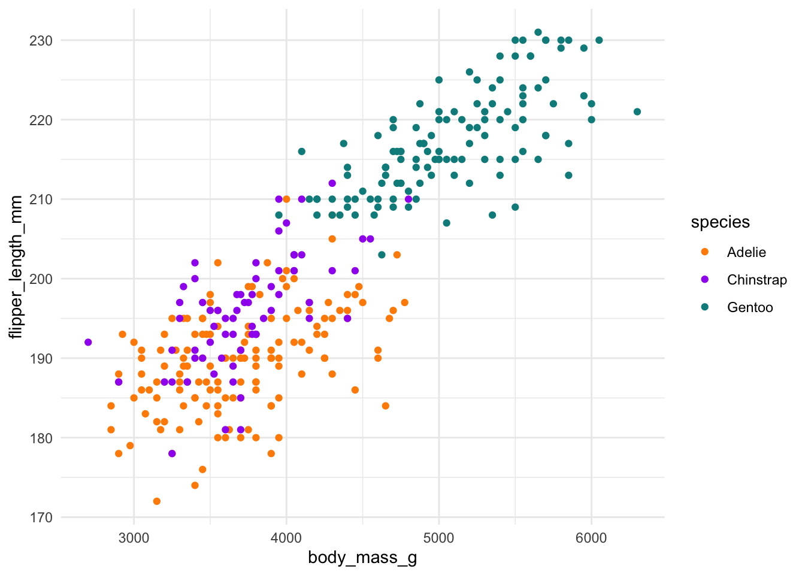

# Palmer Penguins (`.qmd`)

``` r
library(tidyverse)
```

    ── Attaching core tidyverse packages ──────────────────────── tidyverse 2.0.0 ──
    ✔ dplyr     1.1.2     ✔ readr     2.1.4
    ✔ forcats   1.0.0     ✔ stringr   1.5.0
    ✔ ggplot2   3.4.2     ✔ tibble    3.2.1
    ✔ lubridate 1.9.2     ✔ tidyr     1.3.0
    ✔ purrr     1.0.1     
    ── Conflicts ────────────────────────────────────────── tidyverse_conflicts() ──
    ✖ dplyr::filter() masks stats::filter()
    ✖ dplyr::lag()    masks stats::lag()
    ℹ Use the conflicted package (<http://conflicted.r-lib.org/>) to force all conflicts to become errors

``` r
library(palmerpenguins)
```

Data from [Palmer Penguins R package](https://allisonhorst.github.io/palmerpenguins/)

``` r
penguins |> count(species)
```

    # A tibble: 3 × 2
      species       n
      <fct>     <int>
    1 Adelie      152
    2 Chinstrap    68
    3 Gentoo      124

``` r
colors <- c("#FF8C00", "#A020F0", "#008B8B")
```

``` r
ggplot(penguins, aes(body_mass_g, flipper_length_mm)) +
  geom_point(aes(color = species)) +
  scale_color_manual(values = colors) +
  theme_minimal()
```

    Warning: Removed 2 rows containing missing values (`geom_point()`).



Figure 1
