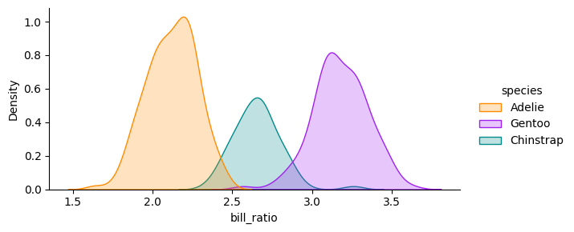
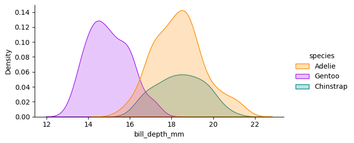
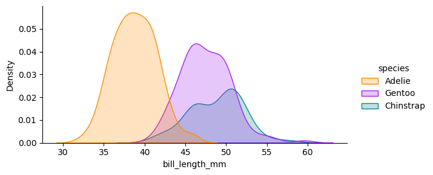

``` python
import pandas as pd
import altair as alt
import seaborn as sns
from matplotlib import pyplot as plt
```

Data from [Palmer Penguins R package](https://allisonhorst.github.io/palmerpenguins/)

``` python
penguins = pd.read_csv("https://pos.it/palmer-penguins-github-csv")
```

``` python
penguins.groupby("species").size().reset_index(name = "count")
```

|     | species   | count |
|-----|-----------|-------|
| 0   | Adelie    | 152   |
| 1   | Chinstrap | 68    |
| 2   | Gentoo    | 124   |

``` python
colors = ["#FF8C00", "#A020F0", "#008B8B"]
sns.set_palette(colors, n_colors = 3)
```

``` python
penguins["bill_ratio"] = (
   penguins["bill_length_mm"] / penguins["bill_depth_mm"] 
)
sns.displot(penguins, 
            x = "bill_ratio", 
            hue = "species", 
            kind = "kde", fill = True, aspect = 2, height = 3)
plt.show()
```



``` python
sns.displot(penguins, 
            x = "bill_depth_mm", 
            hue = "species", 
            kind = "kde", fill = True, 
            aspect = 2, height = 3)
plt.show()
sns.displot(penguins, 
            x = "bill_length_mm", 
            hue = "species", 
            kind = "kde", fill = True, 
            aspect = 2, height = 3)
plt.show()
```



\(a\) Gentoo penguins tend to have thinner bills,



\(b\) and Adelie penguins tend to have shorter bills.

Figure 1: Marginal distributions of bill dimensions

``` python
scale = alt.Scale(domain = ['Adelie', 'Chinstrap', 'Gentoo'],
                  range = colors)
```

``` python
alt.Chart(penguins).mark_circle(size=60).encode(
    alt.X('bill_length_mm',
        scale=alt.Scale(zero=False)
    ),
    alt.Y('bill_depth_mm',
        scale=alt.Scale(zero=False)
    ),
    color = alt.Color('species', scale = scale),
    tooltip=['species', 'sex', 'island']
)
```

Figure 2: A scatterplot of bill dimensions for penguins, made with Altair.
