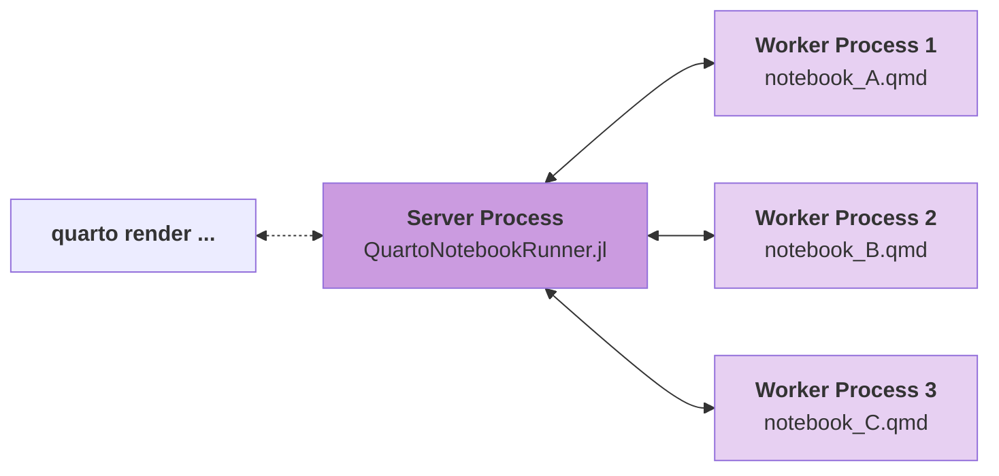

# Using Julia

# Overview

Quarto supports executable Julia code blocks within markdown. This allows you to create fully reproducible documents and reports—the Julia code required to produce your output is part of the document itself, and is automatically re-run whenever the document is rendered.

Quarto has two available engines for executing Julia code, the newer [`julia` engine](#using-the-julia-engine) is using the [QuartoNotebookRunner.jl](https://github.com/PumasAI/QuartoNotebookRunner.jl/) package to render notebooks, the older [`jupyter` engine](#using-the-jupyter-engine) is using the [IJulia](https://github.com/JuliaLang/IJulia.jl) Jupyter kernel.

This table lists some of the reasons why the `julia` engine was created:

|  | julia Engine | jupyter Engine |
|----|----|----|
| Execute Julia code blocks | ✅ | ✅ |
| Keep sessions alive for fast reruns | ✅ | ✅ |
| No Python installation required | ✅ | ❌ |
| No global package installation needed | ✅ | ❌ |
| Automatic integration with juliaup (no kernel installation) | ✅ | ❌ |
| Python & R Codeblocks (via PythonCall.jl and RCall.jl) | ✅ | ❌ |
| “Expandable cells” or programmatic document generation (via [QuartoTools.jl](https://pumasai.github.io/QuartoTools.jl/stable/)) | ✅ | ❌ |

> **NOTE:**
>
> For most users, the `julia` engine should offer the best experience. However, for backwards compatibility the `jupyter` engine remains the default engine for Julia code. The `julia` engine has to be [specifically enabled either in the frontmatter or the project file](#enabling-the-julia-engine).

Using either of the two engines will require manually installing Julia if you have not done so already. Installation via `juliaup` is recommended, for further information check the [official Julia website](https://julialang.org/install/).

Now, we will cover the basics of creating and rendering documents with Julia code blocks.

### Code Blocks

Code blocks that use braces around the language name (e.g. ```` ```{julia} ````) are executable, and will be run by Quarto during render. Here is a simple example:

```` markdown
---
title: "Plots Demo"
author: "Norah Jones"
date: "5/22/2021"
format:
  html:
    code-fold: true
engine: julia
---

### Parametric Plots

Plot function pair (x(u), y(u)). 
See @fig-parametric for an example.

```{julia}
#| label: fig-parametric
#| fig-cap: "Parametric Plots"

using Plots

plot(sin, 
     x->sin(2x), 
     0, 
     2π, 
     leg=false, 
     fill=(0,:lavender))
```
````

You’ll note that there are some special comments at the top of the code block. These are cell level options that make the figure [cross-referenceable](../../docs/authoring/cross-references.llms.md).

This document would result in the following rendered output:


You can produce a wide variety of output types from executable code blocks, including plots, tabular output from data frames, and plain text output (e.g. printing the results of statistical summaries).

There are many options which control the behavior of code execution and output, you can read more about them in the article on [Execution Options](../../docs/computations/execution-options.llms.md).

In addition to code blocks which interrupt the flow of Markdown, you can also include code inline. Read more about inline code in the [Inline Code](../../docs/computations/inline-code.llms.md) article.

#### Multiple Outputs

By default Julia cells will automatically print the value of their last statement (as with the example above where the call to `plot()` resulted in plot output). If you want to display multiple plots (or other types of output) from a single cell you should call the `display()` function explicitly. For example, here we output two plots side-by-side with sub-captions:

```` markdown
```{julia}
#| label: fig-plots
#| fig-cap: "Multiple Plots"
#| fig-subcap:
#|   - "Plot 1"
#|   - "Plot 2"
#| layout-ncol: 2

using Plots
display(plot(sin, x -> sin(2x), 0, 2))
display(plot(x -> sin(4x), y -> sin(5y), 0, 2))
```
````

### Rendering

Quarto will automatically run computations in any markdown document that contains executable code blocks. For example, the example shown above might be rendered to various formats with:

``` bash
quarto render document.qmd # all formats
quarto render document.qmd --to pdf
quarto render document.qmd --to docx
```

The `render` command will render all formats listed in the document YAML. If no formats are specified, then it will render to HTML. You can also provide the `--to` argument to target a specific format.

Quarto can also render any Jupyter notebook (.ipynb):

``` bash
quarto render document.ipynb
```

Note that the target file (in this case `document.qmd`) should always be the very first command line argument.

Note that when rendering an .ipynb Quarto will not execute the cells within the notebook by default (the presumption being that you already executed them while editing the notebook). If you want to execute the cells you can pass the `--execute` flag to render:

``` bash
quarto render notebook.ipynb --execute
```

## Workflow

You can author Quarto documents that include Julia code using any text or notebook editor. No matter what editing tool you use, you’ll always run `quarto preview` first to setup a live preview of changes in your document. Live preview is available for both HTML and PDF output. For example:

``` bash
# preview as html
quarto preview document.qmd

# preview as pdf
quarto preview document.qmd --to pdf

# preview a jupyter notebook
quarto preview document.ipynb
```

Note that when rendering an `.ipynb` Quarto **will not** execute the cells within the notebook by default (the presumption being that you have already executed them while editing the notebook). If you want to execute the cells you can pass the `--execute` flag to render:

``` bash
quarto render notebook.ipynb --execute
```

You can also specify this behavior within the notebook’s YAML front matter:

``` yaml
---
title: "My Notebook"
execute: 
  enabled: true
---
```

## Embed Notebooks

In addition to including executable Julia code chunks in a Quarto document, you can also embed cells from an external Jupyter Notebook (`.ipynb`). See [Embedding Jupyter Notebook Cells](../../docs/authoring/notebook-embed.llms.md) for more details.

## Positron

The [Quarto Extension](https://open-vsx.org/extension/quarto/quarto) is bundled with Positron, and provides a variety of tools for working with `.qmd` files. The extension integrates directly with the [Julia Extension](https://www.julia-vscode.org/docs) to provide code completion, cell execution and side-by-side preview of Quarto documents.


The extension includes a **Quarto: Preview** command that can be accessed via the Command Palette, the keyboard shortcut , or a **Preview** button () in the editor toolbar. After rendering, a preview is displayed in the Viewer pane within Positron.

You can read more about using Positron in [Tools: Positron](../../docs/tools/positron/index.llms.md).

You can also use the Positron notebook editor to create `.ipynb` notebooks that you will render with Quarto. The [Jupyter Lab](#jupyter-lab) section discusses using notebooks with Quarto in the context of Jupyter Lab, but the same concepts apply to Positron.

## VS Code

The [Quarto Extension](https://marketplace.visualstudio.com/items?itemName=quarto.quarto) for VS Code provides a variety of tools for working with `.qmd` files in VS Code. The extension integrates directly with the [Julia Extension](https://www.julia-vscode.org/docs) to provide the following Julia-specific capabilities:

1.  Code completion
2.  Cell execution
3.  Contextual help


You can install the VS Code extension by searching for ‘quarto’ in the extensions panel or from the [extension marketplace](https://marketplace.visualstudio.com/items?itemName=quarto.quarto).

You can also use the VS Code notebook editor to create Julia notebooks that you will render with Quarto. The next section discusses using notebooks with Quarto in the context of Jupyter Lab, but the same concepts apply to VS Code.

## Jupyter Lab

We could convert the simple `document.qmd` we used as an example above to a Jupyter notebook using the `quarto convert` command. For example:

``` bash
quarto convert document.qmd
```

If we open this notebook in Jupyter Lab and execute the cells, here is what we see:


Note that there are three different types of cell here:

1.  The YAML document options at the top are in a **Raw** cell.
2.  The heading and explanation are in a **Markdown** cell.
3.  The Julia code and its output are in a **Code** cell.

When working in a Jupyter notebook, you can use `quarto preview` to provide a live preview of your rendered document:

``` bash
quarto preview document.ipynb
```

The preview will be updated every time you save the notebook in Jupyter Lab.

# Using the `julia` engine

## Installation

The `julia` engine uses the [QuartoNotebookRunner.jl](https://github.com/PumasAI/QuartoNotebookRunner.jl/) package to render notebooks. When you first attempt to render a notebook with the `julia` engine, Quarto will automatically install this package into a private environment that is owned by Quarto. This means you don’t have to install anything in your global Julia environment for Quarto to work and Quarto will not interfere with any other Julia environments on your system. Quarto will use the `julia` binary on your PATH by default, but you can override this using the `QUARTO_JULIA` environment variable.

> **NOTE:**
>
> In special circumstances, you may not want to use the specific `QuartoNotebookRunner` version that Quarto installs for you. For example, you might be developing `QuartoNotebookRunner` itself, or you need to use a fork or an unreleased version with a bugfix. In this case, set the [environment variable](../../docs/projects/environment.llms.md) `QUARTO_JULIA_PROJECT` to a directory of a julia environment that has `QuartoNotebookRunner` installed.
>
> As an example, you could install the main branch of `QuartoNotebookRunner` into the directory `/some/dir` by executing `]activate /some/dir` in a julia REPL followed by `]add QuartoNotebookRunner#main`. As long as there is no server currently running, running a command like `QUARTO_JULIA_PROJECT=/some/dir quarto render some_notebook.qmd` in your terminal will ensure the server process is started using the custom `QuartoNotebookRunner`. You can also set `quarto`’s `--execute-debug` flag and check the output to verify that the custom environment is being used.

## Enabling the `julia` engine

To use the `julia` engine, you have to specifically enable it. For that, you have two options.

Either specify the engine in your frontmatter:

```` markdown
---
title: "A julia engine notebook"
engine: julia
---

```{julia}
1 + 2
```
````

Or, starting with Quarto 1.7, you can prioritize the julia engine project-wide by adding `julia` to the `engines` array in your project file, giving it priority over all unlisted engines (more under [Engine prioritization](#engine-prioritization)). Note that the project file approach is the only option in order to use the `julia` engine with percent-script files.

``` yaml
engines: ['julia']
```

## Rendering notebooks

Requesting the first render of a notebook which contains Julia code blocks and has the `julia` engine enabled will start a persistent server process that loads QuartoNotebookRunner.jl. This package is installed automatically in an environment private to Quarto.

The server spins up a separate Julia worker process for each notebook you want to render. Every purple node in the following graph represents a separate Julia process which runs independently from each short-lived `quarto` process that communicates with the server.



You can check the status of the server, request it to shut down, and more using the [`call julia engine` commands](#quarto-call-engine-julia-commands). The server will stay alive for five minutes after the last worker process has exited, unless it’s closed manually. Changes to environment variables that influence the server process will only be picked up once the next new server process is started.

### Notebook environments

By default, QuartoNotebookRunner will use the `--project=@.` flag when starting a worker. This makes Julia search for an environment (a `Project.toml` or `JuliaProject.toml` file) starting in the directory where the quarto notebook is stored and walking up the directory tree from there.

For example, for a file `/some/dir/notebook.qmd` it will look at `/some/dir/[Julia]Project.toml`, `/some/[Julia]Project.toml` and so on. You could use this behavior to let all notebooks in a quarto project share the same Julia environment, by placing it at the project’s top-level directory.

If no environment has previously been set up in any of these directories, the worker process will start with an empty environment. This means that only Julia’s standard library packages will be available for use in the notebook.

> **NOTE:**
>
> Creating a separate environment for each notebook or each set of closely related notebooks is considered best practice. If too many different notebooks share the same environment (for example the main shared environment that Julia usually loads by default), you’re likely to break some of them unintentionally whenever you make a change to the environment.

You can create a Julia environment in multiple ways, for more information have a look at the [official documentation](https://pkgdocs.julialang.org/v1/environments/). One simple option for adding packages to the default environment of a new quarto notebook is to add some `Pkg` installation commands to the notebook and run it once. Afterwards, those commands can be deleted and a `Project.toml` and `Manifest.toml` file representing the environment should be present in the notebook’s directory.

```` markdown
---
engine: julia
---

```{julia}
using Pkg
Pkg.add("DataFrames")
```
````

Another option is to start `julia` in a terminal which loads the REPL, and to press `]` to switch to the `Pkg` REPL mode. In this mode, you can first activate the desired environment by running `activate /some/dir` and then, for example, install the `DataFrames` package with the command `add DataFrames`.

If you do not want to use the notebook’s directory as the environment, you may specify a different directory via the `--project` flag in the `exeflags` frontmatter setting:

``` markdown
---
engine: julia
julia:
  exeflags: ["--project=/some/other/dir"]
---
```

### Worker process reuse

An idle worker process will be kept alive for 5 minutes by default, this can be changed by passing the desired number of seconds to the `daemon` key:

``` markdown
---
title: "A julia notebook with ten minutes timeout"
engine: julia
execute:
  daemon: 600
---
```

Each re-render of a notebook will reuse the worker process with all dependencies already loaded, which reduces latency. As far as technically possible, QuartoNotebookRunner.jl will release resources from previous runs to the garbage collector. In each run, the code is evaluated into a fresh module so you cannot run into conflicts with variables defined in previous runs. Note, however, that certain state changes like modifications to package runtime settings or the removal or addition of function methods will persist across runs. If necessary, you can use the `--execute-daemon-restart` flag to force a restart of a notebook’s worker process.

You can also disable the daemon which will use a new process for each render (with higher latency due to package reloads):

``` yaml
execute:
  daemon: false
```

The server process itself will time out after five minutes if no more worker processes exist.

## Engine options

Engine options can be passed under the `julia` top-level key:

``` markdown
---
title: "A julia engine notebook"
engine: julia
julia:
  key: value
---
```

The currently available options are:

- `exeflags`: An array of strings which are appended to the `julia` command that starts the worker process. For example, a notebook is run with `--project=@.` by default (the environment in the directory where the notebook is stored) but this could be overridden by setting `exeflags: ["--project=/some/directory/"]`.
- `env`: An array of strings where each string specifies one environment variable that is passed to the worker process. For example, `env: ["SOMEVAR=SOMEVALUE"]`.

## `quarto call engine julia` commands

Starting with Quarto 1.7, The julia engine offers CLI commands for configuration and monitoring via the `quarto call engine julia` entrypoint.

### `status`

The `status` command prints out information about the currently running server process as well as potential worker processes. For example:

    $ quarto call engine julia status
    QuartoNotebookRunner server status:
      started at: 9:44:31 (47 seconds ago)
      runner version: 0.15.0
      environment: /Users/username/Library/Caches/quarto/julia/
      pid: 42008
      port: 8000
      julia version: 1.11.4
      timeout: 5 minutes
      workers active: 1
        worker 1:
          path: /Users/username/notebook.qmd
          run started: 9:44:38 (40 seconds ago)
          run finished: -
          timeout: 5 minutes
          pid: 42026
          exe: `julia`
          exeflags: ["--color=yes"]
          env: ["JULIA_PROJECT=@."]

### `close`

The `close` command allows shutting down notebook worker processes. By default, only closing of idle worker processes is allowed. A worker process is idle when its `run finished` status is populated. In this case, we can call `close` on it:

    $ quarto call engine julia status
    QuartoNotebookRunner server status:
      started at: 9:44:31 (5 minutes 41 seconds ago)
      runner version: 0.15.0
      environment: /Users/username/Library/Caches/quarto/julia/
      pid: 42008
      port: 8000
      julia version: 1.11.4
      timeout: 5 minutes
      workers active: 1
        worker 1:
          path: /Users/username/notebook.qmd
          run started: 9:44:38 (5 minutes 34 seconds ago)
          run finished: 9:46:21 (took 1 minute 43 seconds)
          timeout: 5 minutes (1 minute 9 seconds left)
          pid: 42026
          exe: `julia`
          exeflags: ["--color=yes"]
          env: ["JULIA_PROJECT=@."]

    $ quarto call engine julia close /Users/username/notebook.qmd
    Worker closed successfully.

To force a busy worker to close, for example if it’s stuck in an endless loop or because a computation is taking too long, the `--force` flag can be added. Using this flag means losing all the work that the worker process has done so far. At the next run, the worker process will have to be started from scratch and all packages loaded again:

    $ quarto call engine julia status                                                     
    QuartoNotebookRunner server status:
      started at: 11:2:40 (16 seconds ago)
      runner version: 0.15.0
      environment: /Users/username/Library/Caches/quarto/julia/
      pid: 50642
      port: 8000
      julia version: 1.11.4
      timeout: 5 minutes
      workers active: 1
        worker 1:
          path: /Users/username/notebook.qmd
          run started: 11:2:47 (9 seconds ago)
          run finished: -
          timeout: 5 minutes
          pid: 50650
          exe: `julia`
          exeflags: ["--color=yes"]
          env: ["JULIA_PROJECT=@."]

    $ quarto call engine julia close /Users/username/notebook.qmd
    ERROR: Julia server returned error after receiving "close" command:

    Failed to close notebook: /Users/username/notebook.qmd

    The underlying Julia error was:

    Tried to close file "/Users/username/notebook.qmd" but the corresponding worker is busy.

    Stack trace:
      [omitted for brevity]

    $ quarto call engine julia close --force /Users/username/notebook.qmd
    Worker force-closed successfully.

    $ quarto call engine julia status                                                     
    QuartoNotebookRunner server status:
      started at: 11:2:40 (46 seconds ago)
      runner version: 0.15.0
      environment: /Users/username/Library/Caches/quarto/julia/
      pid: 50642
      port: 8000
      julia version: 1.11.4
      timeout: 5 minutes (4 minutes 56 seconds left)
      workers active: 0

### `stop`

The `stop` command shuts down the server process gracefully. Note that you will get an error if any workers are currently busy:

    $ quarto call engine julia status
    QuartoNotebookRunner server status:
      started at: 11:2:40 (3 minutes 43 seconds ago)
      runner version: 0.15.0
      environment: /Users/username/Library/Caches/quarto/julia/
      pid: 50642
      port: 8000
      julia version: 1.11.4
      timeout: 5 minutes (1 minute 59 seconds left)
      workers active: 0

    $ quarto call engine julia stop 
    Server stopped.

    $ quarto call engine julia status
    Julia control server is not running.

### `kill`

The `kill` command shuts the server process down forcefully. This command is intended as a last resort when the server is in a bad state and unresponsive. Note that all worker processes will be killed as well, so you will lose all progress.

### `log`

The `log` command prints the output of the internal log file of the server process. If the server process fails to start or unexpectedly quits, this log file might contain useful information.

## `juliaup` integration

[`juliaup`](https://github.com/JuliaLang/juliaup) is the recommended way to install and manage Julia versions. The `julia` engine supports using `juliaup`’s `+` channel specifier to select the Julia version that a notebook uses. This allow users to run several notebooks concurrently with different Julia versions on the same machine without the need for customizing their `PATH` in any way.

To use this feature, ensure that you have used `juliaup` to install the channels that you wish to use in your notebooks. Then add the channel specifier to the notebook frontmatter in the `julia.exeflags` option:

```` markdown
---
title: "A Julia 1.11 notebook"
engine: julia
julia:
  exeflags: ["+1.11"]
---

```{julia}
VERSION
```
````

`QuartoNotebookRunner` currently supports running Julia versions from 1.6 onwards. Support for earlier versions is not planned.

## Revise.jl integration

[Revise](https://github.com/timholy/Revise.jl) allows for automatically updating function definitions in Julia sessions. It is an essential tool in the Julia ecosystem for any user that wishes to develop their own packages or large projects. The `julia` engine supports using `Revise` within notebook processes by simply importing the package into a cell at the start of a notebook. Once imported `Revise` will automatically update functions imported from locally developed packages in the same way as it behaves in a Julia REPL.

Ensure that `Revise` is installed in the project environment that the notebook is using, since the global environment is not included in the load path provided to Julia, unlike the behaviour of a Julia REPL session.

## Caching

The engine has built-in support for caching notebook results. This feature is disabled by default but can be enabled by setting the `execute.cache` option to `true` in a notebook’s frontmatter:

```` markdown
---
title: "A caching example"
engine: julia
execute:
  cache: true
---

```{julia}
rand()
```
````

Notebook caches are invalidated based on the following criteria:

- Using a different Julia version to run the notebook.
- Changes to the `Manifest.toml` of the environment the notebook is run in. Adding, removing, or changing package versions will invalidate the cache.
- Changing any contents in the notebook’s frontmatter.
- Changing any contents of any executable Julia cells, including cell options.

Changes that do not invalidate a cache:

- Editing Markdown content outside of executable Julia cells.

Caches are saved to file in a `.cache` directory alongside the notebook file. This directory is safe to remove if you want to invalidate all caches. The contents of the individual cache files is an internal implementation detail and should not be relied upon.

These caches are safe to save in CI via such tools as GitHub Actions `action/cache` to help improve the render time of long-running notebooks that do not often change.

## R and Python support

`{r}` and `{python}` executable code blocks are supported in the `julia` engine via integrations with the [RCall](https://github.com/JuliaInterop/RCall.jl) and [PythonCall](https://github.com/JuliaPy/PythonCall.jl) packages respectively. Using this feature requires the notebook author to explicitly `import` those packages into their notebooks in a `{julia}` cell after which they can use `{r}` and `{python}` cells.

```` markdown
---
title: "Multi-language notebooks"
engine: julia
---

```{julia}
import PythonCall
import RCall
```

Create some data in Julia:

```{julia}
data = sin.(0:0.1:4pi)
```

Then plot it in R by interpolating the `data` variable from Julia into `R` via
the `$` syntax:

```{r}
plot($data)
```

The same `$` syntax can be used to interpolate Julia variables into Python code as well:

```{python}
len($data)
```
````

## Engine “extensions”

The implementation of `QuartoNotebookRunner` allows for extending the behaviour of notebooks via external Julia packages.

One example of this is the [QuartoTools.jl](https://pumasai.github.io/QuartoTools.jl) package, which enables fine-grained function call caching, support for serializing data between notebook processes and normal `julia` processes, and “expandable” cell outputs that allow for programatic creating of cell inputs and outputs within notebooks. See the linked documentation for more thorough discussion of that package’s features.

The same approach used by that package can be applied to other third-party packages that wish to extend the functionality of notebooks in other ways. Please direct questions and requests regarding this functionality to the [QuartoNotebookRunner](https://github.com/PumasAI/QuartoNotebookRunner.jl) repository.

# Using the `jupyter` engine

### Installation

In order to render documents with embedded Julia code you’ll need to install the following components:

1.  IJulia
2.  Revise.jl
3.  Optionally, Jupyter Cache

We’ll cover each of these in turn below.

#### IJulia

[IJulia](https://julialang.github.io/IJulia.jl/stable) is a Julia-language execution kernel for Jupyter. You can install IJulia from within the Julia REPL as follows:

``` julia
using Pkg
Pkg.add("IJulia")
using IJulia
notebook()
```

The first time you run `notebook()`, it will prompt you for whether it should install Jupyter. Hit enter to have it use the [Conda.jl](https://github.com/Luthaf/Conda.jl) package to install a minimal Python+Jupyter distribution (via [Miniconda](https://docs.conda.io/projects/conda/en/stable/user-guide/install/index.llms.md)) that is private to Julia (not in your `PATH`). On Linux, it defaults to looking for `jupyter` in your `PATH` first, and only asks to installs the Conda Jupyter if that fails.

If you choose not to use Conda.jl to install Python and Jupyter you will need to make sure that you have another installation of it on your system (see the section on [Installing Jupyter](#installing-jupyter) if you need help with this).

#### Revise.jl

In addition to IJulia, you’ll want to install [Revise.jl](https://timholy.github.io/Revise.jl/stable) and configure it for use with IJulia. Revise.jl is a library that helps you keep your Julia sessions running longer, reducing the need to restart when you make changes to code.

Quarto maintains a persistent [kernel daemon](#kernel-daemon) for each document to mitigate Jupyter start up time during iterative work. Revise.jl will make this persistent process robust in the face of package updates, git branch checkouts, etc. Install Revise.jl with:

``` julia
using Pkg
Pkg.add("Revise")
```

To configure Revise to launch automatically within IJulia, create a `.julia/config/startup_ijulia.jl` file with the contents:

``` julia
try
  @eval using Revise
catch e
  @warn "Revise init" exception=(e, catch_backtrace())
end
```

You can learn more about Revise.jl at <https://timholy.github.io/Revise.jl/stable>.

#### Jupyter Cache

[Jupyter Cache](https://jupyter-cache.readthedocs.io/en/latest/) enables you to cache all of the cell outputs for a notebook. If any of the cells in the notebook change then all of the cells will be re-executed.

If you are using the integrated version of Jupyter installed by `IJulia.notebook()`, then you will need to add `jupyter-cache` to the Python environment managed by IJulia. You can do that as follows:

``` julia
using Conda
Conda.add("jupyter-cache")
```

Alternatively, if you are using Jupyter from within any other version of Python not managed by IJulia, see the instructions below on [Installing Jupyter](#installing-jupyter) for details on installing `jupyter cache`,

## Caching

[Jupyter Cache](https://jupyter-cache.readthedocs.io/en/latest/) enables you to cache all of the cell outputs for a notebook. If any of the cells in the notebook change then all of the cells will be re-executed.

To use Jupyter Cache you’ll want to first install the `jupyter-cache` package:

[TABLE]

To enable the cache for a document, add the `cache` option. For example:

``` yaml
---
title: "My Document"
format: html
execute: 
  cache: true
---
```

You can also specify caching at the project level. For example, within a project file:

``` yaml
project:
  type: website
  
format:
  html:
    theme: united
    
execute:
  cache: true
```

Note that changes within a document that aren’t within code cells (e.g. markdown narrative) do not invalidate the document cache. This makes caching a very convenient option when you are working exclusively on the prose part of a document.

Jupyter Cache include a `jcache` command line utility that you can use to analyze and manage the notebook cache. See the [Jupyter Cache](https://jupyter-cache.readthedocs.io/en/latest/) documentation for additional details.

### Rendering

You can use `quarto render` command line options to control caching behavior without changing the document’s code. Use options to force the use of caching on all chunks, disable the use of caching on all chunks (even if it’s specified in options), or to force a refresh of the cache even if it has not been invalidated:

``` bash
# use a cache (even if not enabled in options)
quarto render example.qmd --cache 

# don't use a cache (even if enabled in options)
quarto render example.qmd --no-cache 

# use a cache and force a refresh 
quarto render example.qmd --cache-refresh 
```

### Alternatives

If you are using caching to mitigate long render-times, there are some alternatives you should consider alongside caching.

#### Disabling Execution

If you are working exclusively with prose / markdown, you may want to disable execution entirely. Do this by specifying the `enabled: false` execute option For example:

``` yaml
---
title: "My Document"
format: html
execute: 
  enabled: false
---
```

Note that if you are authoring using Jupyter `.ipynb` notebooks (as opposed to plain-text `.qmd` files) then this is already the default behavior: no execution occurs when you call `quarto render` (rather, execution occurs as you work within the notebook).

#### Freezing Execution

If you are working within a project and your main concern is the cumulative impact of rendering many documents at once, consider using the `freeze` option.

You can use the `freeze` option to denote that computational documents should never be re-rendered during a global project render, or alternatively only be re-rendered when their source file changes:

``` yaml
execute:
  freeze: true  # never re-render during project render
```

``` yaml
execute:
  freeze: auto  # re-render only when source changes
```

Note that `freeze` controls whether execution occurs during global project renders. If you do an incremental render of either a single document or a project sub-directory then code is always executed. For example:

``` bash
# render single document (always executes code)
quarto render document.qmd

# render project subdirectory (always executes code)
quarto render articles
```

Learn more about using `freeze` with projects in the article on [managing project execution](../../docs/projects/code-execution.llms.md#freeze).

### Kernel Selection

You’ll note in our first example that we specified the use of the `julia-1.8` kernel explicitly in our document options (shortened for brevity):

``` markdown
---
title: "StatsPlots Demo"
jupyter: julia-1.8
---
```

If no `jupyter` kernel is explicitly specified, then Quarto will attempt to automatically discover a kernel on the system that supports Julia.

You can discover the available Jupyter kernels on your system using the `quarto check` command:

``` bash
quarto check jupyter
```

## Kernel Daemon

To mitigate the start-up time for the Jupyter kernel Quarto keeps a daemon with a running Jupyter kernel alive for each document. This enables subsequent renders to proceed immediately without having to wait for kernel start-up.

The purpose of the daemon is to make render more responsive during interactive sessions. Accordingly, no daemon is created when documents are rendered without an active tty or when they are part of a batch rendering (e.g. in a [Quarto Project](../../docs/projects/quarto-projects.llms.md)).

Note that Quarto does not use a daemon by default on Windows (as some Windows systems will not allow the socket connection required by the daemon).

You can customize this behavior using the `daemon` execution option. Set it to `false` to prevent the use of a daemon, or set it to a value (in seconds) to determine the period after which the daemon will timeout (the default is 300 seconds). For example:

``` yaml
execute:
  daemon: false
```

``` yaml
execute:
  daemon: 60
```

Note that if you want to use a daemon on Windows you need to enable it explicitly:

``` yaml
execute:
  daemon: true
```

### Command Line

You can also control use of the Jupyter daemon using the following command line options:

``` bash
# use a daemon w/ default timeout (300 sec)
quarto render document.qmd --execute-daemon

# use a daemon w/ an explicit timeout
quarto render document.qmd --execute-daemon 60

# prevent use of a daemon
quarto render document.qmd --no-execute-daemon
```

You can also force an existing daemon to restart using the `--execute-daemon-restart` command line flag:

``` bash
quarto render document.qmd --execute-daemon-restart 
```

This might be useful if you suspect that the re-use of notebook sessions is causing an error.

Finally, you can print extended debugging information about daemon usage (startup, shutdown, connections, etc.) using the `--execute-debug` flag:

``` bash
quarto render document.qmd --execute-debug
```

### Installing Jupyter

You can rely on the minimal version of Python and Jupyter that is installed automatically by **IJulia**, or you can choose to install Python and Jupyter separately. If you need to install another version of Jupyter this section describes how.

If you don’t yet have Python 3 on your system, we recommend you install a version using the standard installer from <https://www.python.org/downloads/>.

If you are in a fresh Python 3 environment, installing the `jupyter` package will provide everything required to execute Jupyter kernels with Quarto:

[TABLE]

You can verify that Quarto is configured correctly for Jupyter with:

``` bash
quarto check jupyter
```

Quarto will select a version of Python using the [Python Launcher](https://docs.python.org/3/using/windows.llms.md#python-launcher-for-windows) on Windows or system `PATH` on MacOS and Linux. You can override the version of Python used by Quarto by setting the `QUARTO_PYTHON` environment variable.

If you are using a virtual environment with your environment or project, see more at [Virtual Environments](../../docs/projects/virtual-environments.llms.md).

#### Jupyter Cache

[Jupyter Cache](https://jupyter-cache.readthedocs.io/en/latest/) enables you to cache all of the cell outputs for a notebook. If any of the cells in the notebook change then all of the cells will be re-executed.

To use Jupyter Cache you’ll want to first install the `jupyter-cache` package:

[TABLE]

To enable the cache for a document, add the `cache` option. For example:
